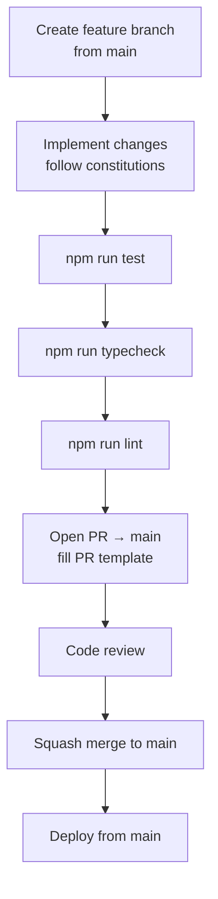

# Contributing to Xkimm Xa Mali Foundation

---

## Before You Write Any Code

Read the constitutions. Every rule in them is non-negotiable.

| Constitution | What it governs |
|---|---|
| [docs/constitutions/backend.md](./docs/constitutions/backend.md) | API handler pattern, service layer, error handling, audit logging |
| [docs/constitutions/frontend.md](./docs/constitutions/frontend.md) | Server vs. client components, form patterns, data fetching |
| [docs/constitutions/database.md](./docs/constitutions/database.md) | Schema rules, migration naming, ON DELETE contracts |
| [docs/constitutions/security.md](./docs/constitutions/security.md) | Security defence layers, input validation, encryption |
| [docs/constitutions/infra.md](./docs/constitutions/infra.md) | Environment tiers, CI/CD pipeline, deployment rules |

---

## Branch Naming

```
feat/<scope>-<short-description>    # new functionality
fix/<scope>-<short-description>     # bug or regression fix
docs/<scope>-<short-description>    # documentation only
chore/<scope>-<short-description>   # tooling, deps, config
refactor/<scope>-<short-description>
```

**Scopes:** `auth`, `payments`, `contributions`, `mandates`, `goals`, `notifications`, `reporting`, `admin`, `db`, `infra`, `api`, `web`, `docs`

Examples:
```
feat/payments-debicheck-retry
fix/auth-session-expiry
docs/db-index-strategy
chore/deps-upgrade-prisma
```

---

## Pull Request Flow



All PRs target `main`. Direct pushes to `main` are blocked.

`main` is the only long-lived branch. There is no integration branch: a feature
branch is cut from `main`, squash-merged back into it, and deleted. That means
`main` is always the deployable truth and there is no second place for it to
drift from.

---

## PR Checklist

Before opening a PR, confirm:

- [ ] Branch is up to date with `main`
- [ ] `npm run typecheck` passes with zero errors
- [ ] `npm run lint` passes with zero warnings
- [ ] `npm run test` passes
- [ ] No `console.log` left in production paths
- [ ] No secrets, credentials, or `.env` values in code or comments
- [ ] New API routes use `withApiHandler` and Zod validation
- [ ] Database migrations are additive — no destructive schema changes
- [ ] AuditLog written for every state-changing operation
- [ ] No `dangerouslySetInnerHTML` without explicit security review

---

## Commit Messages

Use conventional commits:

```
feat(auth): add email verification resend endpoint
fix(payments): handle Netcash TIMEOUT webhook status
docs(db): add index strategy for contributions table
chore(deps): upgrade Prisma to 6.x
refactor(api): extract mandate validation to shared schema
```

One subject line. Present tense. No period at the end. Under 72 characters.

---

## Local Development

```bash
# Install dependencies
npm install

# Set up environment (root .env.example → one per app)
cp .env.example apps/web/.env.local
# Fill in: DATABASE_URL, AUTH_SECRET, ENCRYPTION_KEY, etc.

# Start all apps
npm run dev

# Individual apps
npm run dev --filter=web      # :3000
npm run dev --filter=website  # :3001
npm run dev --filter=admin    # :3002
```

No Docker needed. Uses Neon dev branch + Upstash free tier directly.

See [docs/constitutions/infra.md](./docs/constitutions/infra.md) for environment configuration details.

---

## Database Migrations

```bash
# Create a new migration
cd packages/database
npx prisma migrate dev --name <migration_name>

# Apply migrations to production (CI only)
npx prisma migrate deploy
```

Migration naming convention: `snake_case_description` (Prisma prepends the timestamp).

Migrations are **additive and forward-only** — no destructive schema changes. Roll back a bad release by promoting the previous Vercel deployment (see [DEPLOYMENT.md](./DEPLOYMENT.md#9-rollback)); the additive schema stays compatible.

---

## Security Rules

These are hard stops — do not bypass without a security review:

- All API inputs validated with Zod before any business logic
- SA ID numbers and bank account numbers encrypted at rest (AES-256-GCM)
- Passwords hashed with bcrypt at cost 12 minimum
- No raw SQL with user-supplied input — Prisma parameterised queries only
- Webhook endpoints verified by HMAC only — reject sessions
- `dangerouslySetInnerHTML` requires explicit written approval

Violations block merge.

---

## Questions?

Check the [docs/](./docs/) folder first. Start with [docs/system-overview.md](./docs/system-overview.md).
