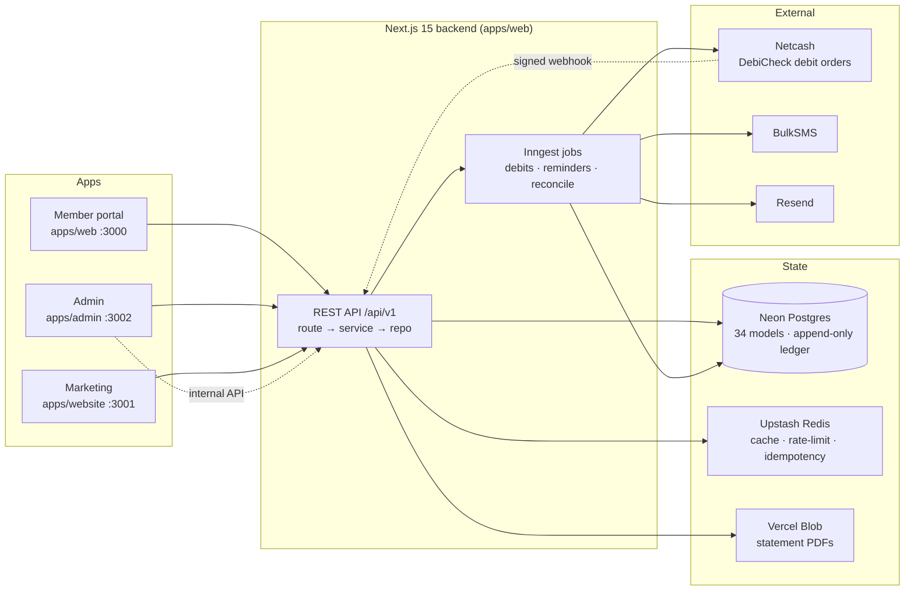

# Xkimm Xa Mali Foundation

> *"It is more blessed to give than to receive."* — Acts 20:35

A private, real-money contribution platform for a family savings group. It automates monthly DebiCheck debit orders, tracks every rand in an append-only ledger, and gives each member a live view of their standing — no spreadsheets, no manual collection. Built for four brothers, designed to scale to ~50 members.



---

## What it does

| Area | Capability |
|---|---|
| **Contributions** | Monthly records (R100 min/member), automatic status: `PENDING → PAID / OVERDUE` |
| **Payments** | Netcash DebiCheck mandates + automated debit runs, idempotent webhook settlement |
| **Ledger** | Append-only double-entry pool ledger; balance = Σcredits − Σdebits; nightly reconciliation |
| **Notifications** | SMS + email + in-app inbox — warnings, receipts, overdue reminders |
| **Goals** | Group savings goals with cheers, comments, and pledges |
| **Engagement** | Contribution badges/tiers, community messages, personal budgets |
| **Member insights** | Year-end forecast, on-time rate, at-risk nudges |
| **Admin** | All members, mandates, goals, audit trail, signed PDF statements, financial-anomaly alerts |
| **Reporting** | PDF statements (admin-signed) + CSV exports |

---

## Tech stack

| Layer | Choice | Why ([ADRs](docs/adr/)) |
|---|---|---|
| Framework | Next.js 15 App Router · React 19 · TS | One deployment for UI + API + jobs |
| Database | PostgreSQL (Neon) via Prisma 6 | ACID — non-negotiable for money |
| Auth | NextAuth v5 · JWT HTTP-only cookies | No `localStorage` token exposure |
| Payments | Netcash DebiCheck | SA-native recurring debit |
| Jobs | Inngest | Durable, retryable — Vercel Cron isn't |
| Cache / limits | Upstash Redis | Serverless-native sliding windows |
| SMS · Email · Files | BulkSMS · Resend · Vercel Blob | |
| Monitoring | Sentry | Errors + performance |

---

## Repository layout

```
apps/
  web/        Member portal + REST API + Inngest jobs (:3000)
    app/      (auth) · (member) · api/v1
    services/ Business logic — one file per domain
    lib/      Clients, Zod schemas, helpers
    inngest/  Durable scheduled jobs
  admin/      Admin dashboard (:3002) — calls web via internal API
  website/    Public marketing site (:3001)
packages/
  database/   Prisma schema, 16 migrations, seed
  ui/ utils/ types/ config/   Shared libraries
docs/         Architecture, flows, database, security, ADRs, constitutions
```

---

## Local setup

```bash
git clone https://github.com/maluleke-ks/xkimi-xa-mali.git && cd xkimi-xa-mali
npm install

# one .env.local per app (see Environment reference below)
cp .env.example apps/web/.env.local
cp .env.example apps/admin/.env.local
cp .env.example apps/website/.env.local

npm run db:generate && npm run db:migrate && npm run db:seed
npm run dev          # all three apps in parallel
```

| App | URL | Single-app command |
|---|---|---|
| Member portal + API | http://localhost:3000 | `npm run dev:web` |
| Admin | http://localhost:3002 | `npm run dev:admin` |
| Marketing | http://localhost:3001 | `npm run dev:website` |

Local runs against a **Neon dev branch — no Docker required**. A `docker-compose.yml` is provided if you prefer local Postgres/Redis. For Inngest jobs locally, run the [Inngest dev server](https://www.inngest.com/docs/local-development) alongside the web app. Visual DB browser: `npm run db:studio`.

Set `FOUNDER_EMAIL`, `FOUNDER_PHONE`, `FOUNDER_PASSWORD` in `apps/web/.env.local` before local seeding — that creates your admin login. The seed command now loads any present app env files automatically and also works with environment variables supplied by CI or deployment without requiring a developer-local file.

---

## Environment reference

Generate secrets: `openssl rand -base64 32` (secrets) · `openssl rand -hex 32` (`ENCRYPTION_KEY`, exactly 64 hex chars). Full list with descriptions lives in [`.env.example`](.env.example).

**Required (web)** — the ones that bite if wrong are flagged:

| Variable | Notes |
|---|---|
| `DATABASE_URL` | Neon connection string (pooled in prod) |
| `AUTH_SECRET` / `NEXTAUTH_SECRET` | 32+ chars |
| `ENCRYPTION_KEY` | AES-256 for bank/ID numbers. **64 hex chars. Set once — never change** (rotating it makes stored data unreadable) |
| `ADMIN_API_SECRET` | Trusted admin→web calls. **Must match on web + admin** |
| `UPSTASH_REDIS_REST_URL` / `_TOKEN` | Cache + rate limit |
| `NETCASH_SERVICE_KEY` / `_WEBHOOK_SECRET` | |
| `NETCASH_API_URL` | ⚠️ **Defaults to the TEST gateway** — override with the production URL for real debits |
| `BULKSMS_USERNAME` / `_PASSWORD`, `RESEND_API_KEY` / `_FROM_EMAIL` | Delivery |
| `INNGEST_EVENT_KEY` / `INNGEST_SIGNING_KEY` | Or jobs never fire |
| `BLOB_READ_WRITE_TOKEN` | Statement PDFs |
| `WHATSAPP_GROUP_LINK` | Group deep link |
| `NEXT_PUBLIC_SENTRY_DSN` / `SENTRY_AUTH_TOKEN` | Optional — monitoring |
| `FOUNDER_EMAIL` / `_PHONE` / `_PASSWORD` | Seed only — first admin |

**Admin app** also needs `AUTH_SECRET`, `ADMIN_API_SECRET` (same as web), `NEXTAUTH_URL` (`:3002`), and `WEB_INTERNAL_URL` (web base URL). **Website** needs the `NEXT_PUBLIC_*_URL` links.

---

## Commands

```bash
npm run dev           # all apps        npm run build      # production build
npm run typecheck     # zero errors     npm run lint       # zero warnings
npm run test          # Vitest          npm run db:studio  # DB browser
npm run db:migrate:dev   # create migration (dev)
npm run db:migrate       # apply pending migrations (prod/CI)
npm run db:seed          # idempotent reference data + founder
```

---

## Deployment

Three Vercel projects (one per app, **Root Directory** = the app path). Set prod env vars, point `DATABASE_URL` at the pooled Neon URL, set `NETCASH_API_URL` to the **production** endpoint, and register the Inngest serve endpoint. The full, ordered runbook — including the Netcash test-mode dry run and post-deploy smoke tests — is in **[DEPLOYMENT.md](DEPLOYMENT.md)**.

---

## Documentation

| Start here | |
|---|---|
| [docs/README.md](docs/README.md) | Documentation index |
| [docs/system-overview.md](docs/system-overview.md) | Full architecture in one page |
| [docs/architecture/](docs/architecture/) | C4 diagrams (context → containers → components → infra) |
| [docs/flows/](docs/flows/) | Sequence diagrams per major flow |
| [docs/database/01-erd.md](docs/database/01-erd.md) | Entity-relationship model |
| [docs/security/01-security-architecture.md](docs/security/01-security-architecture.md) | Threat model, auth, encryption, POPIA |
| [docs/api-contract.yaml](docs/api-contract.yaml) | OpenAPI 3.1 spec |
| [CONTRIBUTING.md](CONTRIBUTING.md) · [docs/constitutions/](docs/constitutions/) | How to contribute + coding standards |

All 13 build modules (M01–M12 + M11a) and Phase-2 hardening are complete. Contributions follow the constitutions in [docs/constitutions/](docs/constitutions/); branches `feat/ fix/ docs/ chore/` target `Dev`.
