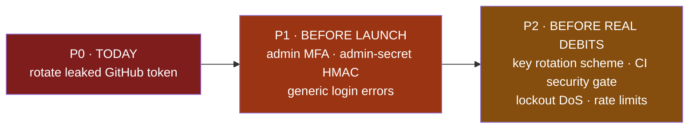

# Security Hardening — Pre-Launch Checklist

Red-team review of the live code. Work top-down: **P0 today, P1 before launch, P2 before real debits.** Tick items as you go. Full reasoning is inline — each item says the risk, where it lives, the fix, and how you know it's done.

> **Verdict:** the *application* is hard to hack — service-layer authorization (IDOR killed), correct AES-256-GCM, idempotent HMAC webhooks, JWT role-version revocation, and CSRF-origin checks are all implemented correctly. The realistic way in is **leaked secrets** and **a phished/breached admin password (no MFA)**. Close P0 + P1 and you've shut the practical attacker out.

---

## ✅ Already strong — do not redo

- **IDOR**: every member service method calls `assertCanAccess(targetUserId, requesterId, roles)` ([member.service.ts](apps/web/services/member.service.ts), [authorization.ts](apps/web/lib/authorization.ts)) — routes never trust the URL `id`.
- **SQL injection**: none — only parameterized tagged-template `$queryRaw` ([notification.repository.ts](apps/web/repositories/notification.repository.ts)); no `queryRawUnsafe`.
- **Encryption**: correct AES-256-GCM, random IV per value, auth tag ([encryption.ts](apps/web/lib/encryption.ts)).
- **Webhooks**: HMAC → IP allowlist → exactly-once dedupe → release-on-failure ([netcash/route.ts](apps/web/app/api/v1/webhooks/netcash/route.ts)).
- **Session revocation**: JWT `roleVersion` checked in middleware; role/status change forces re-auth ([middleware.ts](apps/web/middleware.ts)).
- **CSRF**: origin validation on all mutating authenticated requests ([middleware.ts:139](apps/web/middleware.ts#L139)).
- **Enumeration**: forgot-password always returns 200.

---

## 🔴 P0 — Already exposed (do today)

- [ ] **Rotate the GitHub Personal Access Token.** It has been pasted in plaintext and passed on the command line repeatedly, so it lives in chat logs, shell history, and process listings. Anyone with it has full repo read/write — they can read all code and push a commit that exfiltrates `ENCRYPTION_KEY` or bank numbers, silently.
  - **Fix:** GitHub → Settings → Developer settings → **revoke** it → issue a new one → store it via `gh auth login` or a git credential helper so it never appears in a command again.
  - **Also rotate** anything else ever echoed in a terminal: `AUTH_SECRET`, `ADMIN_API_SECRET`, Netcash keys (and `ENCRYPTION_KEY` — but follow `docs/runbook.md`, "Rotating the encryption key"; replacing that variable on its own makes every stored bank and ID number unreadable).
  - **Done when:** old token returns 401; new credential is not visible in any command or file.

---

## 🟠 P1 — Realistic break-ins (before launch)

- [ ] **Add TOTP MFA for ADMIN logins.** Auth is password-only ([auth.ts](apps/web/lib/auth.ts)). The admin account moves everyone's money and reads all PII, so a phished or reused password = total compromise. This is the highest bang-for-buck item.
  - **Fix:** TOTP (authenticator app) as a second factor, enforced for any user with the `ADMIN` role. Store the secret encrypted (reuse [encryption.ts](apps/web/lib/encryption.ts)).
  - **Done when:** an ADMIN cannot complete login with password alone.

- [ ] **Harden the admin↔web internal trust boundary.** A valid `x-admin-secret` bypasses session/CSRF/role entirely and the acting admin id is taken from the spoofable `x-admin-user-id` header ([middleware.ts:101](apps/web/middleware.ts#L101), [internal-request.ts](apps/web/lib/internal-request.ts)). One static string guards the whole admin API, and the audit log can be forged.
  - **Fix (all three):**
    1. Replace `!==`/`===` secret comparisons with `crypto.timingSafeEqual` (both [middleware.ts:103](apps/web/middleware.ts#L103) and [internal-request.ts:19](apps/web/lib/internal-request.ts#L19)).
    2. Sign requests: `HMAC(secret, timestamp + method + path + body)` and bind `x-admin-user-id` *inside* the signature so it can't be swapped.
    3. Add a one-time nonce (Redis `SETNX`, short TTL) to kill replay within the 5-minute window.
  - **Later:** prefer a short-lived signed JWT minted by the admin app over a static shared secret.
  - **Done when:** a request with the right secret but a tampered `x-admin-user-id` or a replayed nonce is rejected.

- [ ] **Make login errors generic (stop email enumeration).** Login returns distinct `EMAIL_NOT_VERIFIED` / `PENDING_ACTIVATION` vs invalid-credentials ([auth.ts](apps/web/lib/auth.ts)), so an attacker can enumerate members then target them.
  - **Fix:** return a single generic "invalid credentials" on the login path for unknown/unverified/pending; reveal real status only *after* the password verifies.
  - **Done when:** unknown vs unverified emails produce identical responses pre-password.

---

## 🟡 P2 — Secrets, blast radius & operations (before real debits)

- [x] **Versioned `ENCRYPTION_KEY` scheme.** ~~Today it's a single key that "must never change" — which also means one leak exposes every record with no clean rotation path.~~
  - **Done.** Ciphertext is written as `v1.<keyId>.<base64(iv ‖ tag ‖ ciphertext)>`. `ENCRYPTION_KEY_ID` names the key that writes; `ENCRYPTION_PREVIOUS_KEYS` holds retired keys for reading only. `npm run secrets:reencrypt` moves stored rows onto the active key and refuses to report success while anything is unreadable. Values written before this carry no id and are read by trying each key — safe because GCM authenticates a wrong key rather than returning nonsense.
  - A new key can now be introduced without rewriting existing rows, and the old one retired once the backfill is clean. The procedure is `docs/runbook.md`, "Rotating the encryption key" — step 3 (delete the old key) is what actually ends an exposure, and it is the step nobody can skip.
  - Keys stay in the encrypted env store only. No error or log line in `keyring.ts` carries key material, ciphertext or plaintext; a test asserts it.

- [ ] **Lockout should not be a DoS lever.** A hard account lock after N fails lets an attacker lock a known member out before debit day.
  - **Fix:** prefer IP-scoped exponential backoff; keep `LOCKOUT_DURATION_MINUTES` short and **notify** the user instead of silently blocking.
  - **Done when:** repeated failures from one IP throttle without indefinitely locking the victim.

- [ ] **Re-enable CI with a security gate.** No automated dependency/secret scan runs today (Actions minutes exhausted).
  - **Fix:** restore CI (GitHub Pro), add `npm audit --production` and a secret scanner (gitleaks) to the gate.
  - **Done when:** a PR with a known-vulnerable dep or a committed secret fails CI.

- [ ] **Global read rate-limit.** Mutations are well-limited, but authenticated GETs rely on Vercel edge only — a logged-in member could scrape/hammer.
  - **Fix:** add a coarse per-user sliding-window limiter as a backstop.

- [ ] **Don't rely on the leftmost `x-forwarded-for`.** The webhook IP check reads `x-forwarded-for.split(',')[0]` ([netcash/route.ts:42](apps/web/app/api/v1/webhooks/netcash/route.ts#L42)), which is partly client-influenced. HMAC is the real gate, so this is defense-in-depth only.
  - **Fix:** read Vercel's trusted client IP rather than the raw header.

- [ ] **Review signature upload / PDF for SSRF + content injection.** Confirm the admin signature upload is type/size-validated and that react-pdf never fetches attacker-supplied remote image URLs. (Lower risk — renders server-side to PDF, not a browser.)

- [ ] **Verify CSP + HSTS are actually emitted** in `next.config` response headers (not just documented).

---

## Priority summary

| When | Items |
|---|---|
| **Today** | Rotate GitHub token + any echoed secrets |
| **Before launch** | Admin MFA · admin-secret HMAC/nonce/timingSafeEqual · generic login errors |
| **Before real debits** | Versioned encryption key · CI security gate · lockout backoff · global read limit |
| **Soon after** | Trusted client IP · signature/PDF SSRF review · confirm CSP/HSTS |

The way in is leaked secrets and a password-only admin — not a code exploit. Fix P0 tonight and P1 before you flip Netcash to live.
