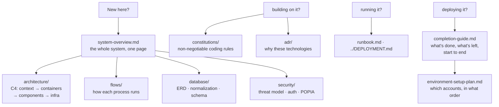

# Documentation Index

**Xkimm Xa Mali Foundation (XXM)** — a real-money family savings platform. Next.js 15 · PostgreSQL · Vercel. Data classification: **financial + PII, highest sensitivity** (POPIA).

---

## Picking this up after a break?

Read **[completion-guide.md](./completion-guide.md)** first — where the system
stands, what only a human can finish, and the order to do it in.

---

## Start here

| Document | Purpose |
|---|---|
| [system-overview.md](./system-overview.md) | Full architecture — stack, bounded contexts, data flow, security, build phases |
| [requirements.md](./requirements.md) | Functional + non-functional requirements, constraints, v2 scope |
| [build-order.md](./build-order.md) | Module build sequence M01–M12 + production hardening record |
| [api-contract.yaml](./api-contract.yaml) | OpenAPI 3.1 spec for every `/api/v1/` endpoint |

## Architecture — C4 model

| Document | Level |
|---|---|
| [architecture/01-system-context.md](./architecture/01-system-context.md) | L1 — actors + external systems |
| [architecture/02-container-architecture.md](./architecture/02-container-architecture.md) | L2 — apps, database, jobs, request lifecycle |
| [architecture/03-component-architecture.md](./architecture/03-component-architecture.md) | L3 — layers + dependency rules |
| [architecture/04-infrastructure-deployment.md](./architecture/04-infrastructure-deployment.md) | Deploy topology, CI/CD, environments |

## Data flows

Sequence diagrams for each major process.

| Document | Flow |
|---|---|
| [flows/01-auth-flow.md](./flows/01-auth-flow.md) | Login, JWT, lockout, logout |
| [flows/02-payment-flow.md](./flows/02-payment-flow.md) | Debit run → Netcash → webhook → ledger |
| [flows/03-contribution-lifecycle.md](./flows/03-contribution-lifecycle.md) | `PENDING → PAID / OVERDUE` state machine |
| [flows/04-notification-pipeline.md](./flows/04-notification-pipeline.md) | Queue → SMS / email / inbox delivery |
| [flows/05-invite-registration-flow.md](./flows/05-invite-registration-flow.md) | Invitation → onboarding |

## Database

| Document | Purpose |
|---|---|
| [database/01-erd.md](./database/01-erd.md) | Entity-relationship diagram (34 models) |
| [database/02-normalization.md](./database/02-normalization.md) | 3NF proof |
| [database/03-schema-design.md](./database/03-schema-design.md) | Enums, indexes, integrity constraints |

## Security & decisions

| Document | Purpose |
|---|---|
| [security/01-security-architecture.md](./security/01-security-architecture.md) | Threat model, auth, encryption, POPIA |
| [adr/001-netcash-over-payfast.md](./adr/001-netcash-over-payfast.md) | Netcash over PayFast |
| [adr/002-inngest-job-engine.md](./adr/002-inngest-job-engine.md) | Inngest over Vercel Cron |
| [adr/003-neon-over-supabase.md](./adr/003-neon-over-supabase.md) | Neon over Supabase |

## Building & operating

| Document | Purpose |
|---|---|
| [constitutions/backend.md](./constitutions/backend.md) · [frontend.md](./constitutions/frontend.md) · [database.md](./constitutions/database.md) · [security.md](./constitutions/security.md) · [infra.md](./constitutions/infra.md) | Non-negotiable coding standards per layer |
| [runbook.md](./runbook.md) | Incident response — failed debits, stuck transactions |
| [../DEPLOYMENT.md](../DEPLOYMENT.md) | Ordered go-live runbook |
| [../CONTRIBUTING.md](../CONTRIBUTING.md) | Contribution guide |

---

**Diagrams** use [Mermaid](https://mermaid.js.org/) (rendered natively on GitHub): `flowchart` for structure & decisions, `sequenceDiagram` for time-ordered interactions, `erDiagram` for the data model, `stateDiagram` for lifecycles.
