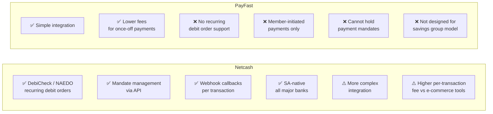

# ADR-001 — Netcash over PayFast for Payment Processing

| | |
|---|---|
| **Status** | Accepted |
| **Date** | 2024-01 |
| **Deciders** | Kurhula Success Maluleke |

---

## Context

Xkimm Xa Mali is a South African family savings group where members contribute a fixed monthly amount via recurring debit orders. The payment processor must support:

1. **Recurring debit orders** initiated by the group (not by the member clicking "pay")
2. **SA banking rails** — DebiCheck and NAEDO
3. **Mandate management** — collecting and managing bank authorisations
4. **Webhook result callbacks** — async notification of success/failure per transaction

---

## Decision

Use **Netcash** as the payment processor.

---

## Options Considered

| Criterion | Netcash | PayFast |
|---|---|---|
| Recurring debit orders (group-initiated) | Yes | No |
| DebiCheck support | Yes | No |
| Mandate management API | Yes | No |
| Webhook per transaction | Yes | Yes |
| SA banking coverage | All major banks | Card-based |
| Integration complexity | Higher | Lower |
| Fee model | Per debit + monthly | % of transaction |

---

## Rationale

PayFast is an e-commerce payment gateway — it processes card payments and EFT that the customer initiates. It has no concept of a recurring debit order, a payment mandate, or group-initiated collections.

Netcash is the industry-standard tool for this use case in South Africa. The DebiCheck scheme (mandatory for new debit orders since 2021) requires the bank to authenticate the mandate with the account holder — Netcash handles this natively.

The higher integration complexity is accepted because there is no viable alternative for the core business function.

---

## Consequences

- Outbound: submit debit batch → Netcash API
- Inbound: webhook callbacks per transaction (SUCCESS / FAILED / REVERSED)
- Mandate lifecycle: PENDING → ACTIVE → SUSPENDED → CANCELLED
- Webhook verification: HMAC-SHA256 signature on every callback
- IP allowlist: Netcash callback IPs added to Vercel trusted IPs

See [docs/flows/02-debit-run-flow.md](../flows/02-debit-run-flow.md) and [docs/flows/03-mandate-setup-flow.md](../flows/03-mandate-setup-flow.md) for full sequence diagrams.
