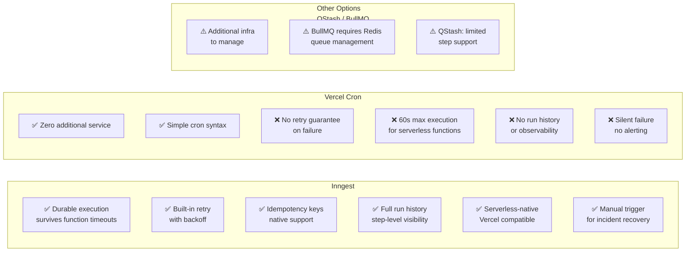

# ADR-002 — Inngest over Vercel Cron for the Job Engine

| | |
|---|---|
| **Status** | Accepted |
| **Date** | 2024-01 |
| **Deciders** | Kurhula Success Maluleke |

---

## Context

The debit run is the most critical system operation. It runs at 20:00 SAST on every debit day and submits payment requests to Netcash for each active mandate. The job engine must:

1. **Guarantee execution** — a missed debit run means members are not charged, breaking the group's finances
2. **Retry on failure** — transient errors (Netcash timeout, DB blip) must not result in missed charges
3. **Idempotency** — retried jobs must not double-charge members
4. **Observability** — full history of every run, every step, every failure

Additionally, the morning warning job (07:00 SAST) sends SMS warnings before debit day, and the overdue reminder job runs daily for members with failed charges.

---

## Decision

Use **Inngest** as the job engine.

---

## Options Considered

| Criterion | Inngest | Vercel Cron | QStash |
|---|---|---|---|
| Retry on failure | Yes (configurable) | No | Yes |
| Durable multi-step jobs | Yes | No | Limited |
| Idempotency built-in | Yes | No | No |
| Run history & logs | Full | None | Limited |
| Manual trigger (incident recovery) | Yes | No | Yes |
| Vercel serverless compatible | Yes | Yes | Yes |
| Function timeout limit | None (multi-step) | 60s | 60s |

---

## Rationale

Vercel Cron triggers a serverless function on a schedule — that is all it does. If the function throws, nothing retries. If it times out at 60 seconds (common when submitting 50 mandates serially), the job dies silently. There is no dashboard, no history, and no way to know whether charges were submitted.

For a monthly financial operation affecting real money, silent failure is unacceptable.

Inngest wraps the job in a durable execution envelope. Each step is checkpointed. If Netcash returns a 503, Inngest retries that step after a backoff delay. The Inngest dashboard shows every invocation, every step, every error. In an incident, the job can be re-triggered manually with the same idempotency key — already-submitted mandates are skipped.

---

## Consequences

- All scheduled jobs defined in `packages/jobs/` as Inngest functions
- `apps/web` serves the Inngest webhook endpoint at `/api/inngest`
- The Inngest endpoint is an L3 (system) route — HMAC-verified, no session
- Inngest is NOT wrapped by `withApiHandler` (its own signature verification handles request integrity)
- Production secret: `INNGEST_SIGNING_KEY` + `INNGEST_EVENT_KEY` in environment
- Local development: `npx inngest-cli@latest dev` alongside `npm run dev`

See [docs/flows/02-debit-run-flow.md](../flows/02-debit-run-flow.md) for the full debit run sequence diagram.
