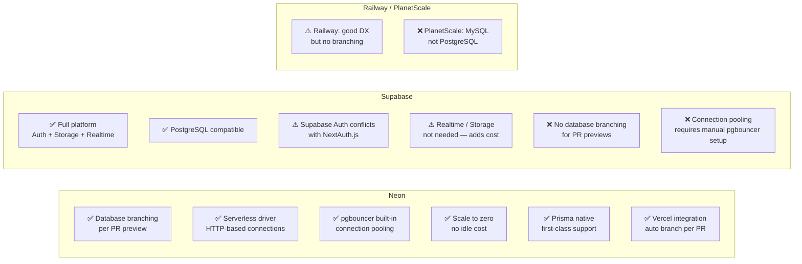

# ADR-003 — Neon over Supabase for PostgreSQL Hosting

| | |
|---|---|
| **Status** | Accepted |
| **Date** | 2024-01 |
| **Deciders** | Kurhula Success Maluleke |

---

## Context

Xkimm Xa Mali requires PostgreSQL with ACID guarantees for financial data. The hosting provider must work well with:

1. **Vercel serverless** — connection pooling is essential; PostgreSQL connections are expensive in serverless environments
2. **Prisma ORM** — the project uses Prisma for all DB access
3. **Branch-per-PR preview** — Vercel creates preview deployments per PR; the DB layer should support isolated preview databases
4. **Zero ops overhead** — no DBA on the team; the service must handle backups, failover, and maintenance

---

## Decision

Use **Neon** as the PostgreSQL hosting provider.

---

## Options Considered

| Criterion | Neon | Supabase |
|---|---|---|
| PostgreSQL | Yes | Yes |
| Database branching for PR previews | Yes | No |
| Serverless-native connection pooling | Yes (built-in pgbouncer) | Manual setup |
| Scale-to-zero (cost) | Yes | No (always-on) |
| Prisma compatibility | First-class | Good |
| Vercel GitHub integration | Native | Manual |
| Bundled services (Auth, Storage) | No — DB only | Yes |

---

## Rationale

Supabase is a full-stack BaaS platform that bundles Auth, Storage, Realtime subscriptions, and Edge Functions on top of PostgreSQL. For this project, those bundled services conflict:

- **Supabase Auth** conflicts with NextAuth.js (the selected auth solution per the security architecture)
- **Supabase Storage** is redundant — Vercel Blob is used for statement PDFs
- **Realtime** is not needed — the member portal does not require live updates

Paying for a bundled platform and only using the DB layer is wasteful, and the bundled services would create confusion about which auth system is canonical.

Neon does one thing: managed PostgreSQL. Its key advantage is **database branching** — each PR in the Vercel integration automatically gets its own Neon branch with a full copy of the schema. This means preview deployments have completely isolated data, so testing a migration on a PR cannot corrupt staging data.

The Neon serverless driver uses HTTP-based connections rather than persistent TCP, which is the correct model for Vercel serverless functions where a new function instance has no connection pool to reuse.

---

## Consequences

- Database URL format: `postgresql://...@<neon-host>/xxm?pgbouncer=true&connect_timeout=10`
- Local development uses a Neon dev branch (not a local Postgres container)
- PR previews: Vercel × Neon integration auto-creates and tears down branches
- Prisma migrations run on deploy via `prisma migrate deploy` in CI
- Connection pool: pgbouncer in transaction mode (Neon handles this automatically)
- Backups: Neon continuous WAL archiving — point-in-time recovery available

See [docs/constitutions/database.md](../constitutions/database.md) for schema rules and migration conventions.
