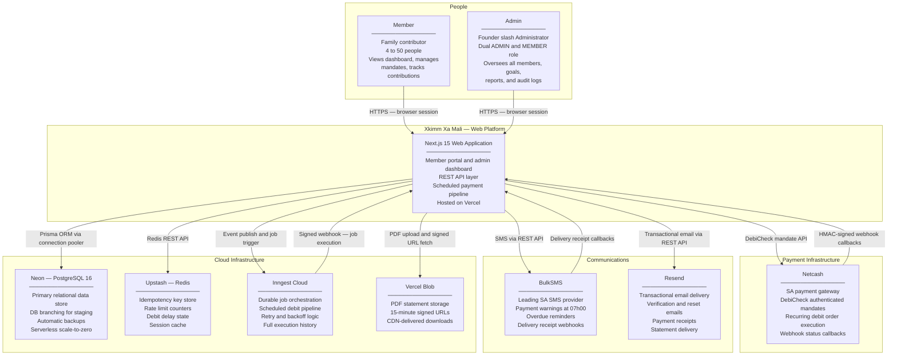
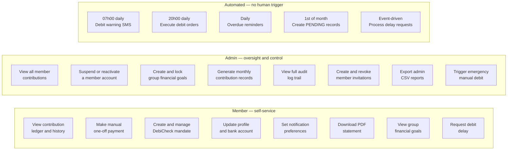
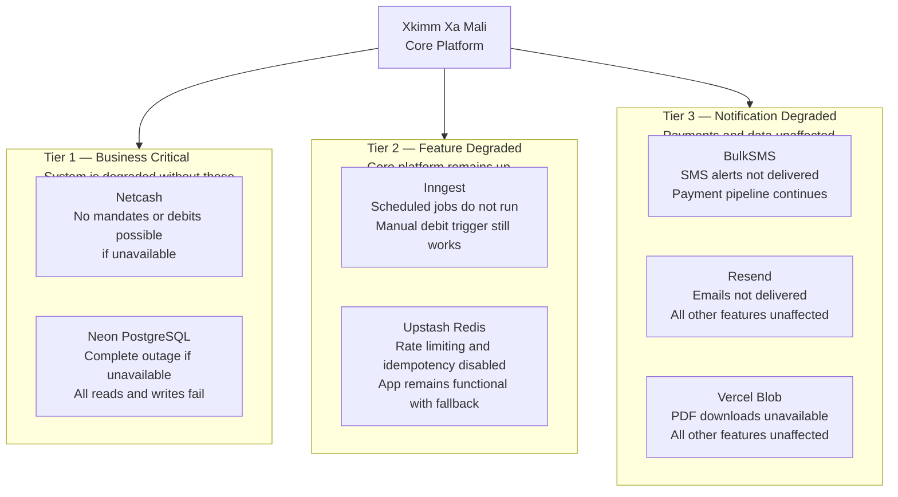

# System Context — C4 Level 1

| | |
|---|---|
| **Purpose** | Defines the system boundary, its actors, and every external system it integrates with |
| **C4 Level** | Level 1 — System Context |
| **Audience** | All stakeholders — technical and non-technical |
| **Related Docs** | [02-container-architecture.md](./02-container-architecture.md) · [../database/01-erd.md](../database/01-erd.md) · [../flows/02-payment-flow.md](../flows/02-payment-flow.md) |

---

## What Is Xkimm Xa Mali?

Xkimm Xa Mali (XXM) is a private financial contribution management platform built for a family savings group. It automates monthly debit orders, tracks every rand contributed, manages member banking mandates, and gives every member a live view of their financial standing within the group — all without requiring manual collection or spreadsheet tracking.

| Attribute | Value |
|---|---|
| **Scale target** | 4 to 50 members |
| **Minimum contribution** | R100 per month per member |
| **Payment mechanism** | Automated DebiCheck debit orders via Netcash |
| **Data classification** | Financial PII — highest sensitivity tier |
| **Compliance** | POPIA (Protection of Personal Information Act, SA) |
| **Platform** | Web-first, PWA-capable, mobile-optimised |

---

## Diagram 1 — System Context (C4 Level 1)

> Every actor and external system the platform touches, and why.

---

## Diagram 2 — Actor Responsibilities

> What each actor does inside the platform.

---

## Diagram 3 — External System Integration Map

> Classifies each external dependency by criticality and failure behaviour.

---

## External Integration Summary

| System | Provider | Protocol | Auth Method | Failure Impact |
|---|---|---|---|---|
| Debit order gateway | Netcash | SOAP/REST over HTTPS | Service key header | No mandate or debit operations |
| Netcash callbacks | Netcash | HTTP POST webhook | HMAC-SHA256 signature | Mandate status not synced |
| SMS delivery | BulkSMS | REST over HTTPS | Basic Auth | SMS alerts not sent |
| SMS callbacks | BulkSMS | HTTP POST webhook | IP allowlist | Delivery status not tracked |
| Email delivery | Resend | REST over HTTPS | API key bearer | Emails not delivered |
| Primary database | Neon PostgreSQL | TCP via pgbouncer | TLS connection string | Full service outage |
| Cache and rate limiting | Upstash Redis | HTTPS REST | Bearer token | Rate limiting and idempotency disabled |
| Job orchestration | Inngest Cloud | HTTPS webhook | Signing key (HMAC) | Scheduled jobs do not run |
| File storage | Vercel Blob | HTTPS REST | Bearer token | PDF statements unavailable |
