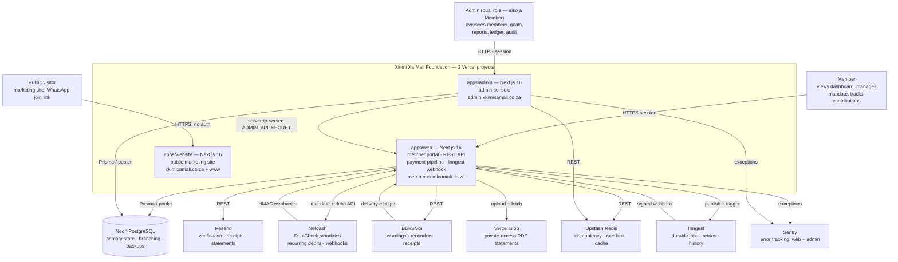
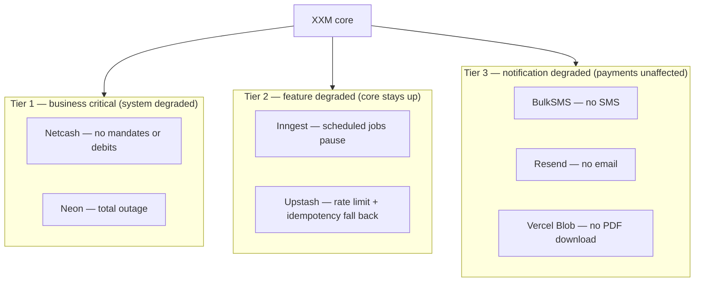

# System Context — C4 Level 1

The system boundary: who uses XXM and every external system it depends on. Audience: everyone. Next: [02-container-architecture.md](./02-container-architecture.md).

| | |
|---|---|
| Scale | 4–50 members · R100 min/month |
| Payments | Netcash DebiCheck debit orders |
| Data | Financial PII — highest tier (POPIA) |
| Platform | Web-first, PWA-capable |

---

## Context

**Not one app — three, each its own Vercel deployment**, sharing one
database and one set of internal packages. Prior versions of this diagram
showed a single "Next.js platform" box; that stopped being accurate once
`apps/admin` and `apps/website` became separate deployments
(`admin.xkimixamali.co.za`, `xkimixamali.co.za`) rather than routes inside
`apps/web`.

Every app shares the same `packages/database` Prisma schema and the same
`packages/utils`/`packages/ui`/`packages/observability` internal libraries
— there is one data model and one set of business-rule helpers, not three
copies. See [02-container-architecture.md](./02-container-architecture.md)
for how the shared-package layer fits in.

---

## Actors

| Member (self-service) | Admin (oversight) | Automated (no human) |
|---|---|---|
| View contribution ledger & history | View all member contributions | 07:00 debit warning SMS |
| Make manual one-off payment | Suspend / reactivate members | 20:00 execute debit orders |
| Create & manage mandate | Create & lock group goals | Daily overdue reminders |
| Update profile & bank account | Generate monthly records | 1st-of-month record creation |
| Set notification preferences | Approve / reject mandates | Process delay requests |
| Download PDF statement | View audit log & ledger | Nightly ledger reconciliation |
| View goals & insights | Create / revoke invites; export CSV | Daily financial-anomaly watch |

---

## Dependency criticality

| System | Protocol | Auth | Failure impact |
|---|---|---|---|
| Netcash (debit + webhook) | SOAP 1.1 (hand-written client against the published WSDL) + HMAC webhook | Service key · HMAC-SHA256 + IP allowlist | No debit operations / status sync |
| BulkSMS | REST/JSON + webhook | Basic auth · IP allowlist | No SMS / no receipts |
| Resend | REST | API key | No email |
| Neon | TCP via pgbouncer | TLS string | Full outage |
| Upstash | REST | Bearer | Rate limit + idempotency disabled |
| Inngest | Webhook | Signing key (HMAC) | Jobs paused |
| Vercel Blob | REST | Bearer | PDFs unavailable (private access — not a public CDN URL) |
| Sentry | HTTPS event ingest | DSN (public by design) | Errors go uncaptured, app itself unaffected |
