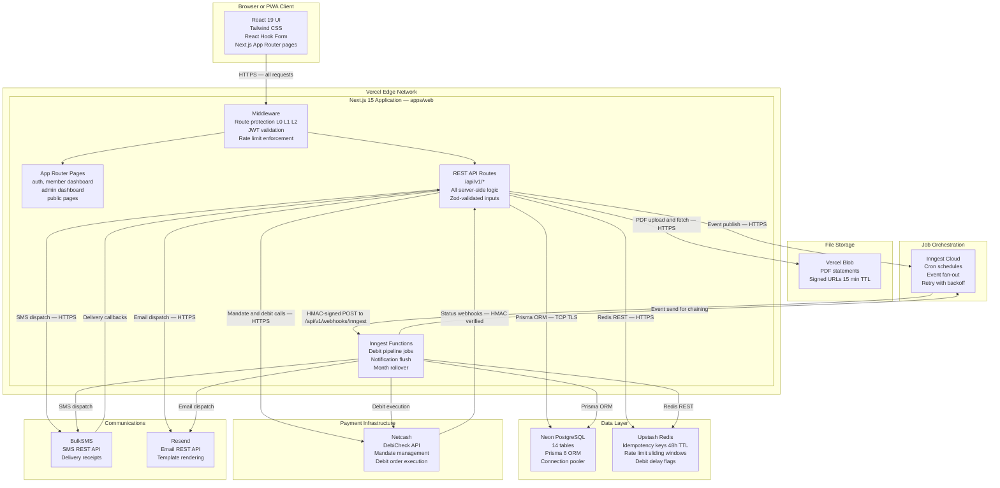
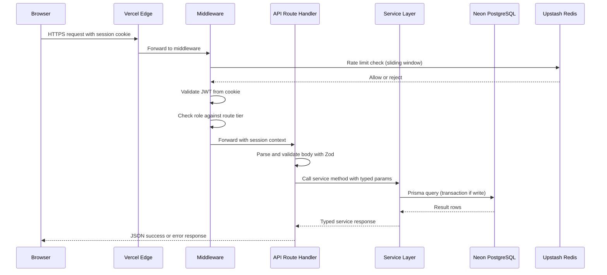
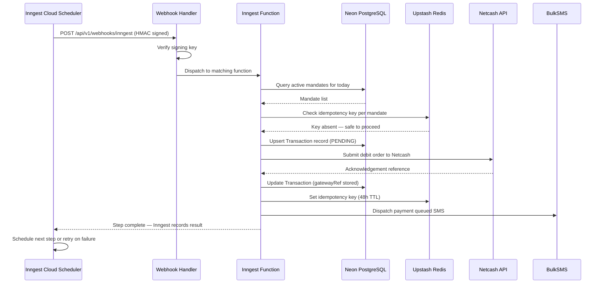
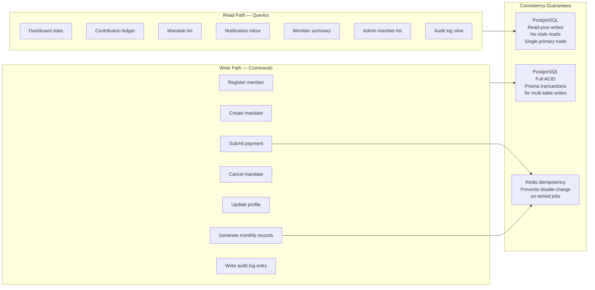

# Container Architecture — C4 Level 2

| | |
|---|---|
| **Purpose** | Shows the major technical containers inside XXM and how they communicate |
| **C4 Level** | Level 2 — Containers |
| **Audience** | Engineers, DevOps, technical leads |
| **Related Docs** | [01-system-context.md](./01-system-context.md) · [03-component-architecture.md](./03-component-architecture.md) · [04-infrastructure-deployment.md](./04-infrastructure-deployment.md) |

---

## Container Overview

XXM is a monorepo with two workspaces. All application logic lives in a single Next.js deployment — there is no separate backend service. The database package exists purely to own the Prisma schema and migrations; it has no runtime server.

| Container | Technology | Responsibility |
|---|---|---|
| Web Application | Next.js 15, TypeScript, React 19 | Member portal, admin dashboard, REST API, job webhook receiver |
| Primary Database | Neon PostgreSQL 16 via Prisma 6 | All persistent data — users, mandates, contributions, audit logs |
| Cache and Rate Limiter | Upstash Redis via REST | Idempotency keys, rate limit counters, debit delay state |
| Job Engine | Inngest Cloud | Durable scheduled jobs — debit pipeline, month rollover, notifications |
| File Storage | Vercel Blob | PDF statement storage with signed URL delivery |
| SMS Gateway | BulkSMS REST API | Outbound SMS — warnings, reminders, receipts |
| Email Service | Resend REST API | Transactional emails — verification, reset, receipts, statements |
| Payment Gateway | Netcash DebiCheck API | Mandate registration, debit order submission, status webhooks |

---

## Diagram 1 — Container Architecture (C4 Level 2)

---

## Diagram 2 — HTTP Request Lifecycle

> Traces a typical authenticated member API request from browser to database and back.

---

## Diagram 3 — Inngest Job Execution Lifecycle

> Traces how a scheduled debit job travels from Inngest Cloud into the application.

---

## Diagram 4 — Write Path vs Read Path

> Separates commands (writes) from queries (reads) to show consistency guarantees.

---

## Container Responsibility Matrix

| Container | Owns | Does NOT Own |
|---|---|---|
| Next.js API Routes | Request parsing, auth, validation, response formatting | Business logic (delegates to services) |
| Service Layer | Business logic, DB orchestration, external API calls | HTTP concerns, request/response shapes |
| Prisma ORM | Query building, connection management, type safety | Business rules, validation |
| Middleware | Route protection, JWT decode, rate limit enforcement | Authentication logic (delegates to NextAuth) |
| Inngest Functions | Job orchestration, retry strategy, step sequencing | Business logic (delegates to services) |
| Redis | Idempotency, rate state, delay flags | Persistent data (only ephemeral state) |
