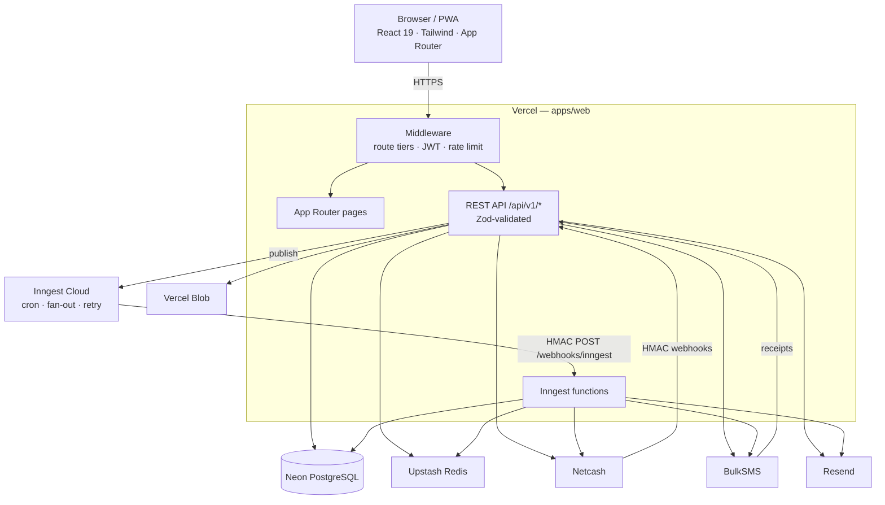
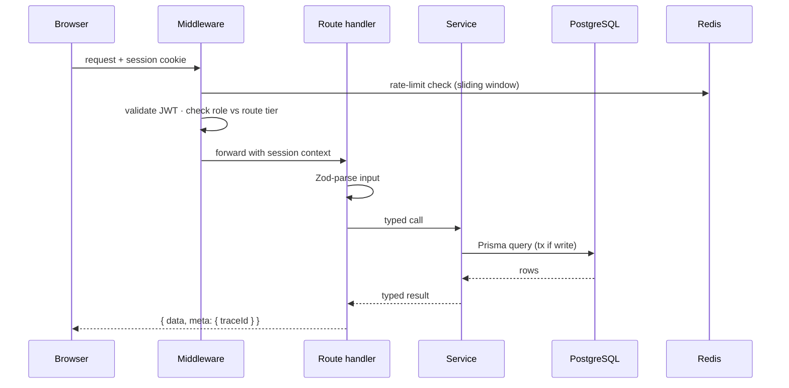
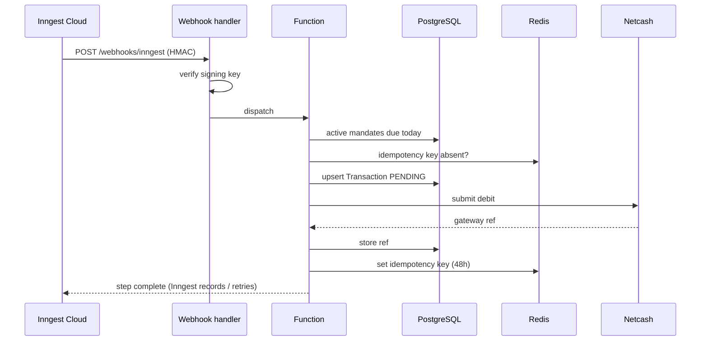

# Container Architecture — C4 Level 2

The technical containers inside XXM and how they talk. All application logic lives in one Next.js deployment — there is no separate backend service; `packages/database` only owns the Prisma schema. Prev: [01-system-context.md](./01-system-context.md) · Next: [03-component-architecture.md](./03-component-architecture.md).

| Container | Tech | Responsibility |
|---|---|---|
| Web application | Next.js 15 · React 19 · TS | Portal, admin API, REST API, job webhook receiver |
| Database | Neon PostgreSQL 16 · Prisma 6 | All persistent data (34 models) |
| Cache / limiter | Upstash Redis | Idempotency keys, rate-limit counters, delay flags |
| Job engine | Inngest Cloud | Durable scheduled jobs — debits, rollover, reconciliation, notifications |
| File storage | Vercel Blob | Signed-URL PDF statements |
| Gateways | Netcash · BulkSMS · Resend | Debits, SMS, email |

---

## Containers

---

## Request lifecycle (authenticated read)

## Job lifecycle (debit run)

> Settlement (webhook → Transaction SUCCESS/FAILED/REVERSED → Contribution status → **ledger CREDIT/DEBIT** → notifications) is covered in [../flows/02-payment-flow.md](../flows/02-payment-flow.md).

---

## Consistency & responsibilities

- **Writes** → PostgreSQL with full ACID; multi-table writes run in Prisma transactions. Money-moving writes (`debit.run`, month rollover) are guarded by Redis idempotency keys + DB `UNIQUE` constraints.
- **Reads** → single primary node, read-your-writes, no stale reads.

| Container | Owns | Does **not** own |
|---|---|---|
| API routes | Parsing, auth, validation, response shape | Business logic (delegates to services) |
| Service layer | Business logic, DB orchestration, external calls | HTTP concerns |
| Prisma | Query building, connection, type safety | Business rules |
| Middleware | Route protection, JWT decode, rate limit | Auth logic (NextAuth) |
| Inngest functions | Orchestration, retry, step sequencing | Business logic (delegates to services) |
| Redis | Idempotency, rate state, delay flags | Persistent data |
