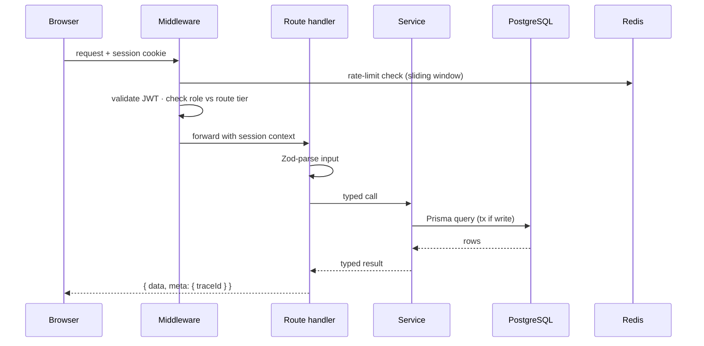
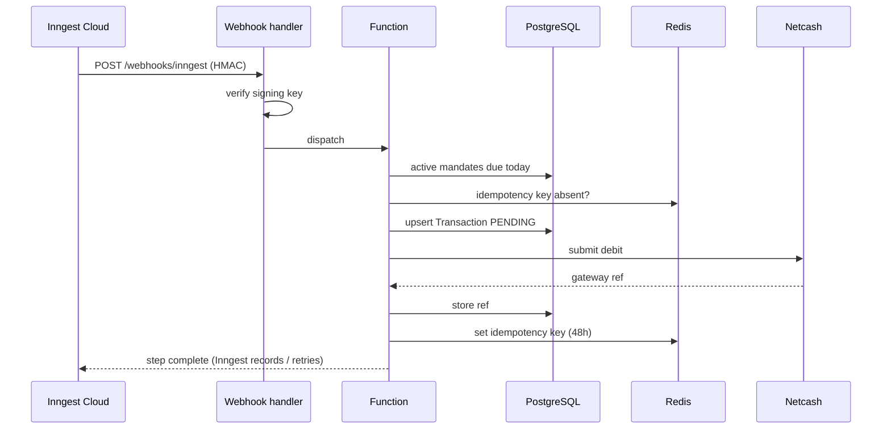

# Container Architecture — C4 Level 2

The technical containers inside XXM and how they talk. **Three separate
Next.js deployments** (not one) share a single database and a set of
internal npm-workspace packages consumed as TypeScript source (no build
step — `transpilePackages`, not published to a registry). Prev:
[01-system-context.md](./01-system-context.md) · Next:
[03-component-architecture.md](./03-component-architecture.md).

| Container | Tech | Responsibility |
|---|---|---|
| `apps/web` | Next.js 16 · React 19 · TS | Member portal, REST API (`/api/v1/*`), Netcash/BulkSMS/Inngest webhook receivers, the payment pipeline |
| `apps/admin` | Next.js 16 · React 19 · TS | Admin console — server actions, not its own REST API; reaches member data via server-to-server calls into `apps/web` (`WEB_INTERNAL_URL` + shared `ADMIN_API_SECRET`) or directly via Prisma against the same database |
| `apps/website` | Next.js 16 · React 19 · TS | Public marketing site — no database, no auth, no payment deps at all; reads only the public stats endpoint |
| Shared packages | `@xxm/database` · `@xxm/utils` · `@xxm/ui` · `@xxm/observability` · `@xxm/types` · `@xxm/config` | Prisma schema/migrations, business-rule helpers (money, dates, SA ID/bank validation, encryption), a hand-built component library, a structured logger wrapping Sentry, shared TS types, shared tsconfig/Tailwind/ESLint base — consumed by all 3 apps, not duplicated per app |
| Database | Neon PostgreSQL · Prisma 6 | All persistent data — see `packages/database/prisma/schema.prisma` and its `migrations/` directory |
| Cache / limiter | Upstash Redis | Idempotency keys, rate-limit counters, delay flags |
| Job engine | Inngest Cloud | Durable scheduled/event-driven jobs — 22 functions covering debits, rollover, reconciliation, notifications, badges, DSR deadlines, backups |
| File storage | Vercel Blob (private access) | Member statements/signatures — access is checked against the database, not a guessable public URL |
| Error tracking | Sentry | `web` and `admin` each have their own Sentry project; `apps/website` has no Sentry integration |
| Gateways | Netcash · BulkSMS · Resend | Debits, SMS, email |

---

## Containers

```mermaid
flowchart TB
    UI["Member browser / PWA"]
    ADMINUI["Admin browser"]
    SITEUI["Public visitor"]

    subgraph VERCEL_WEB["Vercel — apps/web"]
        MW["Middleware<br/>route tiers · JWT · rate limit"]
        PAGES["App Router pages"]
        API["REST API /api/v1/*<br/>Zod-validated"]
        FN["Inngest functions"]
    end

    subgraph VERCEL_ADMIN["Vercel — apps/admin"]
        AMW["Middleware — JWT · ADMIN role"]
        APAGES["App Router pages + server actions"]
    end

    subgraph VERCEL_SITE["Vercel — apps/website"]
        SPAGES["Static/ISR marketing pages"]
    end

    subgraph SHARED["Shared packages — TS source, no build step"]
        PKGDB["@xxm/database — Prisma schema"]
        PKGUTIL["@xxm/utils — money, dates, validation, encryption"]
        PKGUI["@xxm/ui — component library"]
        PKGOBS["@xxm/observability — logger → Sentry"]
    end

    NEON[("Neon PostgreSQL")]
    REDIS["Upstash Redis"]
    BLOB["Vercel Blob"]
    INNGEST["Inngest Cloud<br/>cron · fan-out · retry"]
    NETCASH["Netcash"]
    BULKSMS["BulkSMS"]
    RESEND["Resend"]
    SENTRY["Sentry"]

    UI -->|HTTPS| MW --> PAGES & API
    ADMINUI -->|HTTPS| AMW --> APAGES
    SITEUI -->|HTTPS, no auth| SPAGES
    APAGES -->|server-to-server, ADMIN_API_SECRET| API
    INNGEST -->|HMAC POST /webhooks/inngest| FN
    API --> NEON & REDIS & BLOB
    APAGES --> NEON & REDIS
    API --> NETCASH & BULKSMS & RESEND
    NETCASH -->|HMAC webhooks| API
    BULKSMS -->|receipts| API
    API -->|publish| INNGEST
    FN --> NEON & REDIS & NETCASH & BULKSMS & RESEND
    VERCEL_WEB & VERCEL_ADMIN --> SHARED
    VERCEL_SITE -.->|@xxm/ui, @xxm/utils only —<br/>no @xxm/database| SHARED
    PKGDB --> NEON
    PKGOBS --> SENTRY
```

---

## Request lifecycle (authenticated read)



## Job lifecycle (debit run)



> Settlement (webhook → Transaction SUCCESS/FAILED/REVERSED → Contribution status → **ledger CREDIT/DEBIT** → notifications) is covered in [../flows/02-payment-flow.md](../flows/02-payment-flow.md).

---

## Consistency & responsibilities

- **Writes** → PostgreSQL with full ACID; multi-table writes run in Prisma transactions. Money-moving writes (`debit.run`, month rollover) are guarded by Redis idempotency keys + DB `UNIQUE` constraints.
- **Reads** → single primary node, read-your-writes, no stale reads.

| Container | Owns | Does **not** own |
|---|---|---|
| API routes | Parsing, auth, validation, response shape | Business logic (delegates to services) |
| Service layer | Business logic, DB orchestration, external calls | HTTP concerns |
| Prisma | Query building, connection, type safety | Business rules |
| Middleware | Route protection, JWT decode, rate limit | Auth logic (NextAuth) |
| Inngest functions | Orchestration, retry, step sequencing | Business logic (delegates to services) |
| Redis | Idempotency, rate state, delay flags | Persistent data |
