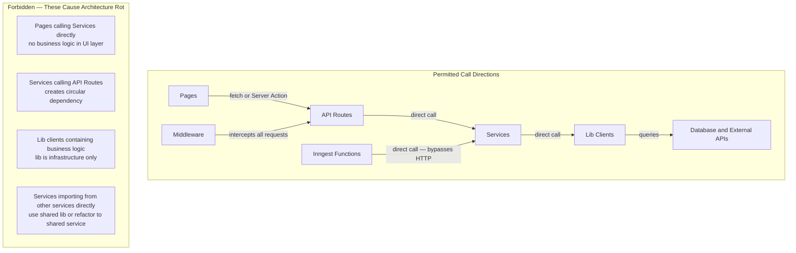
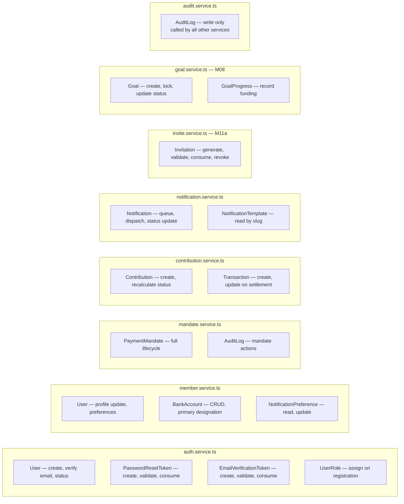
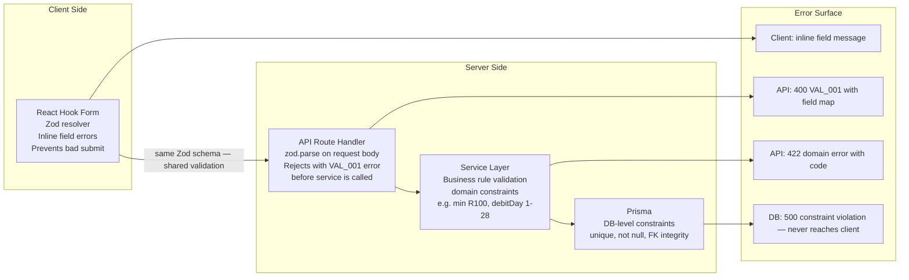

# Component Architecture — C4 Level 3

| | |
|---|---|
| **Purpose** | Shows the internal layers and components of the Next.js application and their dependency rules |
| **C4 Level** | Level 3 — Components |
| **Audience** | Engineers working inside the codebase |
| **Related Docs** | [02-container-architecture.md](./02-container-architecture.md) · [../flows/01-auth-flow.md](../flows/01-auth-flow.md) · [../flows/02-payment-flow.md](../flows/02-payment-flow.md) |

---

## Layer Overview

The Next.js application is structured in strict horizontal layers. Each layer has a single direction of dependency — layers only call downward, never upward. This makes every module independently testable and prevents circular dependency chains.

```
Browser
  └── App Router Pages (UI layer)
        └── API Route Handlers (transport layer)
              └── Service Layer (business logic layer)
                    └── Lib Layer (infrastructure clients)
                          └── External Systems + Database
```

Middleware sits as a vertical cross-cut — it intercepts every request before it reaches any route handler.

Inngest Functions are a parallel execution path — they bypass the HTTP layer entirely and call the service layer directly.

---

## Diagram 1 — Full Component Map

```mermaid
flowchart TD
    subgraph BROWSER["Browser"]
        UI_PAGES["App Router Pages\nauth, member, admin\nServer and Client Components"]
        UI_COMPONENTS["React Components\nui, auth, member\ncontribution, mandate"]
    end

    subgraph MIDDLEWARE_LAYER["Middleware — apps/web/middleware.ts"]
        AUTH_CHECK["JWT validation\nNextAuth session decode"]
        ROLE_CHECK["Route tier enforcement\nL0 public  L1 member  L2 admin"]
        RATE_MW["Rate limit pre-check\nUpstash sliding window"]
    end

    subgraph API_LAYER["API Route Handlers — apps/web/app/api/v1"]
        AUTH_ROUTES["auth/*\nregister, login, reset\nverify, me, change-password"]
        MEMBER_ROUTES["members/[id]/*\nprofile, summary, export"]
        MANDATE_ROUTES["mandates/*\nCRUD, delay"]
        CONTRIB_ROUTES["contributions/*\nledger, pay, generate"]
        BANK_ROUTES["bank-accounts/*\nCRUD"]
        NOTIF_ROUTES["notifications/*\npreferences, inbox"]
        WEBHOOK_ROUTES["webhooks/*\nnetcash, inngest, bulksms"]
        HEALTH_ROUTE["health\nDB and Redis liveness"]
    end

    subgraph SERVICE_LAYER["Service Layer — apps/web/services"]
        AUTH_SVC["auth.service.ts\nregisterUser, login\nresetPassword, verifyEmail"]
        MEMBER_SVC["member.service.ts\nupdateProfile, bankAccounts\nexportPOPIA, summary"]
        MANDATE_SVC["mandate.service.ts\ncreateMandate, updateMandate\ncancelMandate, delayMandate\nprocessWebhook"]
        CONTRIB_SVC["contribution.service.ts\ngenerateMonthly, recordPayment\nrecalculateStatus, getledger"]
        NOTIF_SVC["notification.service.ts\nqueueNotification\ndispatchSMS, dispatchEmail\nupdateStatus"]
        AUDIT_SVC["audit.service.ts\nwriteLog"]
        INVITE_SVC["invite.service.ts\ngenerateCode, validateCode\nconsumeCode, revokeCode"]
    end

    subgraph INNGEST_LAYER["Inngest Functions — apps/web/inngest"]
        JOB1["debit-morning-warning\n07h00 daily cron"]
        JOB2["debit-run\n20h00 daily cron"]
        JOB3["debit-overdue-reminder\ndaily cron"]
        JOB4["contribution-month-rollover\n1st of month cron"]
        JOB5["mandate-delay-handler\nevent-driven"]
        JOB6["notification-flush\nbatch delivery worker"]
    end

    subgraph LIB_LAYER["Lib Layer — apps/web/lib"]
        DB_CLIENT["db.ts\nPrisma singleton"]
        REDIS_CLIENT["redis.ts\nUpstash client\nrate limiter factory"]
        NETCASH_CLIENT["netcash.ts\nDebiCheck API wrapper\ntype-safe methods"]
        BULKSMS_CLIENT["bulksms.ts\nSMS REST client"]
        EMAIL_CLIENT["email.ts\nResend client\nemail templates"]
        INNGEST_CLIENT["inngest.ts\nInngest client\nevent type definitions"]
        ENCRYPT_LIB["encryption.ts\nAES-256-GCM\nencrypt and decrypt"]
        AUTH_LIB["auth.ts\nNextAuth config\nJWT callbacks"]
        ENV_LIB["env.ts\nt3-env validation\ntype-safe env vars"]
        VALIDATION["validation/*\nZod schemas per domain"]
        FORMATTERS["formatters.ts\nZAR currency\ndate formatting SAST"]
        SA_BANKS["sa-banks.ts\nBank account modulus check\nSA bank code registry"]
    end

    UI_PAGES --> UI_COMPONENTS
    UI_PAGES -->|"fetch"| API_LAYER
    MIDDLEWARE_LAYER -->|"wraps every request"| API_LAYER

    AUTH_ROUTES --> AUTH_SVC
    MEMBER_ROUTES --> MEMBER_SVC
    MANDATE_ROUTES --> MANDATE_SVC
    CONTRIB_ROUTES --> CONTRIB_SVC
    NOTIF_ROUTES --> NOTIF_SVC
    WEBHOOK_ROUTES --> MANDATE_SVC
    WEBHOOK_ROUTES --> NOTIF_SVC

    AUTH_SVC --> DB_CLIENT
    AUTH_SVC --> EMAIL_CLIENT
    AUTH_SVC --> ENCRYPT_LIB
    MEMBER_SVC --> DB_CLIENT
    MEMBER_SVC --> ENCRYPT_LIB
    MEMBER_SVC --> SA_BANKS
    MANDATE_SVC --> DB_CLIENT
    MANDATE_SVC --> NETCASH_CLIENT
    MANDATE_SVC --> REDIS_CLIENT
    MANDATE_SVC --> AUDIT_SVC
    CONTRIB_SVC --> DB_CLIENT
    CONTRIB_SVC --> NETCASH_CLIENT
    CONTRIB_SVC --> NOTIF_SVC
    NOTIF_SVC --> DB_CLIENT
    NOTIF_SVC --> BULKSMS_CLIENT
    NOTIF_SVC --> EMAIL_CLIENT
    AUDIT_SVC --> DB_CLIENT
    INVITE_SVC --> DB_CLIENT

    JOB1 --> NOTIF_SVC
    JOB1 --> DB_CLIENT
    JOB2 --> CONTRIB_SVC
    JOB2 --> MANDATE_SVC
    JOB2 --> REDIS_CLIENT
    JOB3 --> NOTIF_SVC
    JOB3 --> DB_CLIENT
    JOB4 --> CONTRIB_SVC
    JOB5 --> MANDATE_SVC
    JOB5 --> REDIS_CLIENT
    JOB6 --> NOTIF_SVC

    AUTH_LIB --> DB_CLIENT
    RATE_MW --> REDIS_CLIENT
    AUTH_CHECK --> AUTH_LIB
```



---

## Diagram 2 — Layer Dependency Rules

> The contract every engineer must follow. Arrows show permitted call directions only.



---

## Diagram 3 — Module-to-Service Ownership

> Which service owns which domain entity.



---

## Diagram 4 — Validation Flow

> How input data is validated across layers before touching the database.



---

## Component Inventory

| Component | File | Layer | Calls |
|---|---|---|---|
| Middleware | `middleware.ts` | Cross-cut | `lib/auth.ts`, `lib/redis.ts` |
| Auth routes | `app/api/v1/auth/*` | API | `auth.service.ts` |
| Mandate routes | `app/api/v1/mandates/*` | API | `mandate.service.ts` |
| Contribution routes | `app/api/v1/contributions/*` | API | `contribution.service.ts` |
| Member routes | `app/api/v1/members/*` | API | `member.service.ts` |
| Netcash webhook | `app/api/v1/webhooks/netcash` | API | `mandate.service.ts` |
| Inngest webhook | `app/api/v1/webhooks/inngest` | API | Inngest SDK handler |
| auth.service | `services/auth.service.ts` | Service | `db`, `email`, `encryption` |
| mandate.service | `services/mandate.service.ts` | Service | `db`, `netcash`, `redis`, `audit` |
| contribution.service | `services/contribution.service.ts` | Service | `db`, `netcash`, `notification` |
| notification.service | `services/notification.service.ts` | Service | `db`, `bulksms`, `email` |
| audit.service | `services/audit.service.ts` | Service | `db` only |
| Debit run job | `inngest/functions/debit-run.ts` | Job | `contribution.service`, `redis` |
| Morning warning job | `inngest/functions/debit-morning-warning.ts` | Job | `notification.service`, `db` |
| Month rollover job | `inngest/functions/contribution-month-rollover.ts` | Job | `contribution.service` |
| Prisma client | `lib/db.ts` | Lib | Neon PostgreSQL |
| Redis client | `lib/redis.ts` | Lib | Upstash Redis |
| Netcash client | `lib/netcash.ts` | Lib | Netcash API |
| Encryption | `lib/encryption.ts` | Lib | Node.js crypto |
| Auth config | `lib/auth.ts` | Lib | NextAuth, `db` |
| Env validation | `lib/env.ts` | Lib | process.env |
