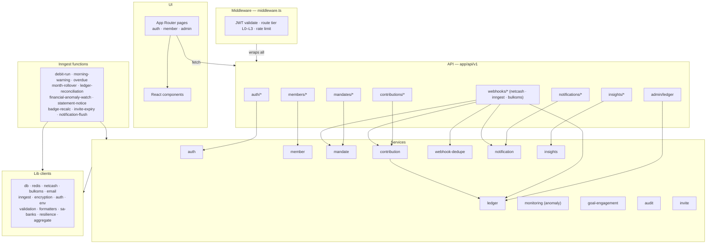
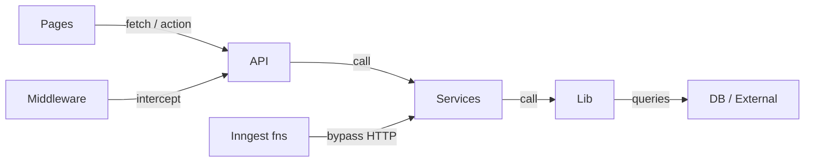

# Component Architecture — C4 Level 3

The internal layers of `apps/web` and the dependency rules that keep them clean. `apps/web` carries almost all of the business logic in this system — `apps/admin` is deliberately thin (pages, server actions, and `requireAdmin`; no service layer of its own, no REST API), reaching the same data either directly via Prisma against the shared database or server-to-server into `apps/web`'s API. `apps/website` has no service layer at all. Prev: [02-container-architecture.md](./02-container-architecture.md).

Strict horizontal layering — each layer calls **only downward**:

```
Pages → API routes → Services → Lib clients → Database / External
```

Middleware is a vertical cross-cut (intercepts every request). Inngest functions are a parallel path — they skip HTTP and call services directly.

---

## Component map



---

## Dependency rules



**Forbidden** (cause architecture rot): pages calling services directly · services calling API routes (circular) · business logic in lib clients · a service importing another service's internals instead of sharing a lib. Cross-service reuse goes through shared lib helpers (e.g. `aggregate`, `resilience`).

---

## Service ownership & validation

*(this list grew from 12 to 29 services since the original version of this
table — updated 2026-08-29 to match `apps/web/services/*.ts` directly
rather than re-describe from memory)*

| Service | Owns | Calls |
|---|---|---|
| `auth` | User, reset/verify tokens, role assignment | db · email · encryption |
| `member` | Profile, bank accounts, notification prefs — every read/write gated through `assertCanAccess(targetUserId, requesterId, roles)` | db · encryption · sa-banks |
| `mandate` | Mandate lifecycle, delay, webhook processing | db · netcash · redis · audit |
| `contribution` | Monthly records, status, webhook settlement, manual payments | db · netcash · notification · **ledger** |
| `ledger` | Append-only pool postings, balance, reconciliation | db |
| `webhook-dedupe` | Exactly-once claim/release on event keys | db |
| `notification` | Queue + dispatch SMS/email/inbox | db · bulksms · email |
| `insights` | Forecast, on-time rate, nudges (read-only) | db · aggregate |
| `monitoring` | Financial-anomaly detection | db · aggregate |
| `goal-engagement` | Cheers, comments, pledges (race-safe) | db |
| `audit` | Append-only log (write-only) | db |
| `invite` | Generate, validate, consume, revoke | db |
| `admin` | Admin-only member management, broadcast notifications | db · notification |
| `alert` | Operational alerts (ops-facing, not member-facing) — the source of the "114 notifications gave up" class of self-alert | db · notification |
| `backup-watch` | Confirms the scheduled backup job actually ran and is fresh | db |
| `badge` | Achievement/recognition badges, generosity score | db |
| `budget` | Personal budgeting tool for members | db |
| `community` | Community message board, pinning | db |
| `data-request` | POPIA data-subject requests (access/erasure) | db · audit |
| `distinction` | Founder-badge and similar one-admin-conferred distinctions | db |
| `dsr-deadline` | Tracks statutory response deadlines on data-subject requests | db |
| `goal` | Group savings goals — create, lock, activate | db |
| `goal-payment` | Once-off/recurring payments toward a goal (race-safe, same double-charge protection class as contributions) | db · netcash · **ledger** |
| `goal-plan` | Recurring auto-collection plans against a goal | db · mandate |
| `inbox` | In-app notification inbox (read/unread) | db |
| `report` | PDF/CSV exports and statements — every one gated by `assertCanAccess` | db · pdf render |
| `retention` | POPIA data-retention survey/enforcement (report-only) | db |
| `risk` | Risk-report generation for financial oversight | db |
| `signature` | Admin e-signature capture/verification (`signature_pad` on the client) | db · blob |
| `stats` | Public, unauthenticated stats endpoint (`/api/v1/stats/public`) — the only service `apps/website` indirectly depends on | db · cache |

**Validation runs in depth:** the same Zod schema validates on the client (React Hook Form) and server (`zod.parse` before the service is called) → service-layer business rules (min R100, debit day 1–28) → Prisma DB constraints (unique, not-null, FK). A DB-level violation is a bug, never a user-facing error.
