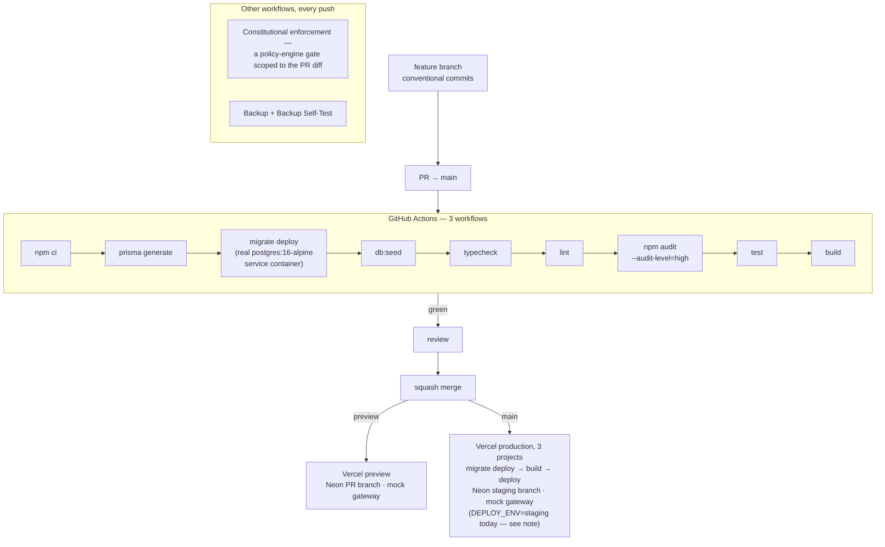
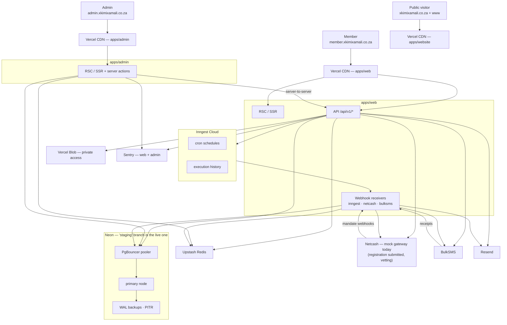
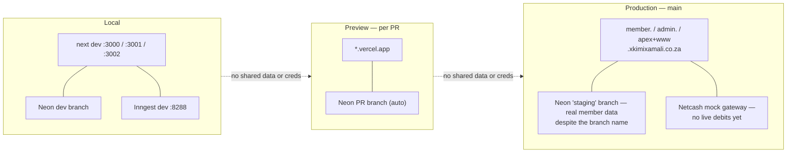

# Infrastructure & Deployment

Deployment topology, CI/CD, and how the cloud services wire together at runtime. Ordered go-live steps: [../../DEPLOYMENT.md](../../DEPLOYMENT.md).

## Environment tiers

Three fully isolated tiers — no tier shares data or credentials with another.

| Tier | Trigger | Database | Redis | Netcash |
|---|---|---|---|---|
| **Local** | Dev machine | Neon dev branch *(Docker optional via `docker-compose.yml`)* | Upstash dev | Mock gateway |
| **Preview** | PR to `main` | Neon PR branch (auto) | Upstash dev | Mock gateway |
| **Production** | Merge to `main` | Neon `staging` branch (the real, live one — see the naming-trap note below) | Upstash production | **Mock gateway, deliberately** — Netcash's registration is submitted and under vetting as of 2026-08-29, not yet live; see `[[project-netcash-critical-path]]` in the project's memory system |

---

## CI/CD pipeline



**CI is green and running normally** — the account's billing lock (a failed
card authorisation, unrelated to spend) blocked GitHub Actions for months
and was resolved 2026-08-15; a previous version of this doc described that
paused state, which is no longer true. Every PR runs `Type Check, Lint &
Test`, `Constitutional enforcement`, and (on `main`) `Backup Self-Test`, all
required to pass before merge.

> **A real naming trap, not a typo:** the Neon branch that actually serves
> production traffic is named **`staging`**, and `DEPLOY_ENV=staging` is set
> on the live `xkimi-xa-mali-web` deployment — both deliberate from early
> infra bootstrapping, neither changed since. The Neon branch literally
> named `production` is empty. Always verify which Neon branch shows
> `Active` compute before trusting a label. `PAYMENT_GATEWAY=mock` is set
> explicitly in production today regardless of this naming, so no real
> debit can go out by accident — see [../../DEPLOYMENT.md](../../DEPLOYMENT.md).

---

## Production topology



**Scheduled jobs (Inngest cron):** 07:00 morning warning · 20:00 debit run · daily overdue reminder · 1st-of-month rollover · nightly ledger + contribution reconciliation · daily financial-anomaly watch · monthly statement notice · badge recalculation · invite expiry.

---

## Environment isolation



---

## Monorepo & env reference

```
apps/web        Next.js 16 — pages · api/v1 · services · lib · inngest · middleware.ts
apps/admin      Next.js 16 — admin dashboard, server actions
apps/website    Next.js 16 — marketing site, no DB/auth/payment deps
packages/database      schema.prisma (34 models · 17 enums) · 46 migrations · seed.ts
packages/observability  structured logger wrapping Sentry
packages/ui|utils|types|config   shared libraries
docs/           architecture · flows · database · security · adr · constitutions
                api-contract.yaml (OpenAPI 3.1)
```

**Monitoring, as actually built vs. as planned:** Sentry (errors, `web` +
`admin`) and Vercel Analytics (Web Vitals, all 3 apps) are live. An uptime
monitor on `/api/v1/health` — several earlier docs in this project name
**Better Stack** for this — is **not yet implemented**; no such dependency
or config exists anywhere in the repo as of 2026-08-29. Treat any mention
of Better Stack elsewhere in `docs/` as a plan, not a running service,
until this line is updated.

Every tier needs the same core secrets (full list + descriptions in [`.env.example`](../../.env.example) and [DEPLOYMENT.md](../../DEPLOYMENT.md#2-environment-variables-production)). The ones that bite if wrong:

| Variable | Note |
|---|---|
| `ENCRYPTION_KEY` | 64 hex chars — **never change it on its own** (it decrypts stored bank/ID numbers). Rotate via `docs/runbook.md`, "Rotating the encryption key" |
| `ADMIN_API_SECRET` | Must match on web + admin (admin→web internal calls) |
| `NETCASH_API_URL` | Defaults to the **test** gateway — override for production |
| `INNGEST_EVENT_KEY` / `_SIGNING_KEY` | Or no scheduled job fires |

### Service failure behaviour

| Service | Used by | On failure | Retry |
|---|---|---|---|
| Neon | All routes + jobs | Hard 500 | Prisma reconnect |
| Upstash | Middleware, mandate, jobs | Soft — limit/idempotency fall back | Client retry |
| Netcash | mandate, contribution, debit-run | Hard — payment unchanged | Inngest step retry |
| BulkSMS / Resend | notification | Soft — marked FAILED | Inngest step retry |
| Inngest | Payment pipeline | Deferred until recovered | Built-in backoff |
| Vercel Blob | Statement export | Soft — guarded by `withRetry` + circuit breaker | Auto + manual |
