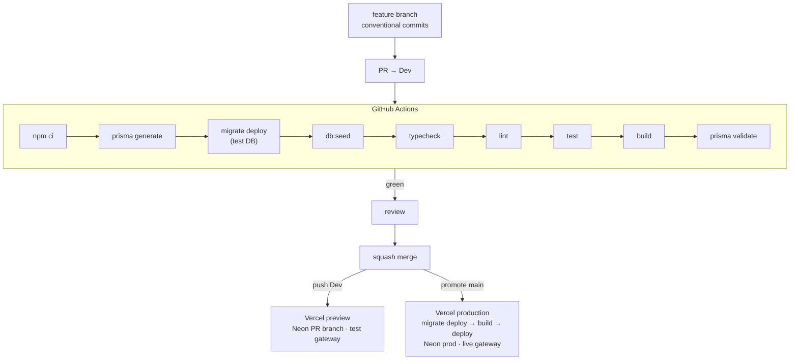
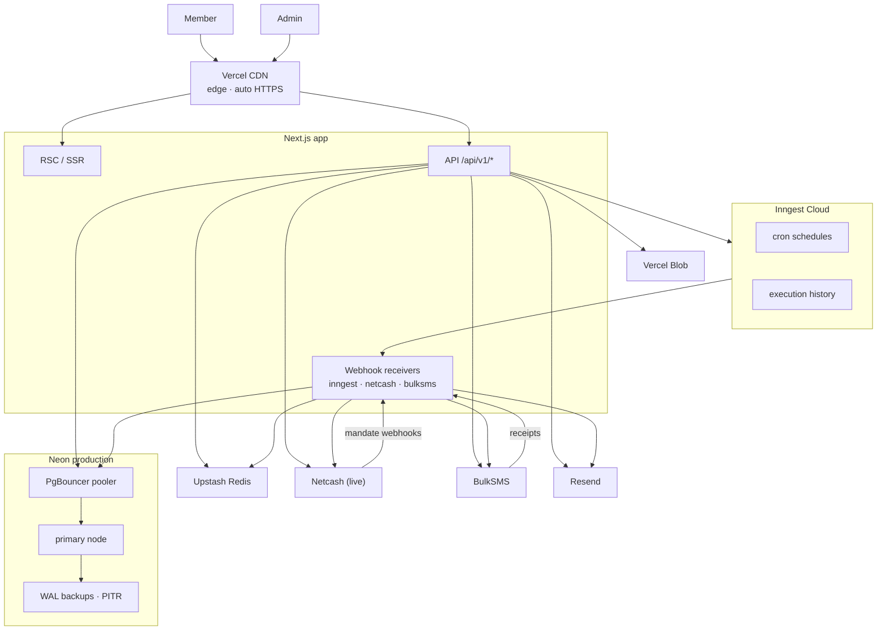
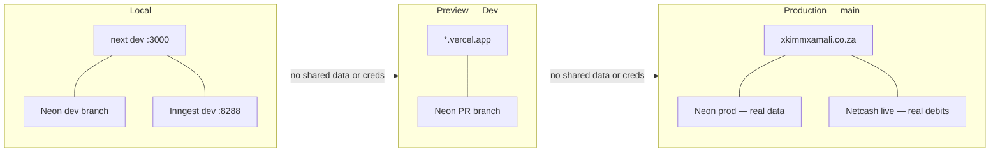

# Infrastructure & Deployment

Deployment topology, CI/CD, and how the cloud services wire together at runtime. Ordered go-live steps: [../../DEPLOYMENT.md](../../DEPLOYMENT.md).

## Environment tiers

Three fully isolated tiers — no tier shares data or credentials with another.

| Tier | Trigger | Database | Redis | Netcash |
|---|---|---|---|---|
| **Local** | Dev machine | Neon dev branch *(Docker optional via `docker-compose.yml`)* | Upstash dev | Test gateway |
| **Preview** | PR / push to `Dev` | Neon PR branch (auto) | Upstash dev | Test gateway |
| **Production** | Promote to `main` | Neon production (pooled) | Upstash production | **Live** |

---

## CI/CD pipeline



> CI is currently paused (Actions minutes exhausted on the private repo); the workflow is correct and goes green once minutes return. Until then the local `typecheck · lint · test · build` is the gate. See [../../DEPLOYMENT.md](../../DEPLOYMENT.md#8-known-limitations-today).

---

## Production topology



**Scheduled jobs (Inngest cron):** 07:00 morning warning · 20:00 debit run · daily overdue reminder · 1st-of-month rollover · nightly ledger + contribution reconciliation · daily financial-anomaly watch · monthly statement notice · badge recalculation · invite expiry.

---

## Environment isolation



---

## Monorepo & env reference

```
apps/web        Next.js — pages · api/v1 · services · lib · inngest · middleware.ts
apps/admin      Admin dashboard          apps/website   Marketing site
packages/database   schema.prisma (34 models · 17 enums) · 16 migrations · seed.ts
packages/ui|utils|types|config   shared libraries
docs/           architecture · flows · database · security · adr · constitutions
                api-contract.yaml (OpenAPI 3.1)
```

Every tier needs the same core secrets (full list + descriptions in [`.env.example`](../../.env.example) and [DEPLOYMENT.md](../../DEPLOYMENT.md#2-environment-variables-production)). The ones that bite if wrong:

| Variable | Note |
|---|---|
| `ENCRYPTION_KEY` | 64 hex chars — **set once, never change** (decrypts stored bank/ID numbers) |
| `ADMIN_API_SECRET` | Must match on web + admin (admin→web internal calls) |
| `NETCASH_API_URL` | Defaults to the **test** gateway — override for production |
| `INNGEST_EVENT_KEY` / `_SIGNING_KEY` | Or no scheduled job fires |

### Service failure behaviour

| Service | Used by | On failure | Retry |
|---|---|---|---|
| Neon | All routes + jobs | Hard 500 | Prisma reconnect |
| Upstash | Middleware, mandate, jobs | Soft — limit/idempotency fall back | Client retry |
| Netcash | mandate, contribution, debit-run | Hard — payment unchanged | Inngest step retry |
| BulkSMS / Resend | notification | Soft — marked FAILED | Inngest step retry |
| Inngest | Payment pipeline | Deferred until recovered | Built-in backoff |
| Vercel Blob | Statement export | Soft — guarded by `withRetry` + circuit breaker | Auto + manual |
