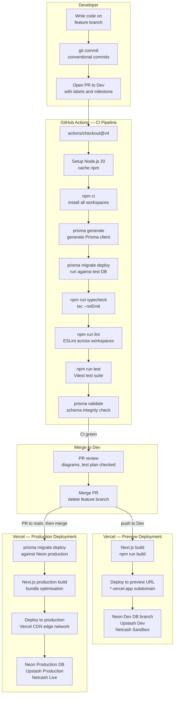
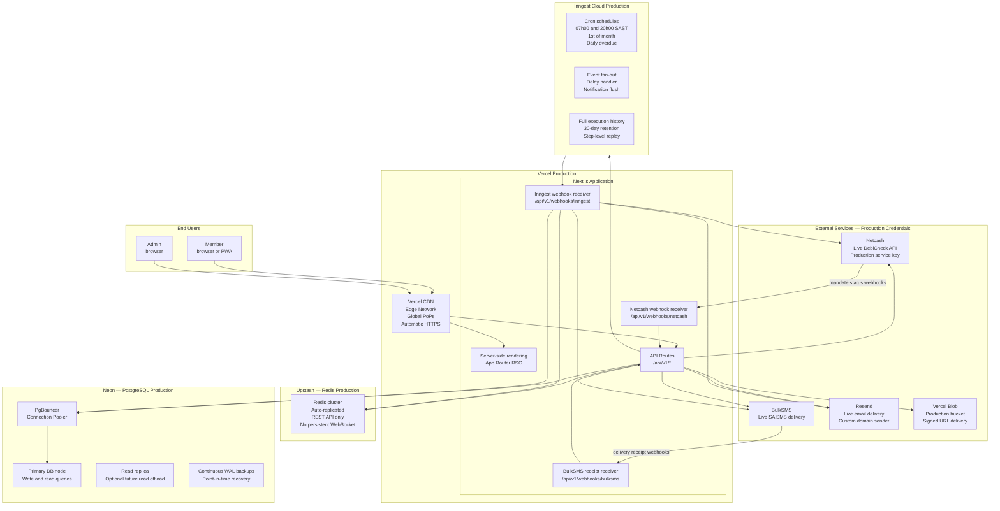
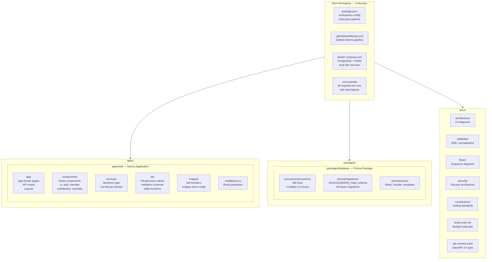

# Infrastructure and Deployment

| | |
|---|---|
| **Purpose** | Documents the deployment topology, CI/CD pipeline, environment tiers, and cloud service wiring |
| **Audience** | Engineers, DevOps, anyone deploying or debugging the system |
| **Related Docs** | [01-system-context.md](./01-system-context.md) · [02-container-architecture.md](./02-container-architecture.md) · [../database/01-erd.md](../database/01-erd.md) |

---

## Environment Tiers

XXM runs across three fully isolated environment tiers. Each tier has its own database, Redis instance, and external service credentials. No tier shares data with another.

| Tier | Trigger | Database | Redis | Netcash | Purpose |
|---|---|---|---|---|---|
| **Local** | Developer machine | Docker PostgreSQL 16 | Docker Redis 7 | Sandbox | Active development |
| **Preview** | Push to `Dev` branch | Neon Dev branch | Upstash Dev | Sandbox | Integration testing |
| **Production** | Push to `main` branch | Neon Production branch | Upstash Production | Live | Live system |

---

## Diagram 1 — CI/CD Pipeline

> From code push to live deployment, every step in order.

---

## Diagram 2 — Production Topology

> How every cloud service connects at runtime in production.

---

## Diagram 3 — Environment Isolation

> How local, preview, and production environments are kept completely separate.

```mermaid
flowchart LR
    subgraph LOCAL["Local Development"]
        L_APP["Next.js dev server\nlocalhost:3000"]
        L_DB["Docker PostgreSQL 16\nlocalhost:5432"]
        L_REDIS["Docker Redis 7\nlocalhost:6379"]
        L_INNGEST["Inngest Dev Server\nlocalhost:8288"]
        L_NC["Netcash Sandbox\nTest ASMX endpoint"]
    end

    subgraph PREVIEW["Preview — Dev branch"]
        P_APP["Vercel preview deployment\n*.vercel.app"]
        P_DB["Neon Dev DB branch\nisolated from production"]
        P_REDIS["Upstash Dev database"]
        P_NC["Netcash Sandbox"]
    end

    subgraph PRODUCTION["Production — main branch"]
        PR_APP["Vercel production\nxkimmxamali.co.za"]
        PR_DB["Neon Production branch\nreal member data"]
        PR_REDIS["Upstash Production database"]
        PR_NC["Netcash Live\nreal debit orders"]
    end

    L_APP --- L_DB
    L_APP --- L_REDIS
    L_APP --- L_INNGEST
    L_APP --- L_NC

    P_APP --- P_DB
    P_APP --- P_REDIS
    P_APP --- P_NC

    PR_APP --- PR_DB
    PR_APP --- PR_REDIS
    PR_APP --- PR_NC

    LOCAL -.->|"no data sharing\nno credential sharing"| PREVIEW
    PREVIEW -.->|"no data sharing\nno credential sharing"| PRODUCTION
```

---

## Diagram 4 — Monorepo Workspace Structure

---

## Environment Variable Reference

| Variable | Required In | Purpose |
|---|---|---|
| `DATABASE_URL` | All tiers | Neon PostgreSQL connection string |
| `NEXTAUTH_SECRET` | All tiers | JWT signing secret (min 32 chars) |
| `NEXTAUTH_URL` | All tiers | Base URL for NextAuth callbacks |
| `ENCRYPTION_KEY` | All tiers | AES-256 key for ID and bank account encryption (64 hex chars) |
| `NETCASH_SERVICE_KEY` | All tiers | Netcash API authentication key |
| `NETCASH_WEBHOOK_SECRET` | All tiers | HMAC secret for webhook verification |
| `NETCASH_API_URL` | All tiers | Sandbox or live Netcash endpoint |
| `BULKSMS_USERNAME` | All tiers | BulkSMS account username |
| `BULKSMS_PASSWORD` | All tiers | BulkSMS account password |
| `RESEND_API_KEY` | All tiers | Resend API key |
| `RESEND_FROM_EMAIL` | All tiers | Verified sender email address |
| `INNGEST_EVENT_KEY` | All tiers | Inngest event publish key |
| `INNGEST_SIGNING_KEY` | All tiers | Inngest webhook signature key |
| `UPSTASH_REDIS_REST_URL` | All tiers | Upstash Redis endpoint |
| `UPSTASH_REDIS_REST_TOKEN` | All tiers | Upstash Redis auth token |
| `BLOB_READ_WRITE_TOKEN` | All tiers | Vercel Blob read/write token |
| `FOUNDER_EMAIL` | Seed script | Founder admin account email |
| `FOUNDER_PHONE` | Seed script | Founder admin account phone |
| `FOUNDER_PASSWORD` | Seed script | Founder admin account password |
| `WHATSAPP_GROUP_LINK` | Runtime | WhatsApp group deep link |

## Service Dependency Matrix

| Service | Used By | Failure Behaviour | Retry? |
|---|---|---|---|
| Neon PostgreSQL | All API routes, all Inngest jobs | Hard failure — request returns 500 | Yes — Prisma connection retry |
| Upstash Redis | Middleware, mandate service, Inngest jobs | Soft failure — rate limit skipped, idempotency bypassed | Yes — Upstash client retry |
| Netcash API | mandate.service, contribution.service, debit-run job | Hard failure — payment not processed, status unchanged | Yes — Inngest step retry |
| BulkSMS | notification.service, morning warning job | Soft failure — SMS not sent, notification marked FAILED | Yes — Inngest step retry |
| Resend | auth.service, notification.service | Soft failure — email not sent, can be resent | Yes — Inngest step retry |
| Inngest Cloud | Scheduled payment pipeline | Deferred — jobs do not run until recovered | Built-in — automatic backoff |
| Vercel Blob | contribution.service PDF export | Soft failure — statement not generated, can be retried | Manual retry via endpoint |
