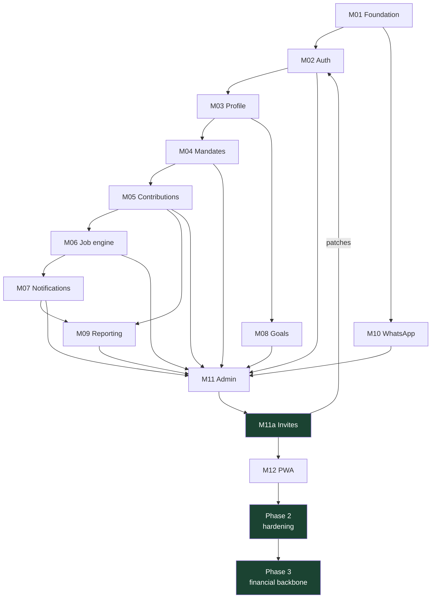

# Build Plan & Status

**Rule:** no module starts before its dependencies are done and deployed to staging. Each has a definition of done; a PR is not merged until the DoD is met.

> This is the build *record* — what shipped, in what order, and why. Implementation detail lives in the code and git history.

---

## Status — all complete

| Module | Purpose | Status |
|---|---|---|
| **M01** Foundation | Turborepo, Next.js 15, Prisma schema, CI skeleton, health endpoint | ✅ |
| **M02** Auth | NextAuth, register/login/reset, email verify, bcrypt-12, role + founder seed, route tiers | ✅ |
| **M03** Profile | Profile edit, encrypted bank accounts (modulus check), notification prefs, POPIA export | ✅ |
| **M04** Mandates | Netcash DebiCheck client, mandate lifecycle, delay request, HMAC webhook | ✅ |
| **M05** Contributions | Monthly records, manual + partial payments, status engine | ✅ |
| **M06** Job engine | Inngest: debit run, morning warning, overdue reminder, month rollover, delay handler; Redis idempotency | ✅ |
| **M07** Notifications | BulkSMS + Resend, template system, inbox, delivery receipts, preference enforcement | ✅ |
| **M08** Goals | CRUD, progress, locking, deadline checker | ✅ |
| **M09** Reporting | PDF statements (React-PDF + Blob), CSV export, transaction history | ✅ |
| **M10** WhatsApp | Public group page + deep link | ✅ |
| **M11** Admin | Standalone admin app — members, mandates, goals, audit, reports, broadcasts | ✅ |
| **M11a** Invites | `XKM-XXXX-XXXX` invite-gated signup, email/phone binding, 7-day expiry, single-use | ✅ |
| **M12** PWA | Manifest, service worker, offline fallback, Lighthouse ≥ 90, Sentry, uptime | ✅ |

**13 of 13 modules** (~30 developer-days).

---

## Phase 2 — Production hardening

Completed 2026-06-04. Hardened the system after all modules shipped.

| Step | What | PR |
|---|---|---|
| `withApiHandler` wrapper | One typed error boundary for all 48 v1 routes — consistent error shape, `x-trace-id` on every response, Sentry on unhandled | #61 |
| Notification seed fix | Corrected slugs, added 13 missing templates, made seed idempotent (never clobbers admin edits), added `db:seed` to CI | #62 |
| Rate-limit audit | 7 dedicated sliding-window limiters sized per threat (forgot-password, verify-email, mandate create/delay, admin invite/broadcast/bulk) | #63 |
| Invite flow e2e | `/invite/[token]` entry page, pre-filled read-only binding fields, verify-email "sent" variant, `PENDING_ACTIVATION` vs `EMAIL_NOT_VERIFIED` | #64 |
| Public stats endpoint | `GET /stats/public` (zero-PII, Redis-cached 1h) wired into the website with ISR + static fallback | #65 |
| Merge-gate verification | `typecheck · lint · test 116/116 · prisma validate` all green; ESLint configs added | #66–67 |

---

## Phase 3 — Financial backbone & intelligence

Senior-engineering pass: make the backend correct under failure and outsmart the frontend. All PRs verified (typecheck + lint per app) and squash-merged.

| Area | What shipped |
|---|---|
| **Append-only ledger** | Double-entry pool ledger (`LedgerEntry`, idempotent `UNIQUE(refType,refId,direction)`); CREDIT on SUCCESS, DEBIT on REVERSED; nightly `reconcileLedger` rebuilds from settled transactions; admin `GET /admin/ledger` |
| **Webhook dedupe** | `ProcessedWebhookEvent` (`UNIQUE(source,eventKey)`); Netcash webhook claims an event key, returns 200 on redelivery, releases on failure — exactly-once processing |
| **Anomaly watch** | Daily `financialAnomalyWatch` — collection-rate floor, failed-debit spike, overdue thresholds → inbox-alerts admins + audit |
| **Member insights** | `getMemberInsights` — year-end forecast, on-time rate, at-risk flag, plain-language nudges; member dashboard section |
| **Engagement** | Goal cheers / comments / pledges (race-safe toggles); contribution badges/tiers; community messages; personal budgets |
| **Resilience** | `withRetry` (backoff + jitter, idempotent-only) + circuit breaker on Blob uploads; statement-notice job; case-insensitive login |
| **Admin signatures** | Signature capture + embed in statement PDFs (`AdminSignature` + history) |

**Deferred (deliberate):** transactional outbox (redundant with the Notification queue), deep trace propagation + SSE (low ROI at this scale), `packages/core` consolidation (high-risk, low-reward).

Go-live runbook: [../DEPLOYMENT.md](../DEPLOYMENT.md).
