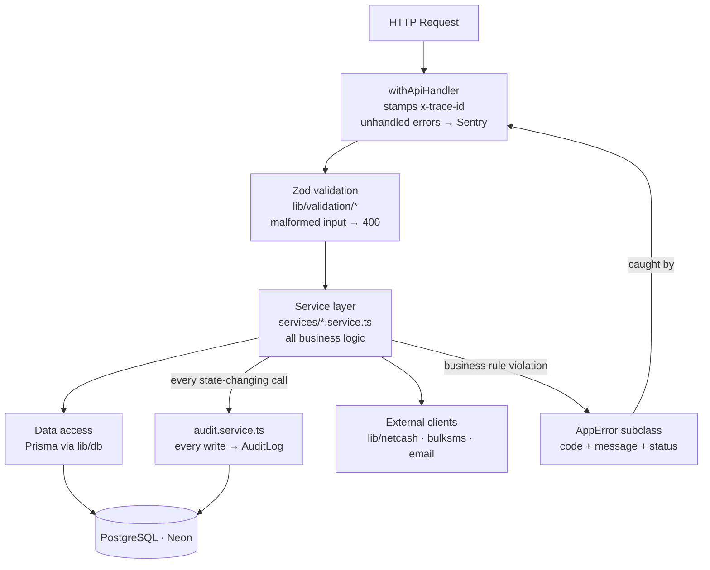

# Backend Constitution — Xkimi Xa Mali Foundation

## Rules

```
[BACKEND-B01]  All business logic lives in service layer only.
               No logic in API route handlers, UI components, or DB layer.

[BACKEND-B02]  All service functions are pure: they receive typed inputs,
               return typed outputs, and throw typed errors. No side effects
               outside the function's declared responsibility.

[BACKEND-B03]  No endpoint ships without Zod input validation.
               Validation runs before any business logic.

[BACKEND-B04]  All API responses use the standard envelope:
               { data, meta } for success, { error } for failure.
               No bare returns.

[BACKEND-B05]  All errors are typed and structured:
               { code: string, message: string, traceId: string }
               No raw Error objects reach API responses.

[BACKEND-B06]  Repository pattern on all Prisma access.
               Business logic never calls prisma.* directly —
               it calls repository functions.

[BACKEND-B07]  Service interfaces are defined before implementations.
               Dependency injection via constructor — no direct imports
               of concrete implementations in business logic.

[BACKEND-B08]  All external service calls (Netcash, BulkSMS, Resend)
               are wrapped in typed client classes in /lib.
               API route handlers never call external APIs directly.

[BACKEND-B09]  Idempotency keys required on all payment-initiating operations.
               Key stored in Redis (48h TTL) before submission to gateway.

[BACKEND-B10]  Audit log written for every state-changing operation.
               Written at service layer, not middleware.

[BACKEND-B11]  Transactions (DB) used for any multi-table write.
               Partial writes are a data integrity failure.

[BACKEND-B12]  All financial amounts stored as Postgres Decimal, never
               Float. In application code, money crosses into a plain JS
               number at the service boundary — the rule is that every
               chained arithmetic op on it goes through the rounding
               helpers in apps/web/lib/money.ts (roundZAR/sumZAR/
               subtractZAR), never raw +/-/*. See database/03-schema-design.md.

[BACKEND-B13]  Strategy pattern for any operation with variants
               (payment methods, notification channels, exporters).
               New variant = new class, not a new conditional.

[BACKEND-B14]  All service functions log structured JSON on entry and exit.
               Log level: info for success, warn for business rule blocks,
               error for exceptions.

[BACKEND-B15]  Sensitive fields (idNumber, accountNumber) decrypted only
               in service layer. Never decrypted in route handlers.
               Never logged in plaintext.
```

## Request Flow

Every HTTP request follows this strict path. No layer skips another.



---

## Service Layer Structure

> **Updated 2026-08-30** — the list below named 10 services, 2 of which
> (`transaction.service.ts`, `statement.service.ts`) no longer exist under
> those names, and it was missing the other ~19. `apps/web/services/`
> actually has **29** files as of this writing; the full current list with
> one-line descriptions lives in
> [../architecture/03-component-architecture.md](../architecture/03-component-architecture.md)
> rather than duplicated here, specifically so this doesn't go stale the
> same way again the next time a service is added. The structural rule
> stands regardless of the exact count: **all business logic lives in
> `services/*.service.ts`**, one file per bounded concern.

## Error Codes

> **Updated 2026-08-30** — the code list previously here was substantially
> wrong: wrong prefix for bank-account errors (`BANK_*` vs. the real
> `BNK_*`), auth codes that don't exist as such (`AUTH_002`/`AUTH_003` are
> actually raw NextAuth error strings like `EMAIL_NOT_VERIFIED`, not
> `AppError` codes), and roughly 15 whole domains missing entirely
> (invites, reports, admin, community messages, budgets, signatures,
> external-service errors). **The source of truth is
> `apps/web/lib/errors.ts`** — read it directly rather than trust a copy
> here; a list this size re-drifts the moment one class is added. The
> pattern it follows, which *is* stable and worth keeping in a doc:

```typescript
// Base class every domain error extends
export class AppError extends Error {
  constructor(message: string, public readonly code: string, public readonly status: number) { ... }
}

// One convention per HTTP shape — domains extend these, not AppError directly
export class NotFoundError extends AppError { constructor(message, code) { super(message, code, 404) } }
export class ConflictError extends AppError { constructor(message, code) { super(message, code, 409) } }
export class ValidationError extends AppError { constructor(message, code = 'VAL_001') { super(message, code, 422) } }

// Domain prefix + sequential number, e.g.:
export class MemberNotFoundError extends NotFoundError {
  constructor() { super('Member not found', 'MBR_001') }
}
```

`SYS_*` is reserved for cross-cutting concerns, not a domain: `SYS_002`
unauthorised, `SYS_003` forbidden, `SYS_005` rate-limited, `SYS_006`
session expired (stale role version), `SYS_007` CSRF origin mismatch,
`SYS_008` refused for membership standing (a resigned member's
state-changing write) — the last three didn't exist when this doc was
first written and were added alongside the security mechanisms they
represent.
