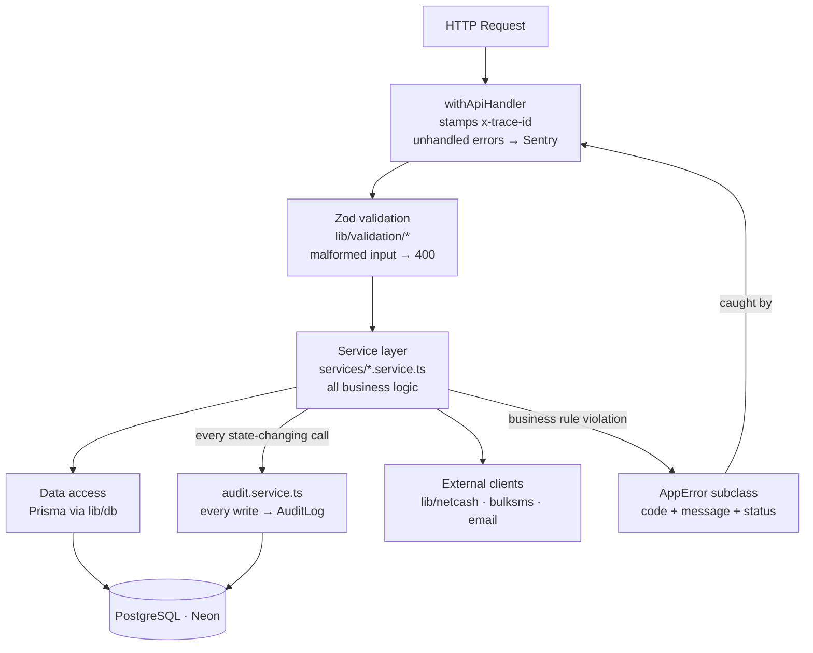

# Backend Constitution — Xkimi Xa Mali Foundation

## Rules

```
[BACKEND-B01]  All business logic lives in service layer only.
               No logic in API route handlers, UI components, or DB layer.

[BACKEND-B02]  All service functions are pure: they receive typed inputs,
               return typed outputs, and throw typed errors. No side effects
               outside the function's declared responsibility.

[BACKEND-B03]  No endpoint ships without Zod input validation.
               Validation runs before any business logic.

[BACKEND-B04]  All API responses use the standard envelope:
               { data, meta } for success, { error } for failure.
               No bare returns.

[BACKEND-B05]  All errors are typed and structured:
               { code: string, message: string, traceId: string }
               No raw Error objects reach API responses.

[BACKEND-B06]  Repository pattern on all Prisma access.
               Business logic never calls prisma.* directly —
               it calls repository functions.

[BACKEND-B07]  Service interfaces are defined before implementations.
               Dependency injection via constructor — no direct imports
               of concrete implementations in business logic.

[BACKEND-B08]  All external service calls (Netcash, BulkSMS, Resend)
               are wrapped in typed client classes in /lib.
               API route handlers never call external APIs directly.

[BACKEND-B09]  Idempotency keys required on all payment-initiating operations.
               Key stored in Redis (48h TTL) before submission to gateway.

[BACKEND-B10]  Audit log written for every state-changing operation.
               Written at service layer, not middleware.

[BACKEND-B11]  Transactions (DB) used for any multi-table write.
               Partial writes are a data integrity failure.

[BACKEND-B12]  All financial amounts handled as Decimal (not float).
               No floating-point arithmetic on money values.

[BACKEND-B13]  Strategy pattern for any operation with variants
               (payment methods, notification channels, exporters).
               New variant = new class, not a new conditional.

[BACKEND-B14]  All service functions log structured JSON on entry and exit.
               Log level: info for success, warn for business rule blocks,
               error for exceptions.

[BACKEND-B15]  Sensitive fields (idNumber, accountNumber) decrypted only
               in service layer. Never decrypted in route handlers.
               Never logged in plaintext.
```

## Request Flow

Every HTTP request follows this strict path. No layer skips another.



---

## Service Layer Structure

```
services/
  auth.service.ts           — registration, login, password, POPIA consent
  member.service.ts         — profile management, bank accounts
  mandate.service.ts        — debit order creation, updates, delay requests
  contribution.service.ts   — monthly records, manual payments, status updates
  transaction.service.ts    — transaction creation, gateway submission, reversals
  notification.service.ts   — channel routing, template rendering, delivery
  goal.service.ts           — goal CRUD, locking, progress tracking
  statement.service.ts      — PDF generation, Blob storage, signed URLs
  admin.service.ts          — reporting, member management, audit access
  audit.service.ts          — audit log writes (called by all other services)
```

## Error Codes

```typescript
export const ErrorCodes = {
  // Auth
  AUTH_INVALID_CREDENTIALS:    'AUTH_001',
  AUTH_EMAIL_NOT_VERIFIED:     'AUTH_002',
  AUTH_ACCOUNT_SUSPENDED:      'AUTH_003',
  AUTH_TOKEN_EXPIRED:          'AUTH_004',

  // Members
  MEMBER_NOT_FOUND:            'MBR_001',
  MEMBER_ALREADY_EXISTS:       'MBR_002',
  MEMBER_SUSPENDED:            'MBR_003',

  // Bank accounts
  BANK_ACCOUNT_NOT_FOUND:      'BANK_001',
  BANK_ACCOUNT_HAS_MANDATE:    'BANK_002',
  BANK_ACCOUNT_INVALID:        'BANK_003',

  // Mandates
  MANDATE_NOT_FOUND:           'MND_001',
  MANDATE_ALREADY_ACTIVE:      'MND_002',
  MANDATE_MINIMUM_AMOUNT:      'MND_003',
  MANDATE_DELAY_WINDOW_CLOSED: 'MND_004',

  // Contributions
  CONTRIBUTION_NOT_FOUND:      'CTR_001',
  CONTRIBUTION_ALREADY_PAID:   'CTR_002',

  // Transactions
  TRANSACTION_DUPLICATE:       'TXN_001',
  TRANSACTION_GATEWAY_ERROR:   'TXN_002',

  // Goals
  GOAL_NOT_FOUND:              'GOL_001',
  GOAL_ALREADY_LOCKED:         'GOL_002',

  // System
  VALIDATION_ERROR:            'SYS_001',
  UNAUTHORISED:                'SYS_002',
  FORBIDDEN:                   'SYS_003',
  INTERNAL_ERROR:              'SYS_004',
  RATE_LIMITED:                'SYS_005',
} as const
```
