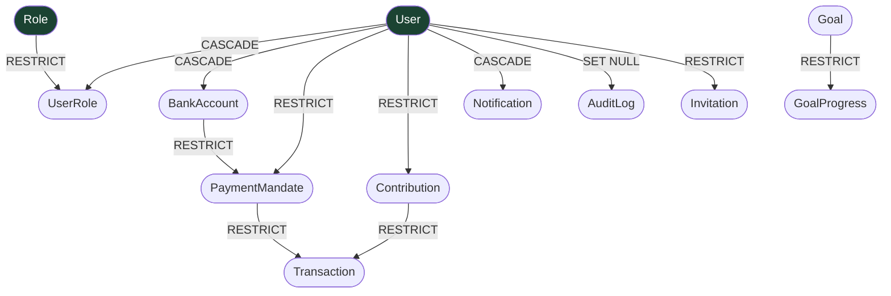

# Database Constitution — Xkimm Xa Mali

## Rules

```
[DB-D01]  Schema versioned from migration 001. Migrations never edited
          retroactively — only additive migrations forward.

[DB-D02]  Every foreign key has an explicit ON DELETE contract.
          No implicit behaviour. Choices: CASCADE, RESTRICT, SET NULL.

[DB-D03]  No application logic in the database. No stored procedures,
          triggers, or functions as business rules. The DB stores data.

[DB-D04]  All monetary amounts: DECIMAL(10,2). Never FLOAT or REAL.
          Floating-point is prohibited for financial values.

[DB-D05]  Every table has createdAt (default now()). Tables with mutable
          records also have updatedAt (auto-updated via Prisma @updatedAt).

[DB-D06]  Surrogate UUID primary keys (cuid()) on all tables.
          No natural key as PK (email, phone, ID number are never PKs).

[DB-D07]  Lookup/reference tables for any value that could expand:
          statuses, types, roles. Currently implemented as Prisma enums.
          Promote to lookup tables when values require admin management.

[DB-D08]  Indexes explicitly defined for every column used in WHERE,
          JOIN ON, or ORDER BY in production queries.
          No blind indexing — every index is justified.

[DB-D09]  Sensitive columns (idNumber, accountNumber) stored encrypted.
          Never query by encrypted value — use a secondary HMAC index
          if lookup by these fields is ever required.

[DB-D10]  Transaction records are immutable after creation.
          Reversals create a new Transaction record of type REVERSAL.
          No UPDATE or DELETE on transactions table except status progression.

[DB-D11]  Soft deletes on User (status = SUSPENDED/DELETED).
          Hard delete only after 90-day retention window.
          Financial records (Contribution, Transaction) retained 5 years.

[DB-D12]  The unique constraint on Contribution(userId, periodMonth, periodYear)
          is the system's protection against double-billing.
          Never remove this constraint.
```

## Entity Delete Cascade Map

Shows what happens when a record is deleted. RESTRICT = deletion blocked if child records exist.



---

## ON DELETE Contracts

| Relationship | Contract | Reason |
|---|---|---|
| UserRole → User | CASCADE | Remove role assignments when user deleted |
| UserRole → Role | RESTRICT | Cannot delete a role that has users |
| BankAccount → User | CASCADE | Accounts belong to user |
| PaymentMandate → User | RESTRICT | Cannot delete user with mandate history |
| PaymentMandate → BankAccount | RESTRICT | Cannot delete account with mandate |
| Contribution → User | RESTRICT | Financial record — must retain |
| Transaction → Contribution | RESTRICT | Financial record — must retain |
| Transaction → PaymentMandate | RESTRICT | Audit trail |
| Notification → User | CASCADE | Notifications belong to user |
| AuditLog → User | SET NULL | Retain audit log even if user deleted |
| GoalProgress → Goal | RESTRICT | Progress is part of goal record |

## Migration Naming

```
001_initial_schema
002_add_notification_preferences
003_add_goal_progress
004_add_idempotency_key_to_transactions
...
```

Migrations are **additive and forward-only** — never edited retroactively, no destructive changes. A bad release is rolled back by promoting the previous Vercel deployment; the additive schema stays compatible. (See [DB-D01].)
