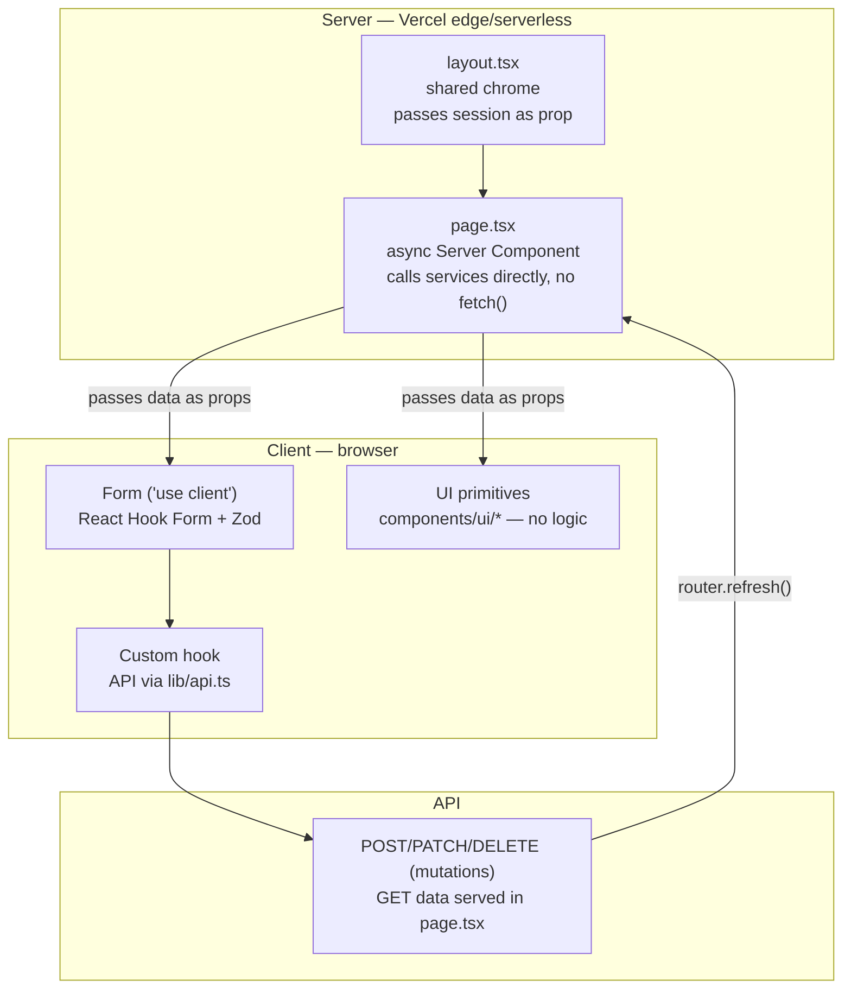

# Frontend Constitution — Xkimm Xa Mali Foundation

## Rules

```
[FRONTEND-F01]  No business logic in UI components.
                Logic lives in hooks or services. Components render; hooks compute.

[FRONTEND-F02]  Component props are explicit TypeScript interfaces.
                No `any`, no object spread without type safety.

[FRONTEND-F03]  Design token system from day one.
                No hardcoded hex colours, spacing values, or font sizes in components.
                All brand values defined in tailwind.config.ts tokens and mirrored
                as CSS custom properties in globals.css. Both Tailwind utilities and
                custom CSS classes draw from these same tokens — never raw values.

[FRONTEND-F04]  Styling approach: Tailwind + custom CSS — both worlds used deliberately.
                Use Tailwind utilities for layout, spacing, and common patterns.
                Use custom CSS (in globals.css or CSS Modules) for complex animations,
                pseudo-element styling, multi-step transitions, and anything that would
                require ugly Tailwind class stacking. One approach does not replace
                the other — use whichever produces cleaner, more readable code.

[FRONTEND-F05]  All forms use React Hook Form + Zod resolver.
                Form schemas are imported from /lib/validation — same schema
                used server-side. No duplicate schema definitions.

[FRONTEND-F06]  All API calls from UI go through typed fetch wrappers in /lib/api.
                No raw fetch() in components or pages.

[FRONTEND-F07]  No sensitive data rendered in component state or localStorage.
                Bank account numbers shown masked (* * * * 1234) client-side.
                Full value fetched only on explicit user request.

[FRONTEND-F08]  Loading, error, and empty states handled in every data-fetching component.
                No UI silently fails. Skeleton loaders on async content.

[FRONTEND-F09]  Composition over monoliths.
                Large components use slot/render-prop patterns.
                No component file exceeds 250 lines.

[FRONTEND-F10]  Mobile-first responsive design. Every page tested at 375px width.
                Tailwind breakpoints (sm/md/lg/xl) used for responsive layout.
                Custom CSS media queries allowed when Tailwind breakpoints
                are insufficient for the specific design requirement.

[FRONTEND-F11]  Accessibility: all interactive elements keyboard-navigable.
                All images have alt text. Colour contrast ≥ WCAG AA.

[FRONTEND-F12]  Server Components for all static and data-fetching content.
                Client Components only when interactivity requires it.
                'use client' directive justified with a comment.

[FRONTEND-F13]  All financial amounts formatted with Intl.NumberFormat (ZAR).
                Never format money manually.
```

## Server / Client Split

The rule: server components fetch and own data, client components own interactivity. `'use client'` is never the default.



---

## Component Structure

```
components/
  ui/                     — shadcn/ui primitives (Button, Input, Card, etc.)
  layout/
    Header.tsx
    Sidebar.tsx
    Footer.tsx
    PageWrapper.tsx
  member/
    ContributionCard.tsx
    TransactionRow.tsx
    MandateForm.tsx
    GoalProgressBar.tsx
    StatementDownload.tsx
  admin/
    MemberTable.tsx
    ReportChart.tsx
    AuditLogRow.tsx
  shared/
    AmountDisplay.tsx      — ZAR formatter wrapper
    StatusBadge.tsx        — generic status badge with colour map
    ConfirmModal.tsx        — reusable destructive action confirmation
    EmptyState.tsx
    ErrorBoundary.tsx
```

## Design Tokens

Tokens are defined once in `tailwind.config.ts` and mirrored as CSS custom properties in `app/globals.css`. Tailwind utilities reference the config; custom CSS references the CSS vars. Both stay in sync from the single source of truth.

**tailwind.config.ts**
```javascript
// Brand colours
'xxm-green':  '#1B4332'   // deep green — wealth
'xxm-gold':   '#D4AF37'   // gold — prosperity
'xxm-light':  '#F0FDF4'   // light green tint — backgrounds

// Semantic
'success': '#16A34A'
'warning': '#D97706'
'danger':  '#DC2626'
'info':    '#2563EB'
```

**app/globals.css** (mirrored as CSS vars for custom CSS use)
```css
:root {
  --xxm-green:   #1B4332;
  --xxm-gold:    #D4AF37;
  --xxm-light:   #F0FDF4;
  --success:     #16A34A;
  --warning:     #D97706;
  --danger:      #DC2626;
  --info:        #2563EB;
}
```

**Usage rule:**
- Tailwind utility → `className="bg-xxm-green text-xxm-gold"`
- Custom CSS → `background: var(--xxm-green)`
- Raw hex in either → not allowed

## Currency Formatting

```typescript
// lib/formatters.ts
export const formatZAR = (amount: number | Decimal) =>
  new Intl.NumberFormat('en-ZA', {
    style: 'currency',
    currency: 'ZAR',
  }).format(Number(amount))

// Usage: formatZAR(contribution.amountDue) → "R 100,00"
```
