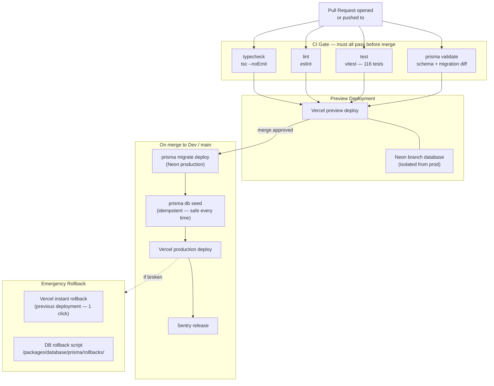
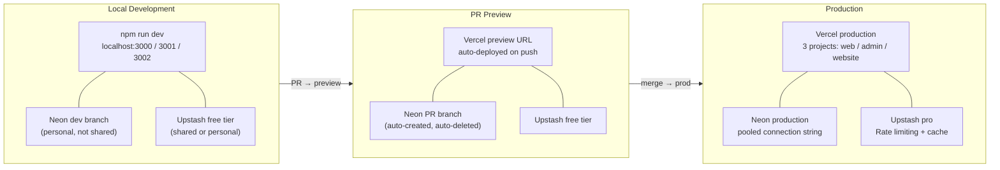

# Infrastructure Constitution — Xkimm Xa Mali

## Rules

```
[INFRA-I01]  Every service exposes GET /api/health.
             Returns { status, db, redis, ts } with appropriate HTTP status.
             This endpoint is public (L0) and never requires auth.

[INFRA-I02]  All environment config validated at startup with t3-env.
             Missing required env vars crash the app at boot, not at runtime.

[INFRA-I03]  No environment-specific code branches.
             Use environment variables to toggle behaviour.
             if (process.env.NODE_ENV === 'production') is a code smell.

[INFRA-I04]  Local development uses Neon dev branch + Upstash free tier directly.
             No Docker required. Clone → npm install → fill .env.local → npm run dev.
             Local environment must mirror production schema via prisma migrate dev.

[INFRA-I05]  Staging uses real external services in sandbox/test mode.
             No mocks in staging. Mocks only in unit tests.

[INFRA-I06]  Database migrations run as part of deployment, not manually.
             prisma migrate deploy is part of the CI/CD pipeline.
             No ad-hoc schema changes in production.

[INFRA-I07]  All secrets in environment variables.
             Vercel project env vars for production.
             .env.local for local development.
             .env.example committed with all required keys (no values).

[INFRA-I08]  Vercel preview deployments on every PR.
             Preview environments use Neon branch databases (isolated from production).
             Preview environments are ephemeral — cleaned up on PR close.

[INFRA-I09]  Sentry configured for error tracking on all environments.
             Source maps uploaded on production deploys.
             Release tracking enabled.

[INFRA-I10]  Better Stack uptime monitor on /api/health.
             Alert channel: email to admin. SLA target: 99.5%.
```

---

## CI/CD Pipeline



---

## Environment Tiers



---

## Environment Variables Reference

```bash
# .env.example — copy to .env.local and fill in values

# Database (Neon pooled connection string)
DATABASE_URL=postgresql://...?pgbouncer=true&connect_timeout=15

# Auth
NEXTAUTH_SECRET=           # random 32-char string
NEXTAUTH_URL=              # http://localhost:3000 locally

# Encryption (AES-256-GCM key)
ENCRYPTION_KEY=            # 32-byte hex string — never commit

# Netcash
NETCASH_SERVICE_KEY=
NETCASH_WEBHOOK_SECRET=
NETCASH_API_URL=           # sandbox: https://sandbox.netcash.co.za

# BulkSMS
BULKSMS_USERNAME=
BULKSMS_PASSWORD=

# Resend
RESEND_API_KEY=
RESEND_FROM_EMAIL=         # noreply@yourdomain.com

# Inngest
INNGEST_EVENT_KEY=
INNGEST_SIGNING_KEY=

# Upstash Redis
UPSTASH_REDIS_REST_URL=
UPSTASH_REDIS_REST_TOKEN=

# Vercel Blob (statement PDFs)
BLOB_READ_WRITE_TOKEN=

# Monitoring
SENTRY_DSN=
SENTRY_AUTH_TOKEN=

# Feature flags
ENABLE_MANUAL_PAYMENTS=true
ENABLE_GOAL_LOCKING=true
WHATSAPP_GROUP_LINK=https://chat.whatsapp.com/...
```
