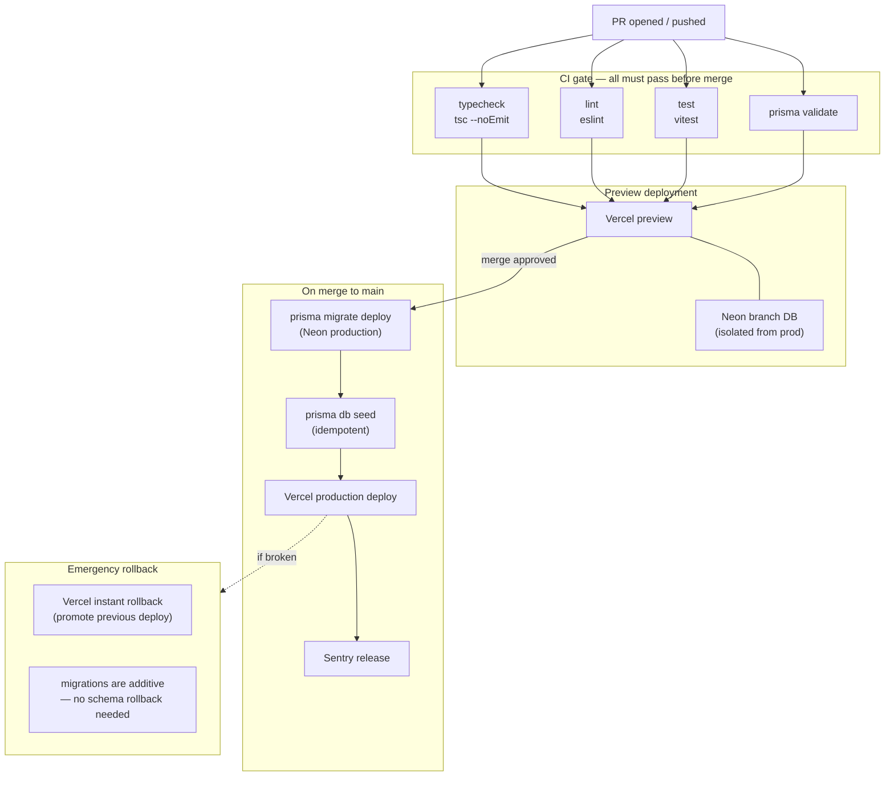
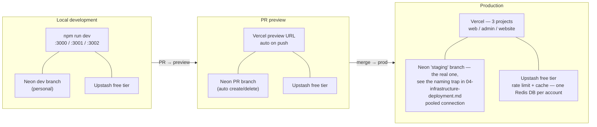

# Infrastructure Constitution — Xkimi Xa Mali Foundation

## Rules

```
[INFRA-I01]  Every service exposes GET /api/v1/health (not /api/health —
             corrected 2026-08-30, the version segment was missing).
             Returns { status, checks: { db, redis, jobs }, ts } with
             appropriate HTTP status.
             This endpoint is public (L0) and never requires auth.

[INFRA-I02]  All environment config validated at startup with t3-env.
             Missing required env vars crash the app at boot, not at runtime.

[INFRA-I03]  No environment-specific code branches.
             Use environment variables to toggle behaviour.
             if (process.env.NODE_ENV === 'production') is a code smell.

[INFRA-I04]  Local development uses Neon dev branch + Upstash free tier directly.
             No Docker required. Clone → npm install → fill .env.local → npm run dev.
             Local environment must mirror production schema via prisma migrate dev.

[INFRA-I05]  Staging uses real external services in sandbox/test mode.
             No mocks in staging. Mocks only in unit tests.

[INFRA-I06]  Database migrations run as part of deployment, not manually.
             prisma migrate deploy is part of the CI/CD pipeline.
             No ad-hoc schema changes in production.

[INFRA-I07]  All secrets in environment variables.
             Vercel project env vars for production.
             .env.local for local development.
             .env.example committed with all required keys (no values).

[INFRA-I08]  Vercel preview deployments on every PR.
             Preview environments use Neon branch databases (isolated from production).
             Preview environments are ephemeral — cleaned up on PR close.

[INFRA-I09]  Sentry configured for error tracking — updated 2026-08-30 for
             accuracy: `apps/web` and `apps/admin` each have their own
             Sentry project; `apps/website` has none. Source maps are
             NOT currently uploaded on production deploys — SENTRY_AUTH_TOKEN
             was deliberately left unset (no Sentry API token created yet);
             error capture itself still works without it, but a stack
             trace in Sentry shows minified code until this is set up.

[INFRA-I10]  Uptime monitoring on /api/v1/health — planned, not yet built.
             A previous version of this rule named Better Stack as if it
             were already wired up; no such dependency exists in the repo
             as of 2026-08-30. Whichever service is eventually set up,
             point it here and assert on `checks.jobs === "ok"`.
```

---

## CI/CD Pipeline



---

## Environment Tiers



---

## Environment Variables Reference

```bash
# .env.example — copy to .env.local and fill in values

# Database (Neon pooled connection string)
DATABASE_URL=postgresql://...?pgbouncer=true&connect_timeout=15

# Auth
AUTH_SECRET=               # random 32-char string — NextAuth v5 renamed this
                           # from v4's NEXTAUTH_SECRET; the old name is not read
NEXTAUTH_URL=              # http://localhost:3000 locally; each app's own prod URL
ADMIN_API_SECRET=          # shared verbatim between apps/web and apps/admin —
                           # authenticates the admin app's trusted server-to-server
                           # calls into apps/web's /api/v1/admin/* routes
WEB_INTERNAL_URL=          # apps/admin's base URL for calling into apps/web

# Encryption (AES-256-GCM key)
ENCRYPTION_KEY=            # 32-byte hex string — never commit

# Netcash
NETCASH_SERVICE_KEY=
NETCASH_WEBHOOK_SECRET=
NETCASH_API_URL=           # sandbox: https://sandbox.netcash.co.za

# BulkSMS
BULKSMS_USERNAME=
BULKSMS_PASSWORD=

# Resend
RESEND_API_KEY=
RESEND_FROM_EMAIL=         # noreply@yourdomain.com

# Inngest
INNGEST_EVENT_KEY=
INNGEST_SIGNING_KEY=

# Upstash Redis
UPSTASH_REDIS_REST_URL=
UPSTASH_REDIS_REST_TOKEN=

# Vercel Blob (statement PDFs)
BLOB_READ_WRITE_TOKEN=

# Monitoring
SENTRY_DSN=
SENTRY_AUTH_TOKEN=

# Feature flags
ENABLE_MANUAL_PAYMENTS=true
ENABLE_GOAL_LOCKING=true
WHATSAPP_GROUP_LINK=https://chat.whatsapp.com/...

# The go-live switch — added here 2026-08-30, previously undocumented in
# this reference despite being one of the most consequential vars in the
# system
DEPLOY_ENV=                # staging | production — gates which env vars
                           # env.ts treats as required (`requiredWhenLive`)
                           # and, independently, whether selectGateway() will
                           # ever pick the real Netcash gateway over mock.
                           # Flipping this without the 4 NETCASH_* vars in
                           # place fails loud at deploy time, by design.
SUPPORT_EMAIL=              # member-facing support contact
ADMIN_WHATSAPP_NUMBER=      # E.164-ish, no + — e.g. 27810780859
```
