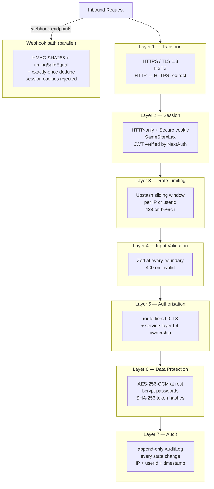

# Security Constitution — Xkimm Xa Mali Foundation

## Security Defence Layers

Every request passes through layers in order. A failure at any layer halts the request.



---

## Rules

```
[SEC-S01]  All passwords hashed with bcrypt at cost 12 minimum.
           Cost never reduced without explicit security review.

[SEC-S02]  All sessions use HTTP-only cookies.
           SameSite=Lax (auth cookie must survive top-level navigation from
           email links). Secure flag on all non-localhost environments.
           No session tokens in localStorage, sessionStorage, or URL.

[SEC-S03]  SA ID numbers and bank account numbers encrypted at rest.
           AES-256-GCM. Key sourced from environment — never committed.

[SEC-S04]  All inputs validated with Zod before any business logic.
           Validation at API boundary AND client-side (same schema).
           Validation failure returns 400 with structured error.

[SEC-S05]  Rate limiting on all endpoints via Upstash.
           Auth endpoints: 5 req/min per IP.
           General endpoints: 60 req/min per IP.

[SEC-S06]  Webhook endpoints verified by HMAC signature only.
           Session cookies on webhook endpoints → 403.
           IP allowlist for Netcash webhooks.

[SEC-S07]  Password reset always returns HTTP 200 regardless of email existence.
           No user enumeration through auth endpoints.

[SEC-S08]  Audit log written for every state-changing operation.
           Cannot be disabled. Written synchronously before response.

[SEC-S09]  POPIA: consent timestamp recorded at registration.
           Data export endpoint required. Retention policy enforced.

[SEC-S10]  L4 hard blocks enforced in service layer.
           Middleware misconfiguration cannot bypass resource-level checks.

[SEC-S11]  No secrets in code, comments, logs, or error messages.
           All secrets in environment variables.
           No .env files committed (only .env.example).

[SEC-S12]  All HTTPS. TLS 1.3 minimum.
           HSTS header set on all responses.
           No mixed content.

[SEC-S13]  SQL injection: Prisma parameterised queries only.
           No raw SQL with user input. Raw queries require security review.

[SEC-S14]  XSS: React's default escaping for all rendered content.
           dangerouslySetInnerHTML is banned without explicit review.
           Content-Security-Policy header configured.

[SEC-S15]  Financial amounts validated server-side for minimum (R100)
           and maximum (configurable per mandate) on every payment request.
           Client-side validation is UX only — never trusted.
```
