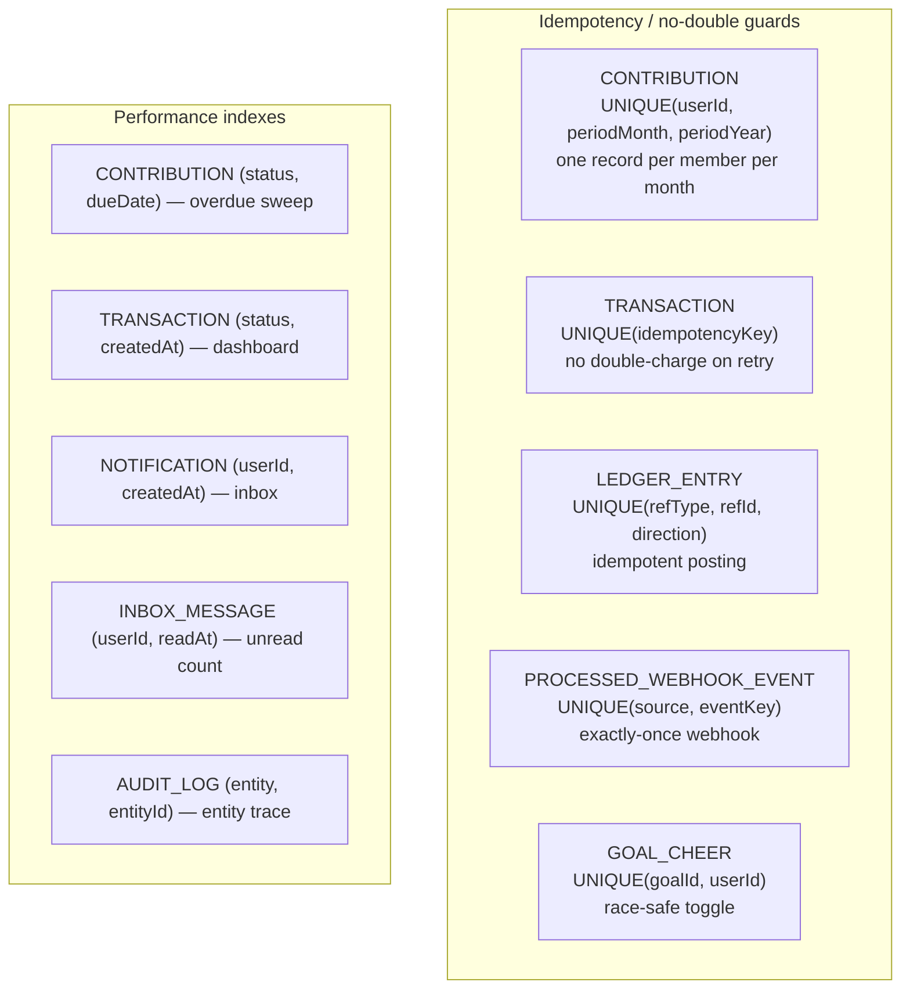
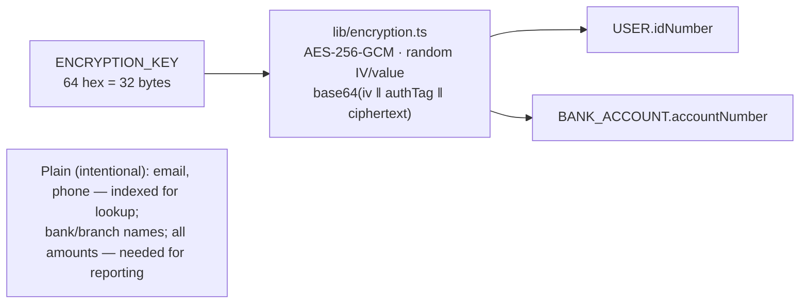

# Entity Relationship Diagram

Visual map of the data model. Source of truth: [`packages/database/prisma/schema.prisma`](../../packages/database/prisma/schema.prisma) — **34 models, 17 enums, 16 migrations**. Next: [02-normalization.md](./02-normalization.md) · [03-schema-design.md](./03-schema-design.md).

The diagrams below group the model into four areas. Auth-adapter tables (`Account`, `Session`, `VerificationToken`) and config (`SystemConfig`, `LoginHistory`) are omitted for clarity — see the schema.

---

## Financial core

> Identity → banking → contributions → transactions → **append-only ledger**.

```mermaid
erDiagram
    USER {
        string id PK
        string email UK
        string phone UK
        string idNumber "AES-256-GCM"
        string password "bcrypt 12"
        enum status "PENDING ACTIVE SUSPENDED"
        datetime popiaConsentAt
    }
    ROLE { string id PK; string name UK "ADMIN MEMBER" }
    USER_ROLE { string userId FK; string roleId FK }
    BANK_ACCOUNT {
        string id PK
        string userId FK
        string accountNumber "AES-256-GCM"
        enum accountType
        boolean isPrimary
    }
    PAYMENT_MANDATE {
        string id PK
        string userId FK
        string bankAccountId FK
        int debitDay "1-28"
        decimal amount
        enum status "PENDING ACTIVE SUSPENDED CANCELLED"
        string netcashMandateId
    }
    CONTRIBUTION {
        string id PK
        string userId FK
        int periodMonth
        int periodYear
        decimal amountDue
        decimal amountPaid
        enum status "PENDING PARTIAL PAID OVERDUE WAIVED"
    }
    TRANSACTION {
        string id PK
        string contributionId FK
        string paymentMandateId FK
        decimal amount
        enum type "DEBIT_ORDER MANUAL REVERSAL"
        enum status "PENDING PROCESSING SUCCESS FAILED REVERSED"
        string idempotencyKey UK
    }
    LEDGER_ENTRY {
        string id PK
        enum account "POOL"
        enum direction "CREDIT DEBIT"
        decimal amount
        string refType
        string refId
    }
    PROCESSED_WEBHOOK_EVENT { string id PK; string source; string eventKey }

    USER ||--o{ USER_ROLE : has
    ROLE ||--o{ USER_ROLE : assigned
    USER ||--o{ BANK_ACCOUNT : owns
    USER ||--o{ PAYMENT_MANDATE : holds
    BANK_ACCOUNT ||--o{ PAYMENT_MANDATE : backs
    USER ||--o{ CONTRIBUTION : owes
    PAYMENT_MANDATE ||--o{ TRANSACTION : produces
    CONTRIBUTION ||--o{ TRANSACTION : "settled by"
    TRANSACTION ||--o{ LEDGER_ENTRY : "posts (idempotent)"
```

Settlement posts a `LEDGER_ENTRY` keyed `UNIQUE(refType, refId, direction)` (CREDIT on SUCCESS, DEBIT on REVERSED). Webhooks are deduped by `PROCESSED_WEBHOOK_EVENT` `UNIQUE(source, eventKey)`. Pool balance = Σ CREDIT − Σ DEBIT.

---

## Engagement & goals

```mermaid
erDiagram
    USER { string id PK }
    GOAL {
        string id PK
        string createdById FK
        enum type "MONTHLY YEARLY CUSTOM"
        decimal targetAmount
        decimal currentAmount
        enum status "DRAFT ACTIVE ACHIEVED FAILED"
    }
    GOAL_PROGRESS { string id PK; string goalId FK; decimal amount }
    GOAL_CHEER { string id PK; string goalId FK; string userId FK }
    GOAL_COMMENT { string id PK; string goalId FK; string userId FK; string body }
    GOAL_PLEDGE { string id PK; string goalId FK; string userId FK; decimal amount }
    BADGE_SCORE { string id PK; string userId FK; enum tier; int score }
    BADGE_HISTORY { string id PK; string userId FK; enum tier }
    COMMUNITY_MESSAGE { string id PK; string userId FK; string body }
    USER_BUDGET { string id PK; string userId FK; enum type; decimal amount }
    BUDGET_OVERRIDE { string id PK; string userBudgetId FK; decimal amount }

    USER ||--o{ GOAL : creates
    GOAL ||--o{ GOAL_PROGRESS : "tracked by"
    GOAL ||--o{ GOAL_CHEER : cheered
    GOAL ||--o{ GOAL_COMMENT : discussed
    GOAL ||--o{ GOAL_PLEDGE : pledged
    USER ||--o| BADGE_SCORE : earns
    USER ||--o{ BADGE_HISTORY : "tier history"
    USER ||--o{ COMMUNITY_MESSAGE : posts
    USER ||--o| USER_BUDGET : sets
    USER_BUDGET ||--o{ BUDGET_OVERRIDE : "overridden by"
```

---

## Notifications, audit, onboarding, signatures

```mermaid
erDiagram
    USER { string id PK }
    NOTIFICATION_TEMPLATE { string id PK; string slug UK; enum channel }
    NOTIFICATION { string id PK; string userId FK; enum channel; enum status "QUEUED SENT FAILED" }
    INBOX_MESSAGE { string id PK; string userId FK; enum category; datetime readAt }
    NOTIFICATION_PREFERENCE { string id PK; string userId FK UK }
    AUDIT_LOG { string id PK; string userId FK; string action; string entity; string entityId }
    PASSWORD_RESET_TOKEN { string id PK; string userId FK; string tokenHash UK; datetime usedAt }
    EMAIL_VERIFICATION_TOKEN { string id PK; string userId FK; string tokenHash UK; datetime usedAt }
    INVITATION { string id PK; string codeHash UK; string email UK; string phone UK; enum status "PENDING ACCEPTED REVOKED EXPIRED" }
    ADMIN_SIGNATURE { string id PK; string adminId FK; string blobUrl }
    ADMIN_SIGNATURE_HISTORY { string id PK; string adminId FK; string blobUrl }

    NOTIFICATION_TEMPLATE ||--o{ NOTIFICATION : renders
    USER ||--o{ NOTIFICATION : receives
    USER ||--o{ INBOX_MESSAGE : reads
    USER ||--o| NOTIFICATION_PREFERENCE : has
    USER ||--o{ AUDIT_LOG : generates
    USER ||--o{ PASSWORD_RESET_TOKEN : requests
    USER ||--o{ EMAIL_VERIFICATION_TOKEN : "verifies via"
    USER ||--o{ INVITATION : sends
    USER ||--o| ADMIN_SIGNATURE : signs
    ADMIN_SIGNATURE ||--o{ ADMIN_SIGNATURE_HISTORY : "versioned by"
```

---

## Constraints & indexes that matter



## Encryption



Encrypting email/phone would make login `O(n)` (every row decrypted to match) — the threat model accepts them as semi-public identifiers. All money columns are `Decimal(10,2)`; `audit_logs` is append-only (no UPDATE/DELETE).
