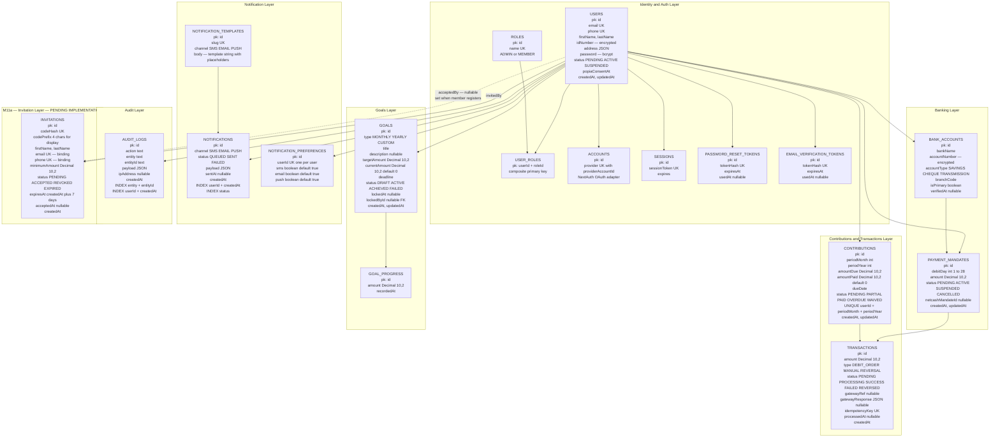
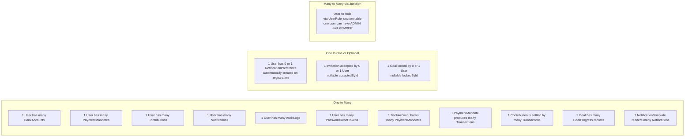
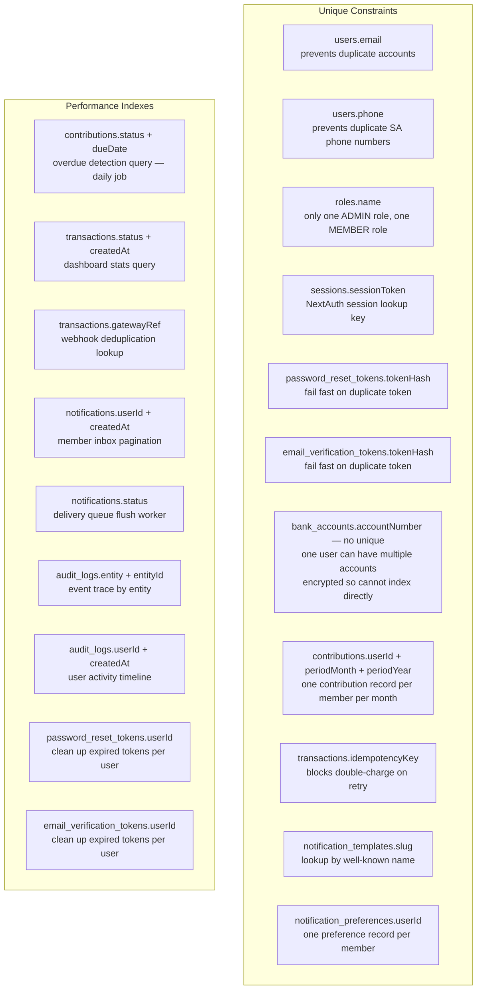
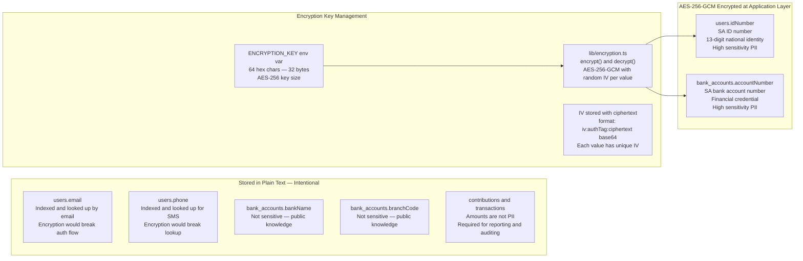

# Entity Relationship Diagram

| | |
|---|---|
| **Purpose** | Complete visual map of every table, relationship, cardinality, and key constraint in the database |
| **Schema file** | `packages/database/prisma/schema.prisma` |
| **Migration** | `packages/database/prisma/migrations/20241201000000_initial_schema` |
| **Tables** | 14 current + 1 planned (Invitation — M11a) |
| **Related Docs** | [02-normalization.md](./02-normalization.md) · [03-schema-design.md](./03-schema-design.md) · [../architecture/03-component-architecture.md](../architecture/03-component-architecture.md) |

---

## Diagram 1 — Full ERD by Domain Layer

> Every table grouped by domain. Arrows show foreign key direction (child points to parent).

---

## Diagram 2 — Cardinality Map

> Shows the exact one-to-one, one-to-many, and many-to-many relationships between entities.

---

## Diagram 3 — Key Constraint Index Map

> Every index and unique constraint and why it exists.

---

## Diagram 4 — Encrypted Fields

> Identifies every field protected by AES-256-GCM application-layer encryption.

---

## Table Reference

| Table | Rows at Scale | Primary Access Pattern | Notes |
|---|---|---|---|
| `users` | 4 to 50 | By email, by id | Core identity record |
| `roles` | 2 (fixed) | By name | ADMIN, MEMBER only |
| `user_roles` | 4 to 100 | By userId | Founder has 2 rows |
| `accounts` | 4 to 50 | By userId | NextAuth OAuth — credentials provider only for now |
| `sessions` | Varies | By sessionToken | JWT strategy — rows minimal |
| `password_reset_tokens` | Low | By tokenHash | Cleaned up after use |
| `email_verification_tokens` | Low | By tokenHash | Cleaned up after use |
| `bank_accounts` | 4 to 150 | By userId | 1 to 3 accounts per member |
| `payment_mandates` | 4 to 50 | By userId, by status | One active per member at a time |
| `contributions` | Up to 600/year at 50 members | By userId + period, by status | One per member per month |
| `transactions` | Up to 1200/year | By contributionId, by idempotencyKey | Multiple per contribution possible |
| `goals` | 5 to 30 | By status | Admin creates, members view |
| `goal_progress` | Grows with goals | By goalId | Funding history per goal |
| `notification_templates` | 10 to 20 (fixed) | By slug | Seeded, rarely changes |
| `notifications` | High | By userId + createdAt, by status | Inbox history + delivery queue |
| `notification_preferences` | 4 to 50 | By userId | One per member |
| `audit_logs` | Grows continuously | By entity + entityId | Append-only, never deleted |
