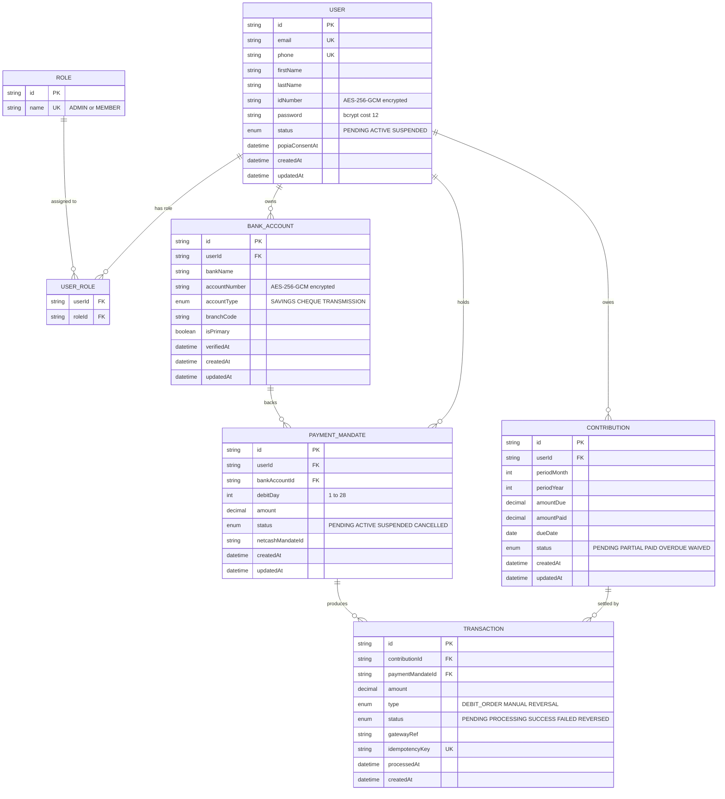
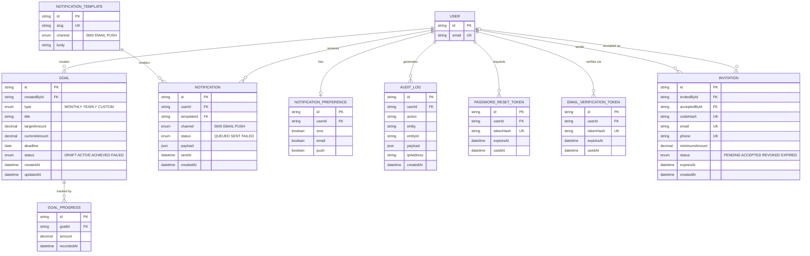
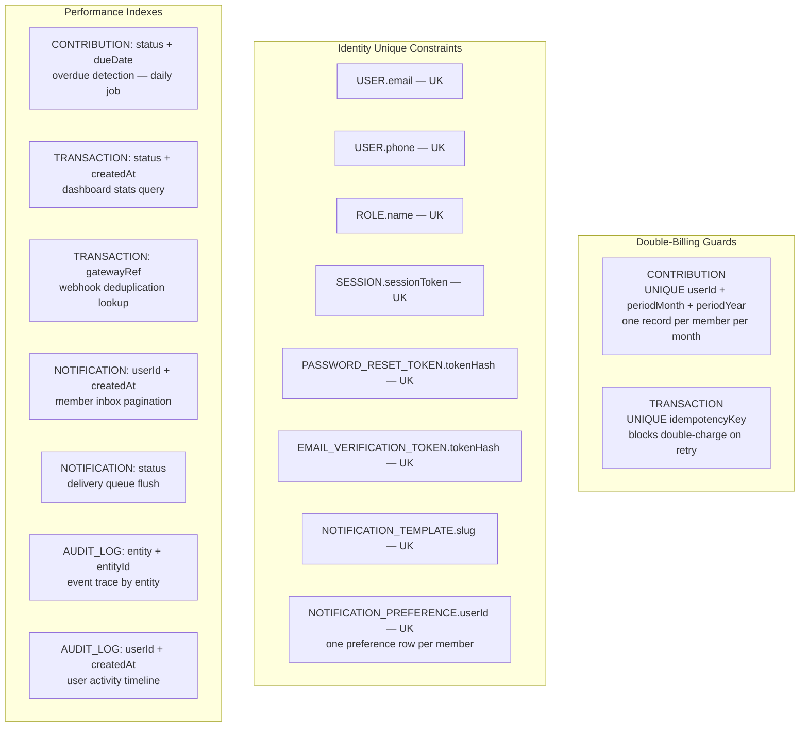
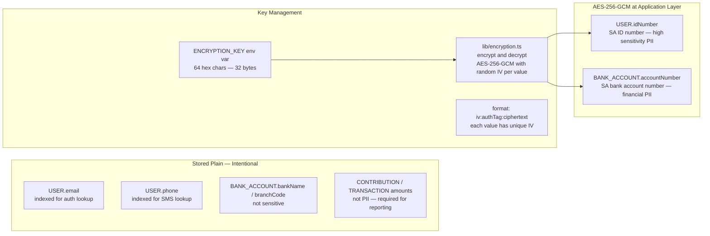

# Entity Relationship Diagram

| | |
|---|---|
| **Purpose** | Complete visual map of every table, relationship, cardinality, and key constraint in the database |
| **Schema file** | `packages/database/prisma/schema.prisma` |
| **Migration** | `packages/database/prisma/migrations/20241201000000_initial_schema` |
| **Tables** | 18 (including Invitation — M11a) |
| **Related Docs** | [02-normalization.md](./02-normalization.md) · [03-schema-design.md](./03-schema-design.md) |

---

## Diagram 1 — Core Domain Relationships

> Identity, Banking, Contributions, and Transactions — the financial core.

---

## Diagram 2 — Support Domain Relationships

> Goals, Notifications, Audit, Auth tokens, and Invitations.

---

## Diagram 3 — Key Constraints and Indexes

---

## Diagram 4 — Encrypted Fields

---

## Table Reference

| Table | Primary Access Pattern | Notes |
|---|---|---|
| `users` | By email, by id | Core identity record |
| `roles` | By name | ADMIN and MEMBER only — 2 rows total |
| `user_roles` | By userId | Founder has 2 rows (both roles) |
| `accounts` | By userId | NextAuth OAuth adapter table |
| `sessions` | By sessionToken | JWT strategy — minimal rows |
| `password_reset_tokens` | By tokenHash | Cleaned up after use |
| `email_verification_tokens` | By tokenHash | Cleaned up after use |
| `bank_accounts` | By userId | 1–3 accounts per member |
| `payment_mandates` | By userId, by status | One active per member at a time |
| `contributions` | By userId + period, by status | One per member per month |
| `transactions` | By contributionId, by idempotencyKey | Multiple per contribution possible |
| `goals` | By status | Admin creates, members view |
| `goal_progress` | By goalId | Funding history per goal |
| `notification_templates` | By slug | Seeded, rarely changes |
| `notifications` | By userId + createdAt, by status | Inbox + delivery queue |
| `notification_preferences` | By userId | One per member |
| `audit_logs` | By entity + entityId | Append-only, never deleted |
| `invitations` | By codeHash, by email | M11a — invite-only onboarding |
