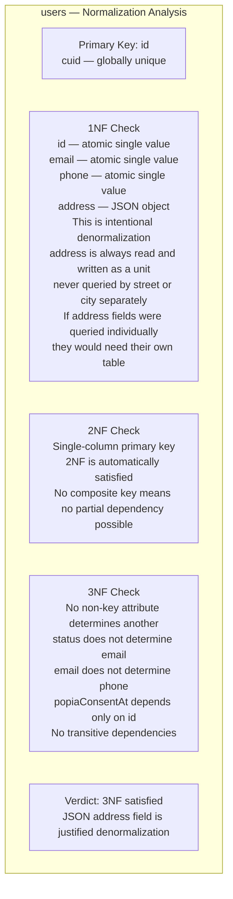
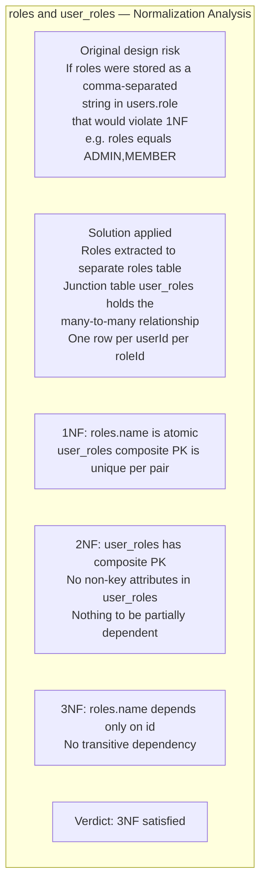
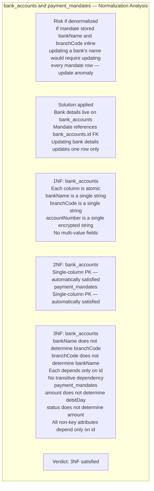
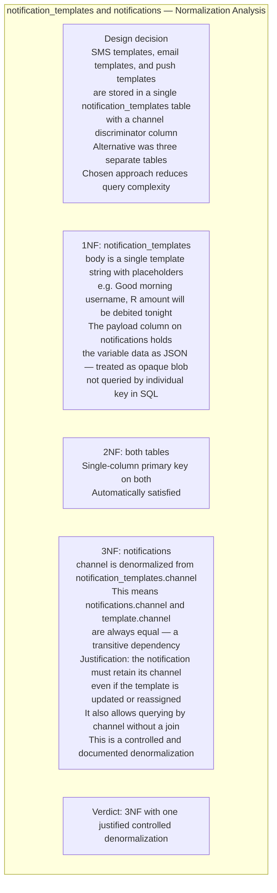
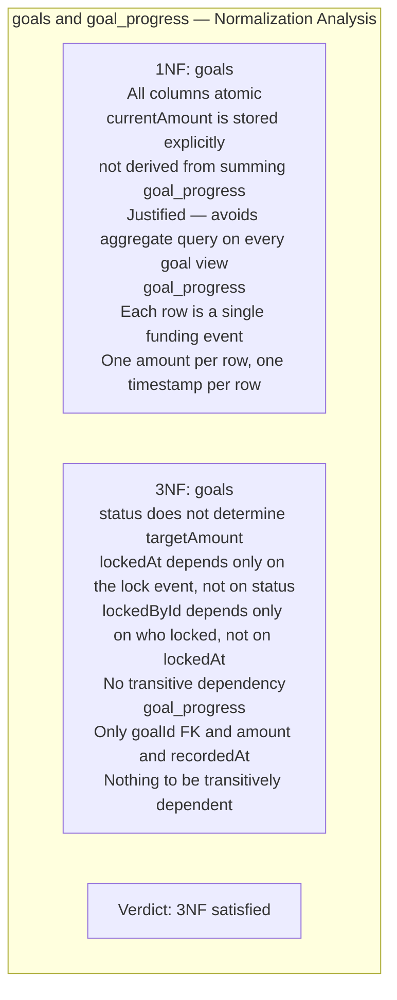
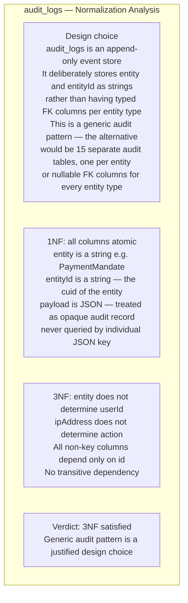

# Database Normalization

| | |
|---|---|
| **Purpose** | Proves the schema satisfies 1NF, 2NF, and 3NF across every domain layer, and documents deliberate denormalization choices |
| **Normal Form Target** | Third Normal Form (3NF) throughout |
| **Related Docs** | [01-erd.md](./01-erd.md) · [03-schema-design.md](./03-schema-design.md) |

---

## Normalization Primer

| Normal Form | Requirement |
|---|---|
| **1NF** | Every column holds one atomic value. No repeating groups. Every row is uniquely identifiable. |
| **2NF** | Satisfies 1NF. Every non-key attribute is fully functionally dependent on the entire primary key (eliminates partial dependency — matters only when PK is composite). |
| **3NF** | Satisfies 2NF. Every non-key attribute depends only on the primary key, not on another non-key attribute (eliminates transitive dependency). |

---

## Diagram 1 — Normalization Journey Overview

```mermaid
flowchart LR
    subgraph RAW["Unnormalized — what it could look like"]
        R1["A single member record with\nembedded bank accounts as arrays\nembedded contribution history as arrays\nembedded mandate details inline\nrepeated role names as strings"]
    end

    subgraph NF1["After 1NF — Atomic values, no repeating groups"]
        N1A["users table — one row per user"]
        N1B["bank_accounts table — one row per account"]
        N1C["payment_mandates table — one row per mandate"]
        N1D["contributions table — one row per contribution period"]
        N1E["roles stored separately — not as comma-separated string"]
    end

    subgraph NF2["After 2NF — No partial dependencies"]
        N2A["user_roles junction table\neliminating partial dependency\non composite key userId + roleId"]
        N2B["contributions uniqueness constraint\nuserId + periodMonth + periodYear\neach attribute fully depends on all three"]
    end

    subgraph NF3["After 3NF — No transitive dependencies"]
        N3A["bank_accounts.bankName and branchCode\nstored on bank_accounts not derived\nfrom accountNumber"]
        N3B["contributions.amountDue\nstored explicitly not derived\nfrom mandate.amount at query time"]
        N3C["notifications.channel\ndenormalized from template for query efficiency\njustified denormalization — see below"]
    end

    RAW --> NF1 --> NF2 --> NF3
```

---

## Domain Analysis — Identity Layer

### `users` table

### `roles` and `user_roles` tables

---

## Domain Analysis — Banking Layer

---

## Domain Analysis — Contributions and Transactions Layer

```mermaid
flowchart TD
    subgraph CONTRIB_NF["contributions and transactions — Normalization Analysis"]
        KEY_DECISION["Key design decision\ncontributions.amountDue is stored explicitly\neven though mandate.amount exists\nThis is deliberate — the contribution captures\nthe amount owed at the time of that period\nMandate amount can change for future periods\nThe historical record must not change"]

        NF1_C["1NF: contributions\nAll columns are single atomic values\nperiodMonth and periodYear are separate integers\nnot a single date field — enables efficient\nmonth-year queries without date parsing\ntransactions\ngatewayResponse stored as JSON blob\nThis is 1NF-compliant — the JSON is treated\nas a single opaque value, never queried by key"]

        NF2_C["2NF: contributions\nComposite unique constraint on userId + periodMonth + periodYear\nbut the primary key is a single id column\nSo 2NF is automatically satisfied\nThe unique constraint is a business rule\nnot the PK — no partial dependency possible\ntransactions\nSingle-column PK — automatically satisfied"]

        NF3_C["3NF: contributions\nstatus does not determine amountDue\namountPaid does not determine status\nstatus is computed from amountPaid vs amountDue\nbut is stored explicitly for query performance\nThis is justified denormalization — see below\ntransactions\ngatewayRef does not determine amount\ntype does not determine status\nAll attributes depend only on id"]

        JUSTIFIED_DENORM["Justified denormalization\ncontributions.status is derivable from\namountPaid compared to amountDue\nbut computing it on every query would require\na case expression on every row in every query\nStoring it explicitly allows a simple WHERE status equals OVERDUE\nA trigger or service method keeps it in sync\nThis is a well-known controlled denormalization\npattern for OLTP systems"]

        VERDICT_C["Verdict: 3NF satisfied with one justified denormalization"]
    end
```

---

## Domain Analysis — Notification Layer

---

## Domain Analysis — Goals Layer

---

## Domain Analysis — Audit Layer

---

## Denormalization Summary

| Table | Denormalized Column | Why Justified |
|---|---|---|
| `users` | `address` as JSON | Address is always read/written as a unit; never queried by individual field |
| `contributions` | `status` column | Avoid case expression on every ledger query; kept in sync by service layer |
| `contributions` | `amountDue` column | Historical snapshot; mandate amount can change for future periods |
| `goals` | `currentAmount` column | Avoid aggregate sum on every goal view; updated on each funding event |
| `notifications` | `channel` column | Retain channel even if template changes; avoids join on every inbox query |
| `audit_logs` | `entity` and `entityId` as strings | Generic audit pattern; avoids 15 separate audit tables |
