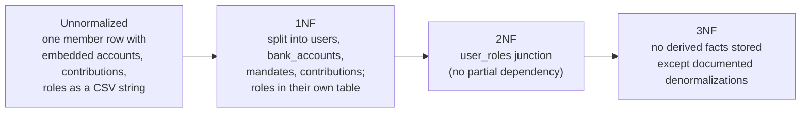

# Database Normalization

The schema is **3NF throughout**, with a handful of deliberate, documented denormalizations for OLTP read performance. Prev: [01-erd.md](./01-erd.md) · [03-schema-design.md](./03-schema-design.md).

| Form | Requirement |
|---|---|
| **1NF** | Atomic columns, no repeating groups, every row uniquely identifiable |
| **2NF** | 1NF + every non-key attribute depends on the *whole* key (only relevant for composite keys) |
| **3NF** | 2NF + no non-key attribute depends on another non-key attribute (no transitive dependency) |

Because almost every table uses a single-column CUID primary key, **2NF is automatic** — partial dependency is impossible without a composite key. The work is in 1NF (atomicity) and 3NF (no transitive dependency).

---

## From unnormalized to 3NF

---

## 3NF verdict by domain

| Domain | 1NF | 3NF | Notes |
|---|---|---|---|
| **users** | ✅ (`address` is JSON — read/written as a unit, never queried by field) | ✅ `status`, `email`, `phone`, `popiaConsentAt` each depend only on `id` | — |
| **roles / user_roles** | ✅ roles extracted from any CSV string | ✅ junction holds the M:N; `roles.name` depends only on `id` | Prevents the `"ADMIN,MEMBER"` 1NF violation |
| **bank_accounts / mandates** | ✅ atomic columns | ✅ bank/branch on the account, not inline on the mandate | Avoids update anomaly when a bank's details change |
| **contributions / transactions** | ✅ `periodMonth`/`periodYear` integers; gateway response is opaque JSON | ✅ + one justified denormalization (`status`) | `amountDue` is a historical snapshot, not derived live |
| **ledger_entries** | ✅ one posting per row (account, direction, amount, ref) | ✅ balance derived, never stored | Append-only; idempotent via `UNIQUE(refType,refId,direction)` |
| **notifications / inbox** | ✅ `payload` opaque JSON | ✅ + `channel` denormalized from template | Notification keeps its channel even if the template changes |
| **goals / progress / engagement** | ✅ one event per row | ✅ `currentAmount` denormalized | Avoids an aggregate sum on every goal view |
| **audit_logs** | ✅ `entity`/`entityId` strings | ✅ generic event store | Generic pattern beats 15 per-entity audit tables |

---

## Deliberate denormalizations

Each is a controlled trade — a stored derived value kept in sync by the service layer, justified by read frequency.

| Table | Column | Why |
|---|---|---|
| `users` | `address` (JSON) | Always read/written as a unit; never filtered by street/city |
| `contributions` | `status` | Avoids a CASE expression on every ledger query; service keeps it in sync with `amountPaid` vs `amountDue` |
| `contributions` | `amountDue` | Historical snapshot — the mandate amount may change for future periods |
| `goals` | `currentAmount` | Avoids `SUM(goal_progress)` on every goal view |
| `notifications` | `channel` | Retains the delivery channel even if the template is reassigned; no join on inbox reads |
| `audit_logs` | `entity`, `entityId` | Generic audit store instead of one table per entity type |

The **ledger** is intentionally *not* denormalized — the pool balance is always derived from entries and is reconcilable, because correctness of money outranks read cost there.
