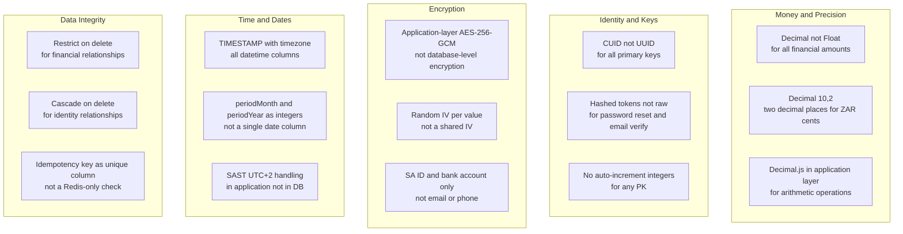
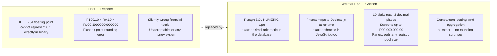
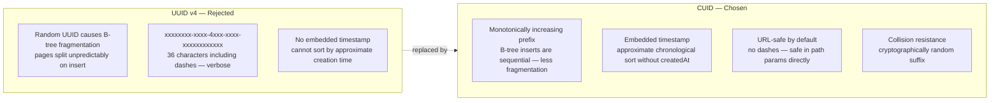
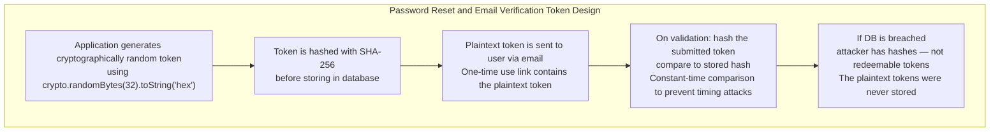
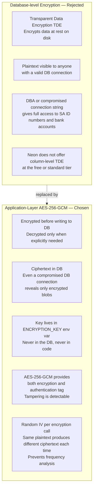
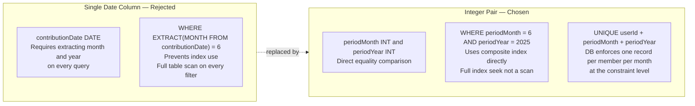
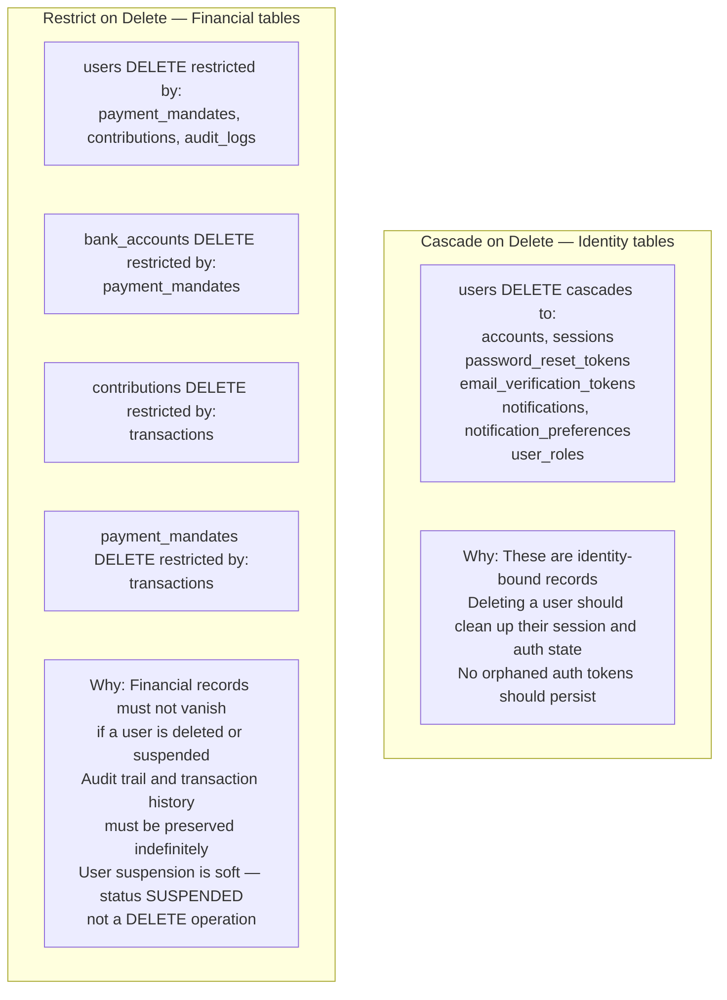
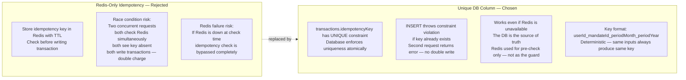

# Schema Design Decisions

| | |
|---|---|
| **Purpose** | Documents every non-obvious design decision in the schema — what was chosen, what was rejected, and why |
| **Audience** | Engineers extending the schema, technical reviewers |
| **Related Docs** | [01-erd.md](./01-erd.md) · [02-normalization.md](./02-normalization.md) |

---

## Diagram 1 — Decision Map Overview

---

## Money — Why `Decimal(10,2)` Not `Float`

**Rule:** Every currency column in the schema is `@db.Decimal(10,2)`. No exceptions. All arithmetic in application code uses `Decimal.js`.

---

## Primary Keys — Why CUID Not UUID

---

## Token Storage — Why Hashed

**Why not JWT for reset tokens?** JWTs are self-contained and cannot be revoked. A hashed DB token can be invalidated by setting `usedAt` — this prevents token reuse even if the email was forwarded or the link was bookmarked.

---

## Application-Layer Encryption — Why Not DB Encryption

**What is encrypted:** `users.idNumber`, `bank_accounts.accountNumber`

**What is NOT encrypted (intentional):** `users.email` and `users.phone` are authentication lookup keys — encrypting them would require decrypting every row to find a match, making login O(n). The threat model accepts that email and phone are stored in plain text because they are semi-public identifiers.

---

## Period Columns — Why `periodMonth` and `periodYear` as Integers

---

## Delete Behaviour — Restrict vs Cascade

---

## Idempotency Key — Why a Unique DB Column Not Redis-Only

---

## Index Strategy Summary

| Index | Table | Columns | Query It Serves |
|---|---|---|---|
| Unique | `users` | `email` | Auth login lookup |
| Unique | `users` | `phone` | SA phone duplicate check |
| Unique | `sessions` | `sessionToken` | NextAuth session validation |
| Unique | `contributions` | `userId, periodMonth, periodYear` | One record per member per month |
| Unique | `transactions` | `idempotencyKey` | Double-charge prevention |
| Composite | `contributions` | `status, dueDate` | Overdue detection daily job |
| Composite | `transactions` | `status, createdAt` | Dashboard stats query |
| Single | `transactions` | `gatewayRef` | Webhook deduplication |
| Composite | `notifications` | `userId, createdAt` | Member inbox pagination |
| Single | `notifications` | `status` | Delivery queue flush |
| Composite | `audit_logs` | `entity, entityId` | Event trace per entity |
| Composite | `audit_logs` | `userId, createdAt` | User activity timeline |
| Single | `password_reset_tokens` | `userId` | Token cleanup per user |
| Single | `email_verification_tokens` | `userId` | Token cleanup per user |
