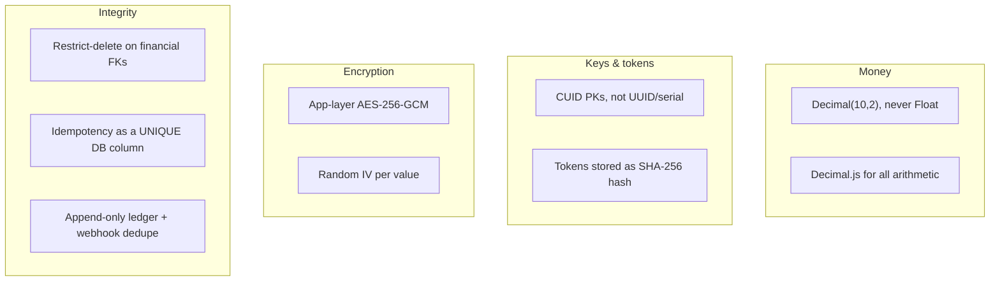
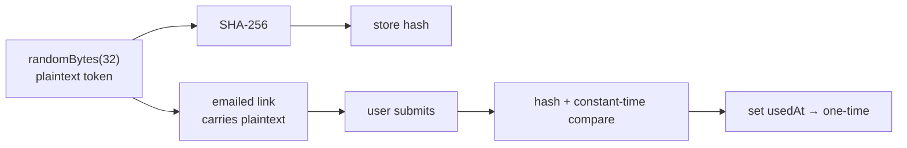

# Schema Design Decisions

The non-obvious choices in the schema — what was chosen, what was rejected, why. Prev: [01-erd.md](./01-erd.md) · [02-normalization.md](./02-normalization.md).

---

## Decision table

| Decision | Rejected | Chosen — why |
|---|---|---|
| **Money type** | `Float` (IEEE-754 can't represent 0.1; `100.10 + 0.10` drifts) | `Decimal(10,2)` → Postgres `NUMERIC`, exact; Prisma maps to `Decimal.js`. Holds up to R99,999,999.99. **Every** currency column, no exceptions. |
| **Primary keys** | UUID v4 (random → B-tree fragmentation; 36 chars; no time order) | **CUID** — monotonic prefix (sequential inserts), embedded timestamp (rough chrono sort), URL-safe, collision-resistant. |
| **Reset/verify/invite tokens** | Store raw token, or use JWT (can't revoke) | Store **SHA-256 hash**; plaintext only in the emailed link. A DB breach yields non-redeemable hashes; `usedAt` makes them one-time. |
| **PII encryption** | DB-level TDE (plaintext to any connection; not on Neon standard tier) | **App-layer AES-256-GCM** before write; DB holds only ciphertext + auth tag (tamper-evident); key in `ENCRYPTION_KEY` env, never in DB/code; random IV per value defeats frequency analysis. Encrypts `idNumber`, `accountNumber` only. |
| **Period columns** | Single `DATE` (forces `EXTRACT(MONTH …)` → full scan) | `periodMonth` + `periodYear` **integers** → direct equality hits the composite index; backs `UNIQUE(userId, periodMonth, periodYear)`. |
| **Delete behaviour** | Cascade everywhere | **Cascade** identity/auth rows (sessions, tokens, prefs, roles); **Restrict** financial rows (mandates, contributions, transactions, audit, ledger) — financial history must never vanish. Suspension is a soft `status` change, not a delete. |
| **Idempotency** | Redis-only check (race window; bypassed if Redis down) | **`UNIQUE` DB column** `transactions.idempotencyKey` — the DB enforces it atomically; Redis is only a fast pre-check. Key = `userId_mandateId_periodMonth_periodYear` (deterministic). |
| **Ledger** | Mutable balance column | **Append-only `LedgerEntry`** with `UNIQUE(refType, refId, direction)` — postings are idempotent; balance is derived (Σ credits − Σ debits) and reconcilable from settled transactions. |
| **Webhook processing** | Trust gateway not to redeliver | **`ProcessedWebhookEvent`** with `UNIQUE(source, eventKey)` — claim before processing, release on failure → exactly-once. |

---

## Why hashed tokens (flow)

A self-contained JWT can't be revoked; a hashed DB token can (`usedAt`), surviving forwarded emails and bookmarked links.

---

## Index strategy

| Type | Table | Columns | Serves |
|---|---|---|---|
| Unique | `users` | `email` / `phone` | Login lookup / duplicate check |
| Unique | `contributions` | `userId, periodMonth, periodYear` | One record per member per month |
| Unique | `transactions` | `idempotencyKey` | Double-charge prevention |
| Unique | `ledger_entries` | `refType, refId, direction` | Idempotent posting |
| Unique | `processed_webhook_events` | `source, eventKey` | Exactly-once webhook |
| Unique | `goal_cheers` | `goalId, userId` | Race-safe cheer toggle |
| Composite | `contributions` | `status, dueDate` | Overdue sweep |
| Composite | `transactions` | `status, createdAt` | Dashboard stats |
| Composite | `notifications` | `userId, createdAt` | Inbox pagination |
| Composite | `inbox_messages` | `userId, readAt` | Unread count |
| Composite | `audit_logs` | `entity, entityId` | Entity trace |
