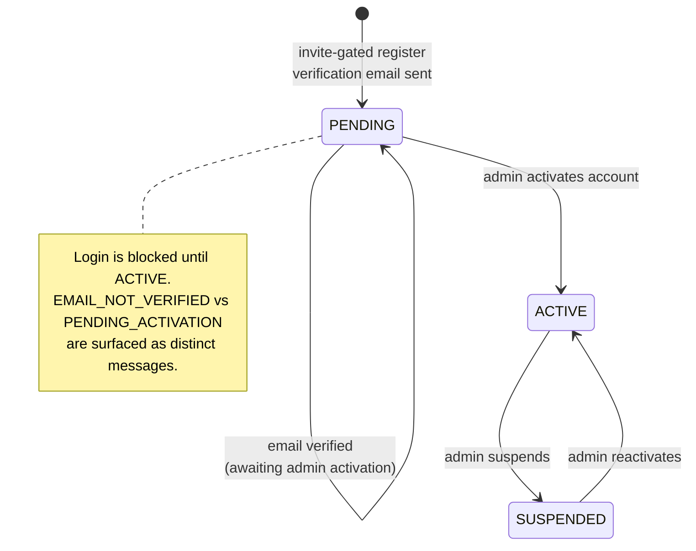
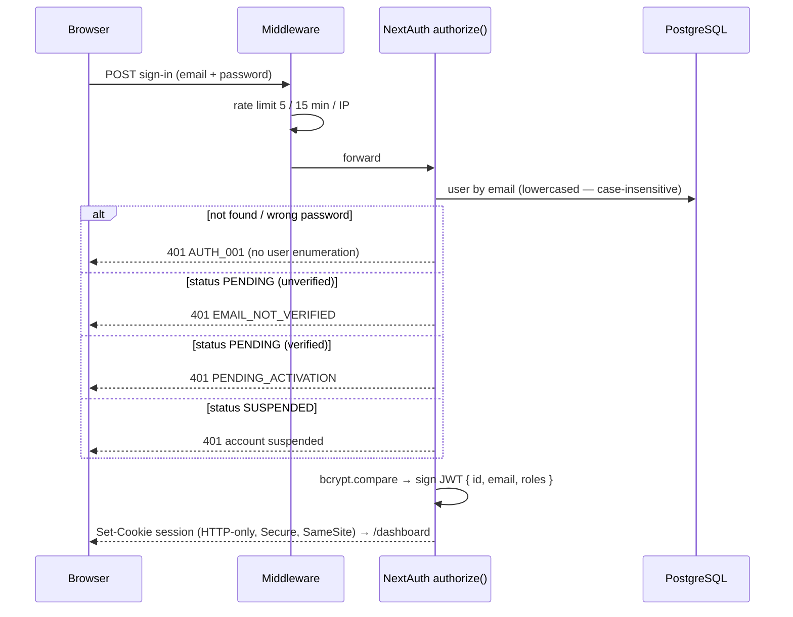
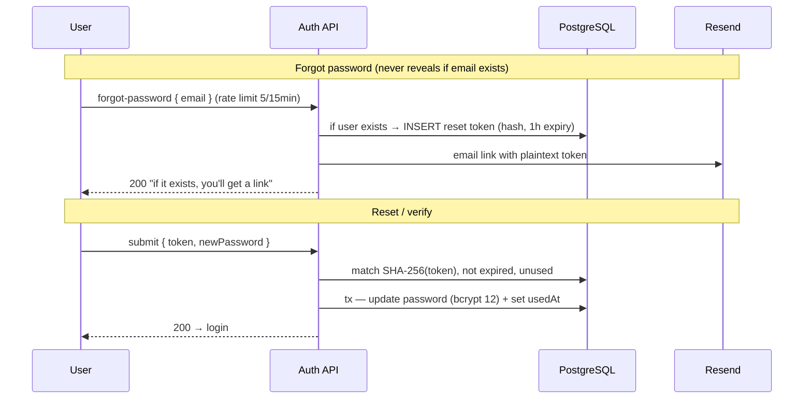
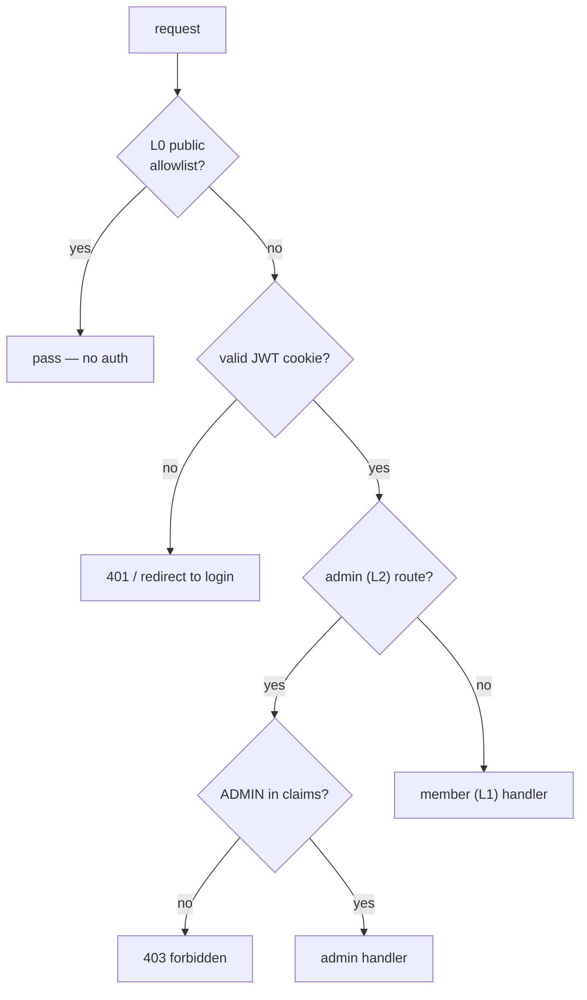

# Authentication Flow

Registration, email verification, login, session validation, password reset, and route-tier enforcement. Registration is **invite-gated** (full flow: [05-invite-registration-flow.md](./05-invite-registration-flow.md)). Security model: [../security/01-security-architecture.md](../security/01-security-architecture.md).

---

## Account states

## Login

## Email verification & password reset

Both use the same pattern: a random token is emailed in plaintext; only its **SHA-256 hash** is stored. On submit, the hash is recomputed and compared (constant-time); success sets `usedAt` (one-time) inside a transaction.

---

## Route-tier enforcement (`middleware.ts`)

| Tier | Routes | Rule |
|---|---|---|
| **L0** Public | `/` · `/whatsapp` · `/auth/*` · `/api/v1/auth/*` · `health` · `stats/public` | No auth |
| **L1** Member | `/dashboard/*` · members · mandates · contributions · transactions · notifications · insights · inbox | Any valid session; queries scoped to `x-user-id` — never a client-supplied id |
| **L2** Admin | `/admin/*` · `/api/v1/admin/*` · goals (write) | ADMIN role in JWT |
| **L3** System | `/api/v1/webhooks/*` | HMAC only — session cookies rejected |
