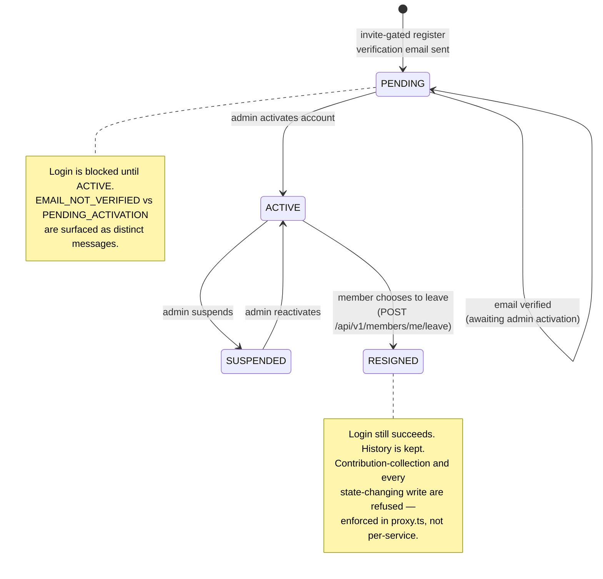
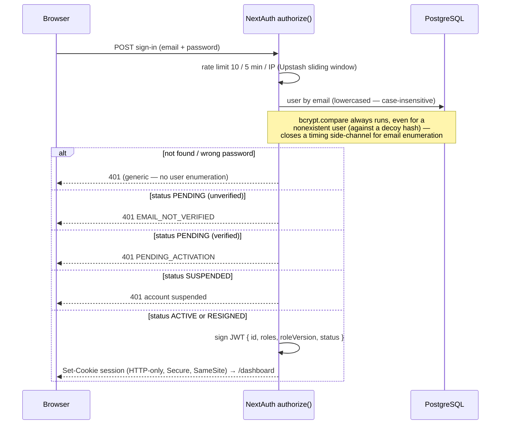
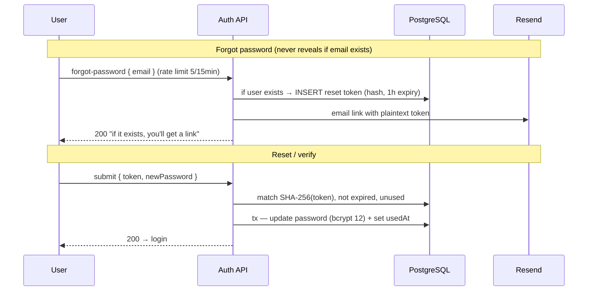
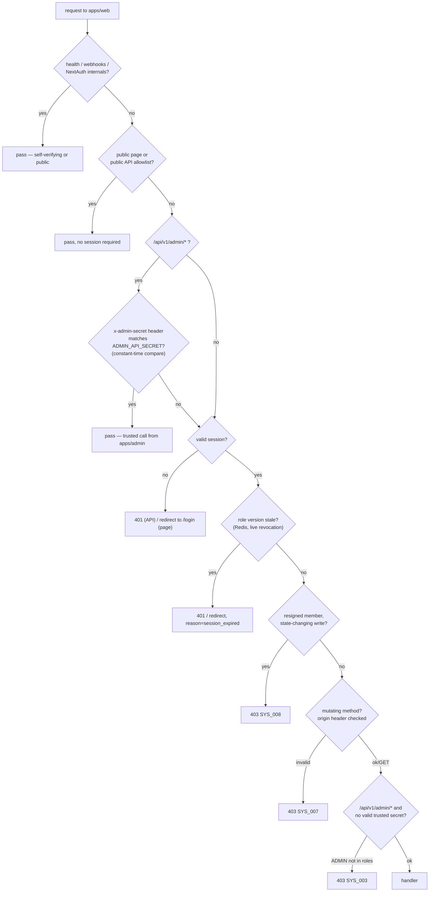

# Authentication Flow

Registration, email verification, login, session validation, password reset, and route-tier enforcement. Registration is **invite-gated** (full flow: [05-invite-registration-flow.md](./05-invite-registration-flow.md)). Security model: [../security/01-security-architecture.md](../security/01-security-architecture.md).

> **Updated 2026-08-30 — this doc previously described one app's middleware.**
> `apps/web` and `apps/admin` are separate Vercel deployments, each with its
> own NextAuth config and its own route-protection file — and in Next.js 16
> that file is named `proxy.ts`, not `middleware.ts` (a breaking rename from
> the version most training data reflects). See
> [../architecture/01-system-context.md](../architecture/01-system-context.md)
> for the 3-app boundary.

---

## Account states

There are **four** states, not three — `RESIGNED` (a member who chose to
leave; history stays, future collections stop) is easy to miss because it
never appears in the login-rejection flow below: a resigned member can
**still sign in**. Only certain writes are refused for them (see
"Membership standing" further down).

## Login

Rate limiting happens **inside** the `authorize()` callback
(`assertLoginAllowed(ip)` in `lib/auth.ts`), not as a separate middleware
step before it — the two used to be drawn as sequential stages; in the real
code they're the same function call.

`apps/admin`'s own `authorize()` in `apps/admin/lib/auth.ts` runs the
identical shape — same decoy-hash timing defence, same lockout counter —
with one addition: it rejects at this exact point if the account does not
hold the `ADMIN` role, before a session is ever issued. A member-only
account gets the same generic 401 as a wrong password, not a hint that the
account exists.

## Email verification & password reset

Both use the same pattern: a random token is emailed in plaintext; only its **SHA-256 hash** is stored. On submit, the hash is recomputed and compared (constant-time); success sets `usedAt` (one-time) inside a transaction.

---

## Route-tier enforcement (`apps/web/proxy.ts`)

There is no `/admin/*` UI tier inside `apps/web` — the admin console is a
separate app (`apps/admin`) with its own `proxy.ts`. What `apps/web`'s
proxy actually gates is its own `/api/v1/admin/*` **API** routes, reached
two ways: a real admin's session (checked the same as any other route,
plus an `ADMIN` role check), or a **trusted server-to-server call from
`apps/admin` itself**, authenticated by a shared `ADMIN_API_SECRET` header
compared in constant time — not a session at all.

`apps/admin`'s own `proxy.ts` is much shorter: it only has to protect one
app's worth of pages behind a session that carries the `ADMIN` role — it
has no public-API allowlist, no trusted-secret bypass (it's the caller of
that mechanism, not the receiver), and no membership-standing check (an
admin is never "resigned" out of the console, only suspended or demoted).

| Concern | Where it's actually enforced |
|---|---|
| Public pages/APIs | `apps/web/proxy.ts` — explicit allowlist, not a route prefix |
| Any-valid-session pages | `apps/web/proxy.ts` — `!session` check; queries themselves are scoped to `session.user.id` via `assertCanAccess`, never a client-supplied id |
| `apps/web`'s admin API | `apps/web/proxy.ts` — trusted-secret OR `ADMIN` role in session, both checked here |
| Admin console UI | `apps/admin/proxy.ts` — session + `ADMIN` role, separately, plus `requireAdmin()` re-checking role live on every server action |
| Webhooks | Both apps' `WEBHOOK_PREFIX` allowlist — HMAC/signing-key verified inside the handler itself, session cookies never consulted |
| **Live role revocation** | Redis-cached `roleVersion`, seeded at login, bumped on any role/status change; a stale token forces re-authentication mid-session rather than waiting for JWT expiry — this is what makes suspending a member or demoting an admin take effect immediately instead of up to 24h later |
| **Resigned-member write block** | `refuseForStanding()` in `apps/web/proxy.ts` — reads are untouched, only state-changing calls are refused, so a departed member keeps visibility into their own history |
| **CSRF** | Origin-header check on every mutating method against authenticated API routes (`verifyCsrfOrigin`) |
| **CSP** | A fresh nonce generated per request, threaded onto both the request and response headers — the previous version of this policy shipped `'unsafe-inline'` on scripts, which made the CSP decorative against XSS |
