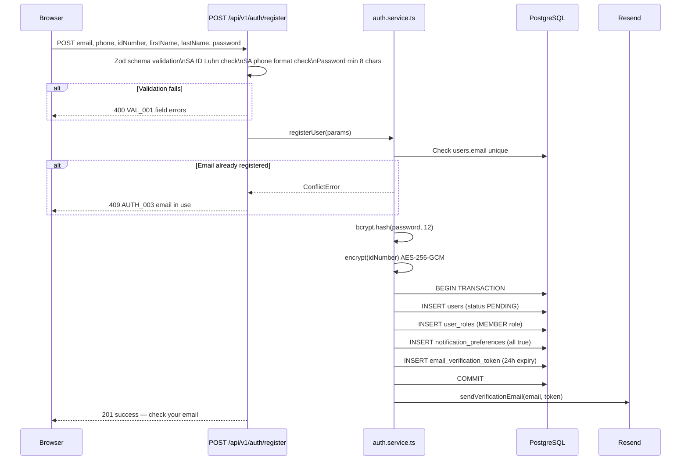
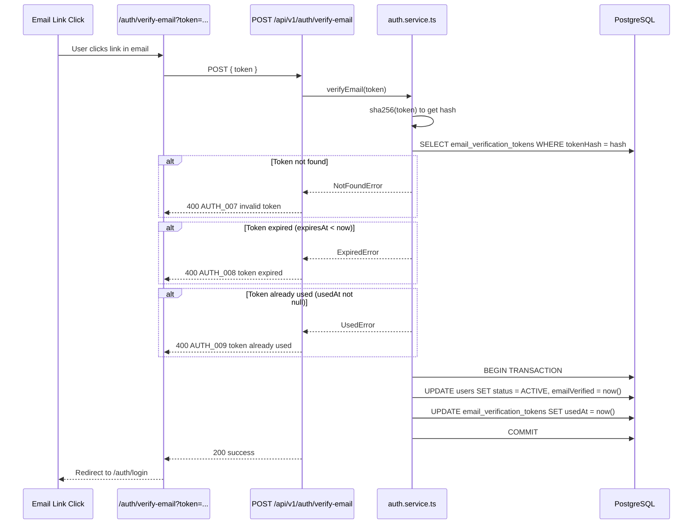
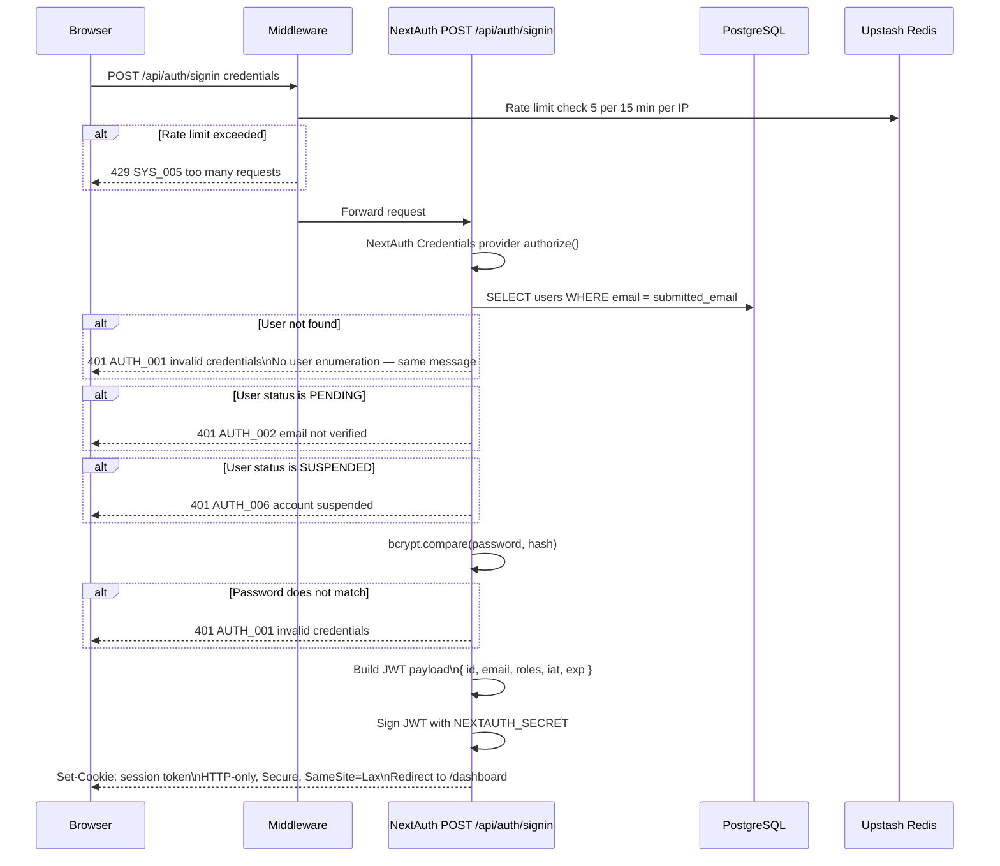
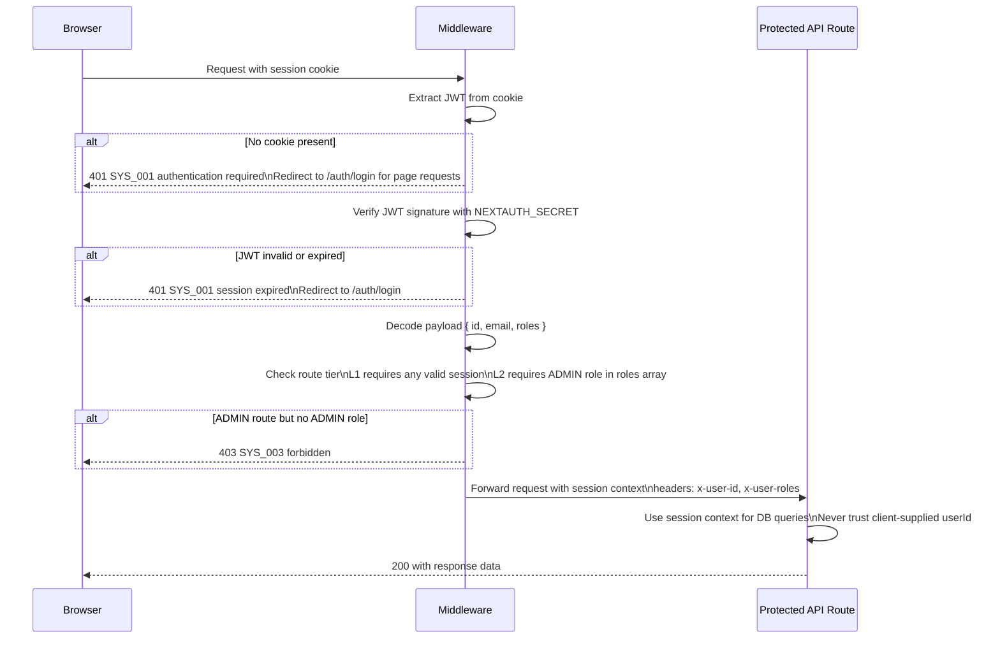
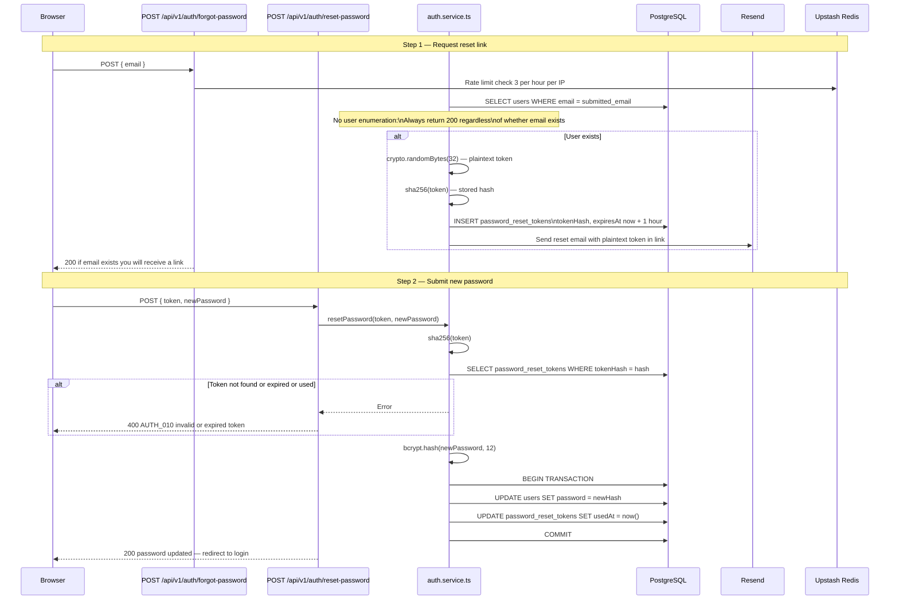
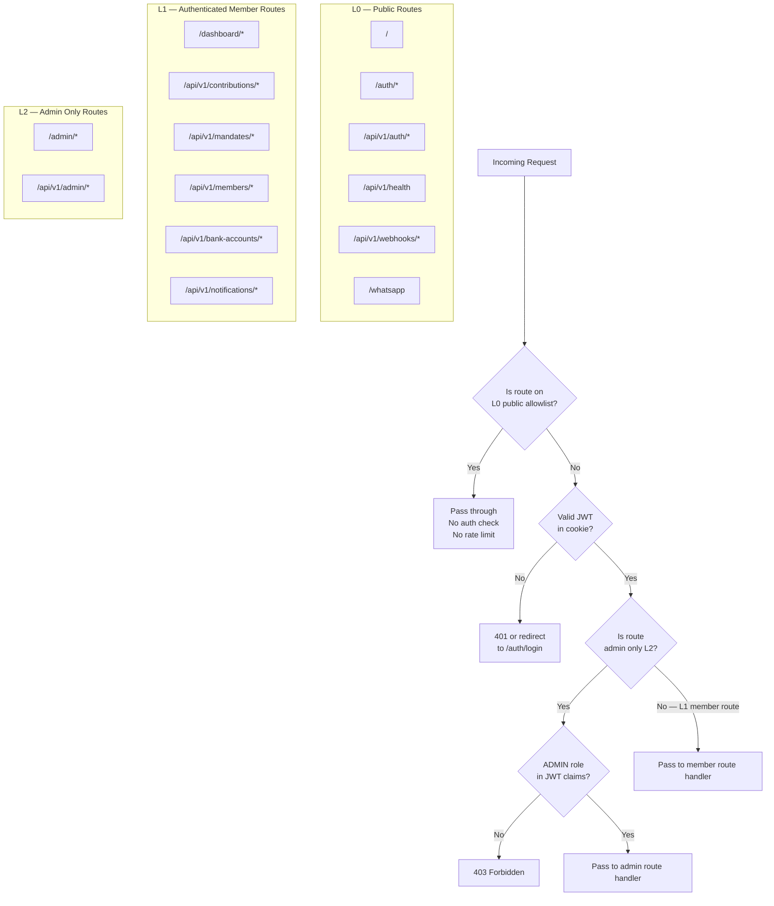

# Authentication Flow

| | |
|---|---|
| **Purpose** | Full sequence diagrams for every auth flow — registration, email verification, login, session, password reset, and logout |
| **Modules** | M02 Auth System · M11a Invite and Access Control (patches registration) |
| **Related Docs** | [../security/01-security-architecture.md](../security/01-security-architecture.md) · [05-invite-registration-flow.md](./05-invite-registration-flow.md) · [../database/01-erd.md](../database/01-erd.md) |

---

## Diagram 1 — Registration Flow (Current — Open Registration)

> Pre-M11a: any person with a valid SA ID and phone can register. M11a closes this with invite codes.

---

## Diagram 2 — Email Verification Flow

---

## Diagram 3 — Login Flow

---

## Diagram 4 — Authenticated Request Flow (Session Validation)

---

## Diagram 5 — Password Reset Flow

---

## Diagram 6 — Route Tier Enforcement

> The three access tiers enforced by `middleware.ts` on every request.

