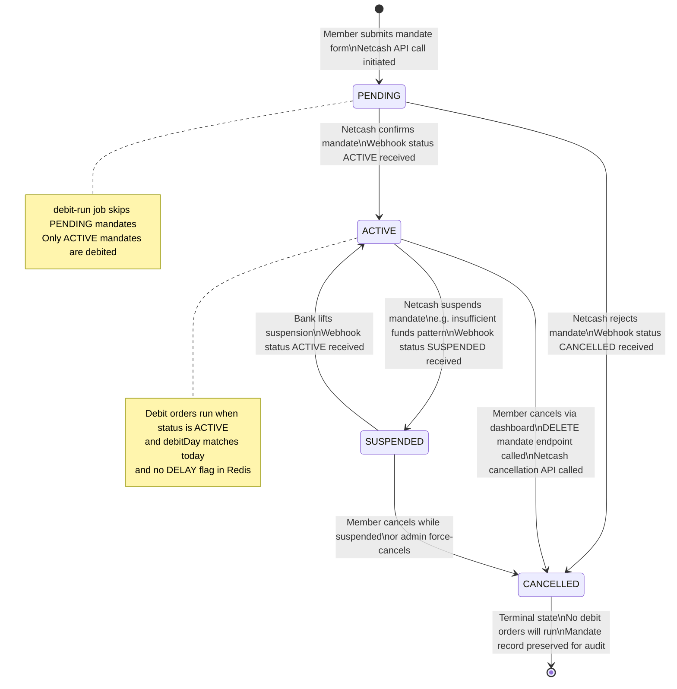
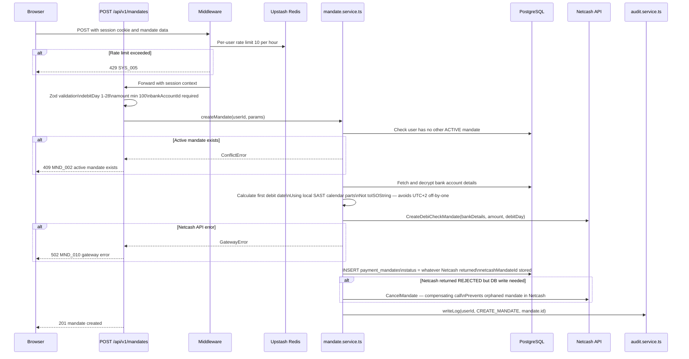
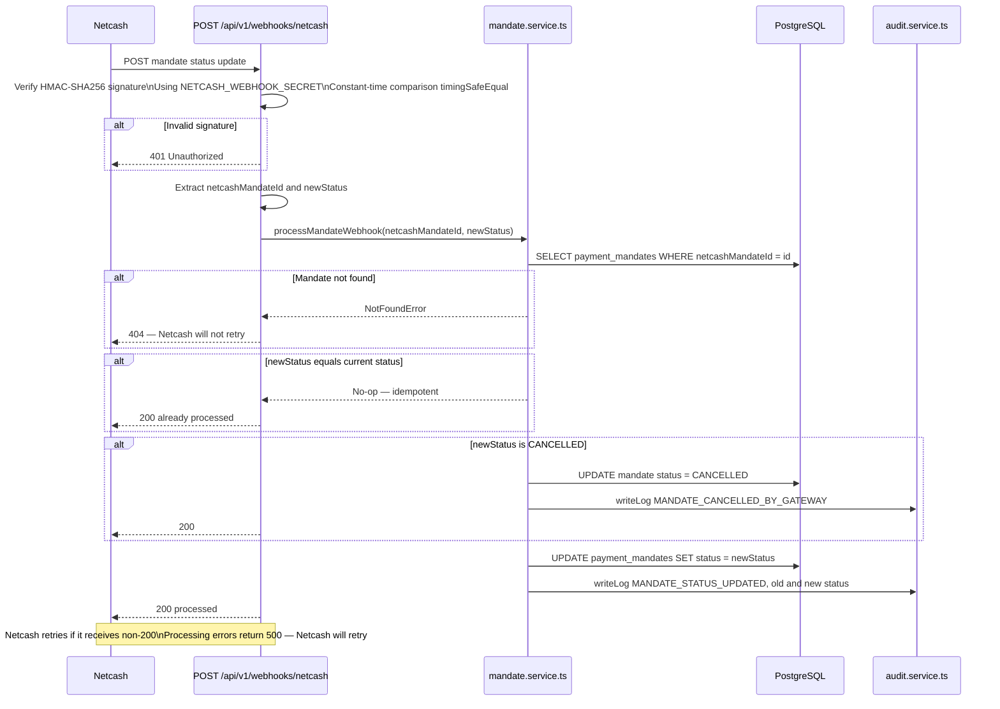
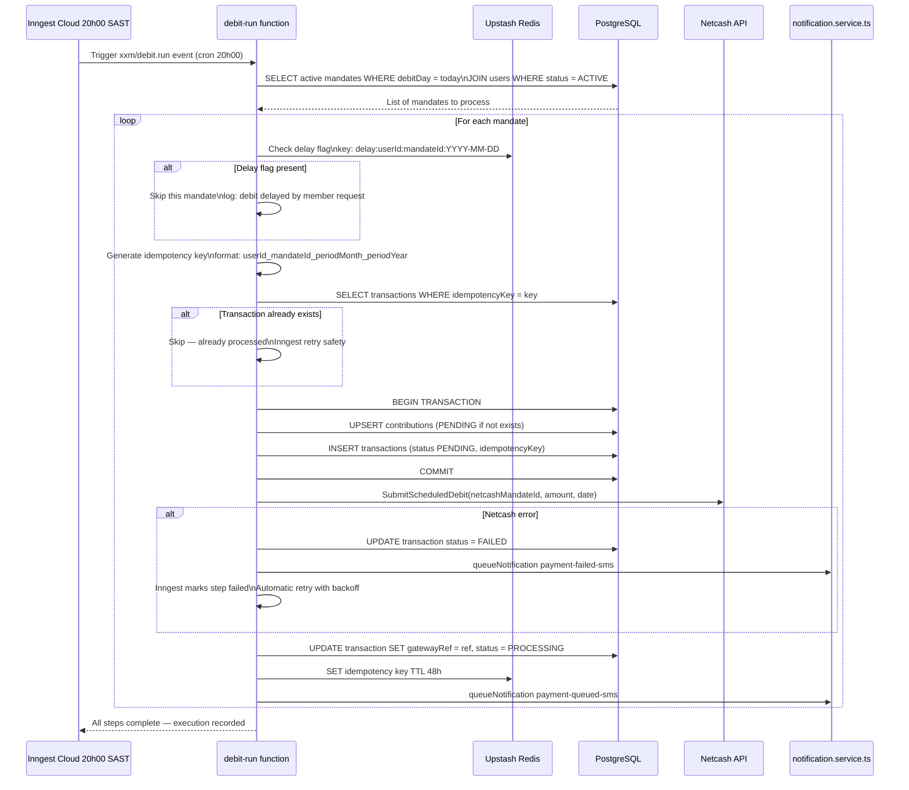
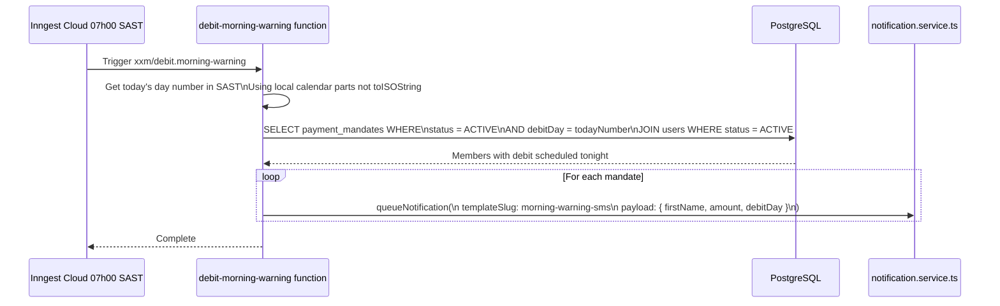
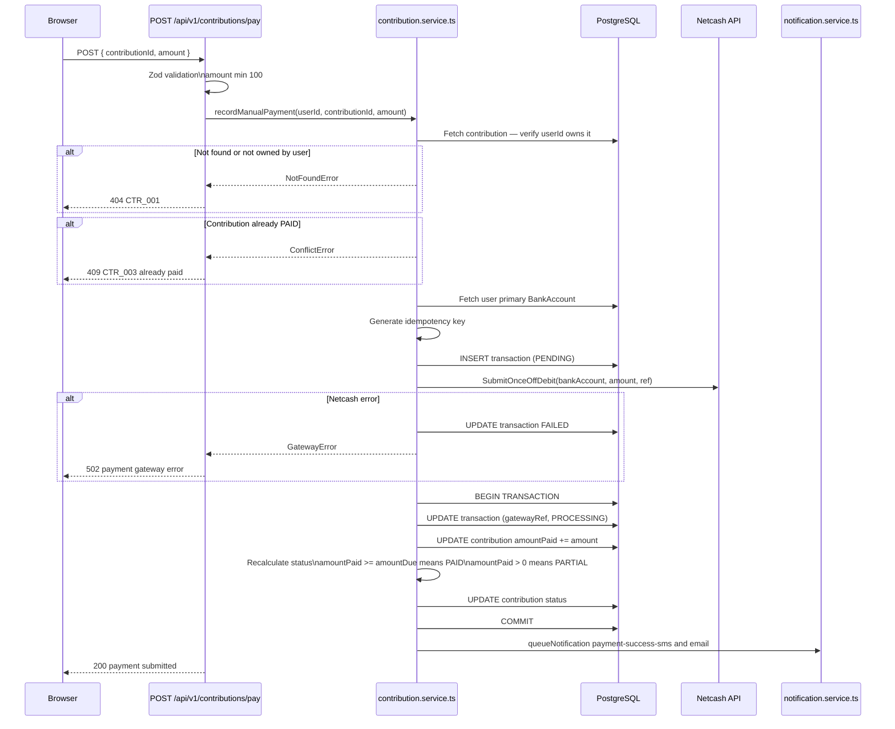
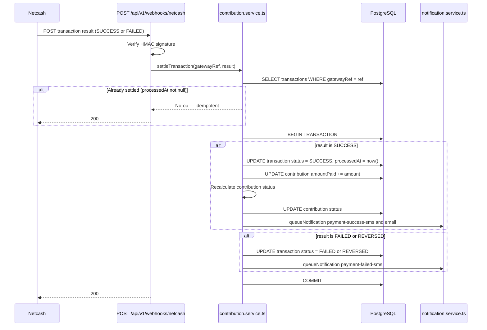

# Payment and Mandate Flow

| | |
|---|---|
| **Purpose** | Complete sequence and state diagrams for mandate creation, the nightly debit pipeline, manual payments, and webhook settlement |
| **Modules** | M04 Payment Mandates · M05 Contribution Engine · M06 Job Engine |
| **Related Docs** | [03-contribution-lifecycle.md](./03-contribution-lifecycle.md) · [04-notification-pipeline.md](./04-notification-pipeline.md) · [../architecture/02-container-architecture.md](../architecture/02-container-architecture.md) |

---

## Diagram 1 — Mandate State Machine

> Every state a `PaymentMandate` can be in and every valid transition.

---

## Diagram 2 — Mandate Creation Flow

---

## Diagram 3 — Netcash Webhook Handler

> Netcash sends status updates asynchronously — this is how they are processed.

---

## Diagram 4 — Nightly Debit Pipeline (Full)

> The automated payment pipeline that runs every night at 20:00 SAST.

---

## Diagram 5 — Morning Warning Job

> Runs at 07:00 SAST daily — warns members that tonight their account will be debited.

---

## Diagram 6 — Manual Payment Flow

---

## Diagram 7 — Transaction Settlement via Netcash Webhook

> After a debit runs, Netcash sends a result webhook — this is how the transaction is settled.

