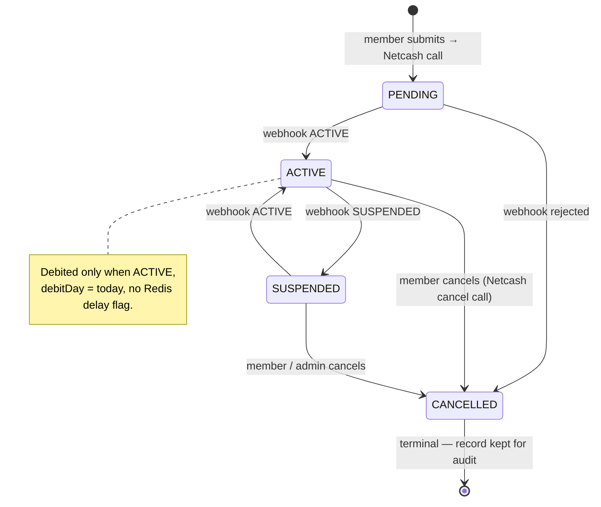
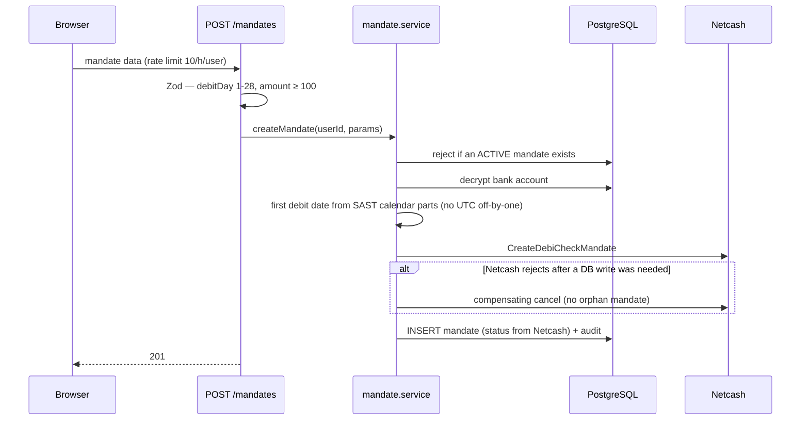
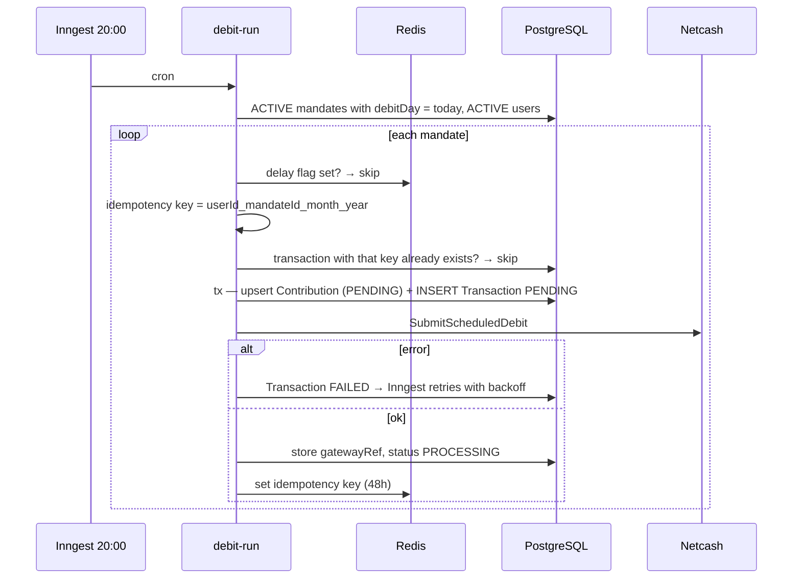
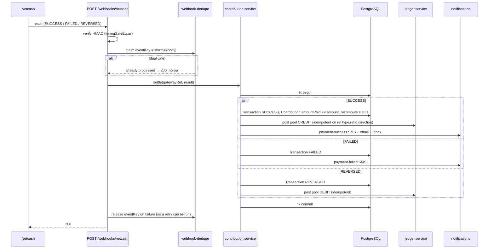

# Payment & Mandate Flow

Mandate lifecycle, the nightly debit pipeline, manual payments, and webhook settlement into the ledger. Related: [03-contribution-lifecycle.md](./03-contribution-lifecycle.md) · [04-notification-pipeline.md](./04-notification-pipeline.md).

---

## Mandate state machine

## Mandate creation

---

## Nightly debit pipeline (20:00 SAST)

> A morning-warning SMS goes out at 07:00 to everyone whose `debitDay` is today (day number computed from SAST calendar parts, not `toISOString`).

---

## Settlement → ledger (Netcash result webhook)

Pool balance = Σ CREDIT − Σ DEBIT, rebuilt nightly by `reconcileLedger`. A manual payment (`POST /contributions/pay`) follows the same settle path via its own once-off Netcash debit.
