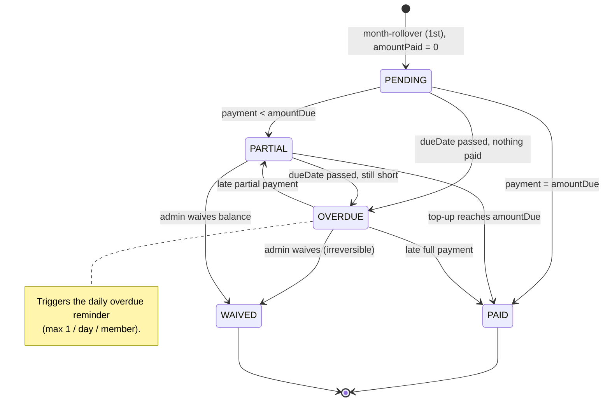
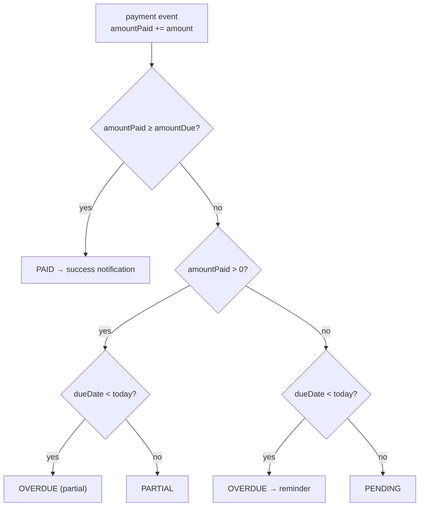
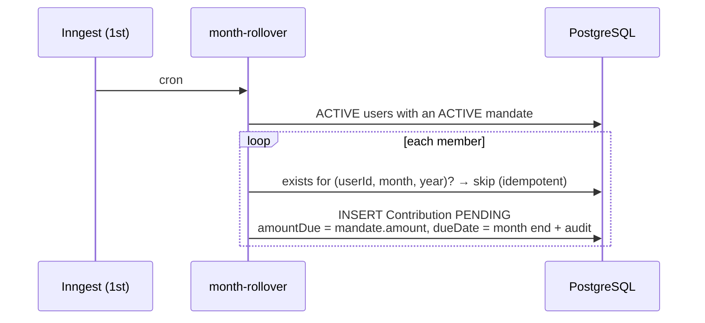
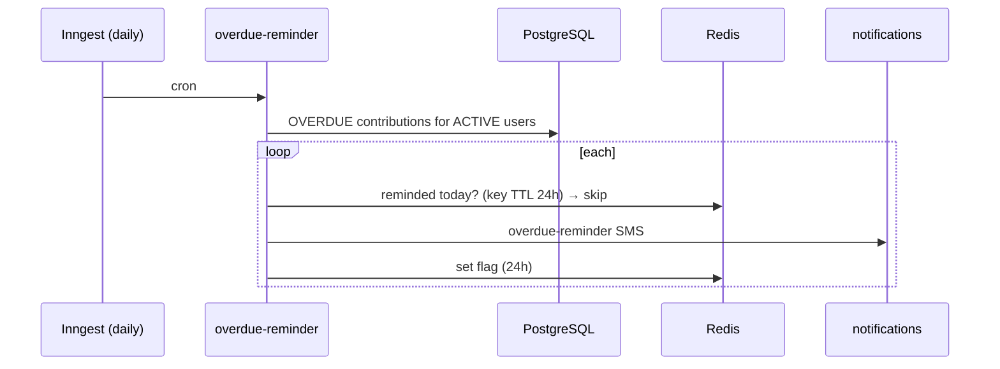

# Contribution Lifecycle

A contribution record from monthly creation through settlement or write-off. Related: [02-payment-flow.md](./02-payment-flow.md) · [04-notification-pipeline.md](./04-notification-pipeline.md).

---

## Status state machine

## Status recalculation (after any payment)

`status` is stored (not derived live) so overdue sweeps are a simple `WHERE status = 'OVERDUE'`; the service keeps it in sync. `amountDue` is snapshotted from the mandate amount at creation — future mandate changes never rewrite history.

---

## Monthly rollover (1st of month)

## Overdue reminder (daily)

---

## One contribution, many transactions

A contribution can be settled by several transactions (e.g. a R150 debit order + a R50 manual top-up = R200 against R200 due → PAID). Each transaction carries its own idempotency key; each SUCCESS posts a ledger CREDIT.

**Admin overrides** — all L2-gated, confirmation-modal'd, and audited: **waive** an outstanding amount, **generate** monthly records manually (idempotent fallback if the rollover job missed), **force-debit** an immediate once-off charge.
