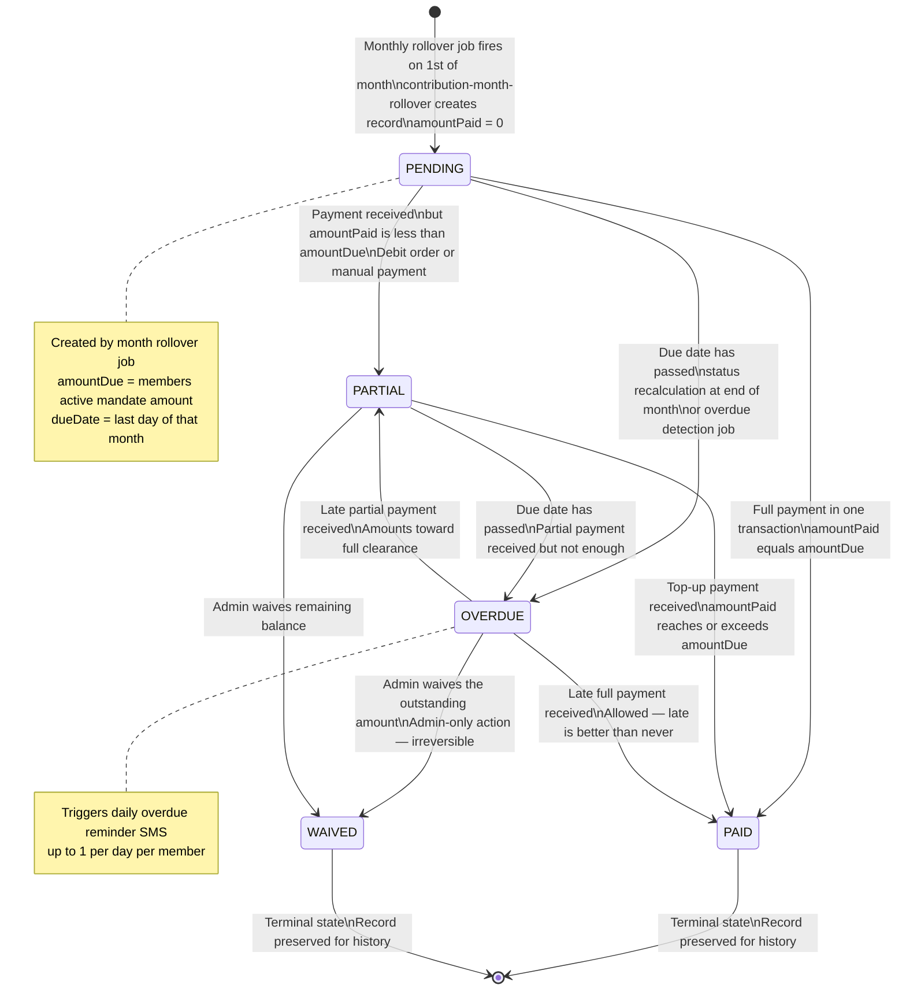
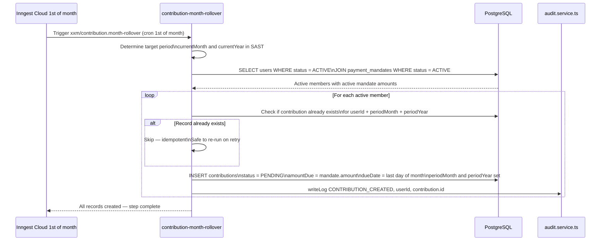
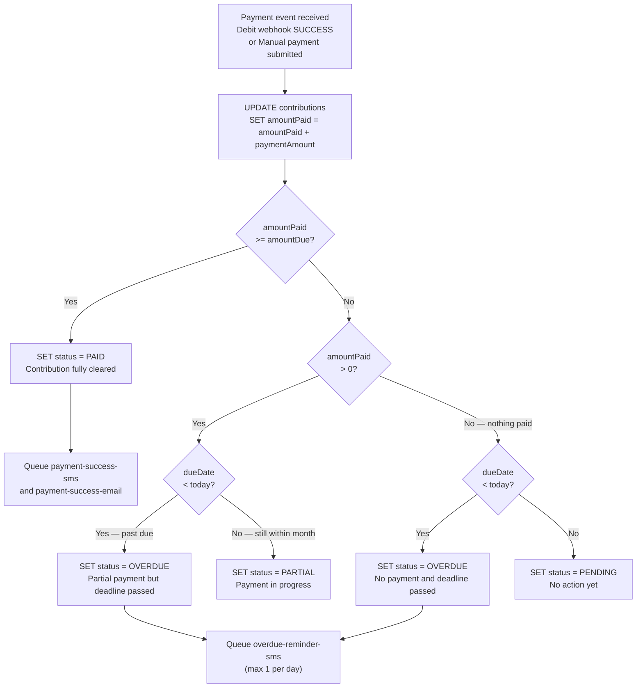
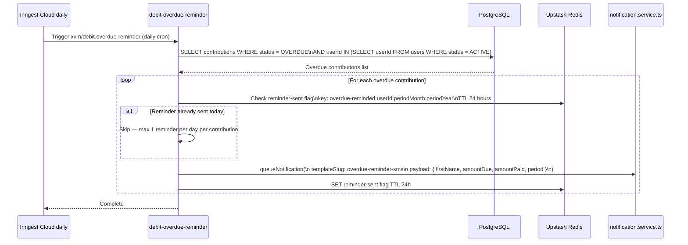
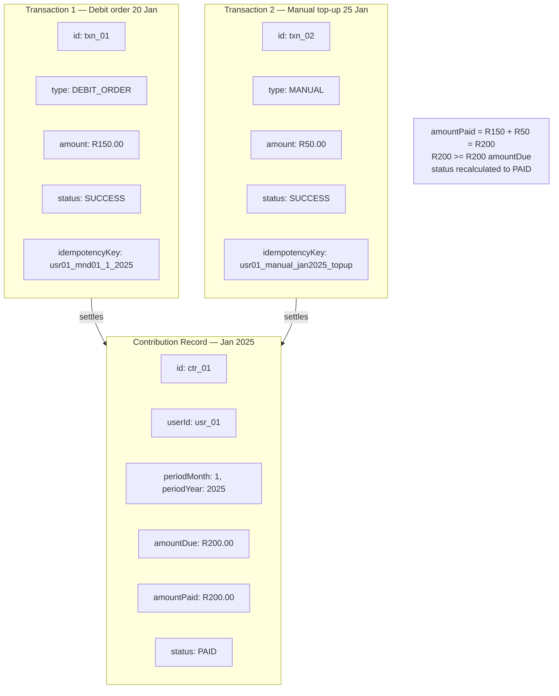
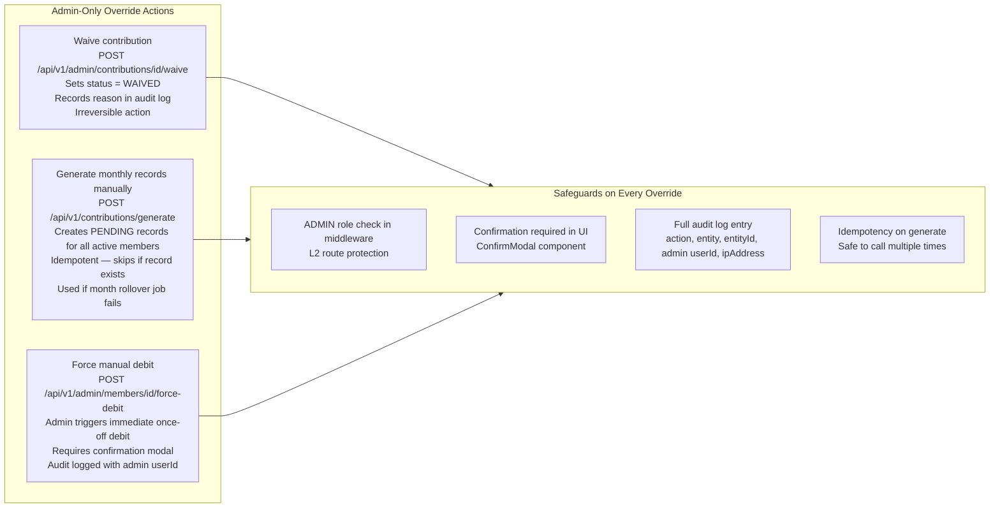

# Contribution Lifecycle

| | |
|---|---|
| **Purpose** | Documents the complete lifecycle of a contribution record — from creation through all status transitions to final settlement or write-off |
| **Modules** | M05 Contribution Engine · M06 Job Engine |
| **Related Docs** | [02-payment-flow.md](./02-payment-flow.md) · [04-notification-pipeline.md](./04-notification-pipeline.md) · [../database/01-erd.md](../database/01-erd.md) |

---

## Diagram 1 — Contribution Status State Machine

> Every state a `Contribution` record can be in, and every event that causes a transition.

---

## Diagram 2 — Monthly Rollover Job

> On the 1st of every month, new contribution records are created for all active members.

---

## Diagram 3 — Status Recalculation Logic

> How the contribution.service determines the correct status after any payment event.

---

## Diagram 4 — Overdue Detection and Reminder Job

---

## Diagram 5 — Contribution and Transaction Relationship

> Shows how multiple transactions can settle a single contribution.

---

## Diagram 6 — Admin Override Actions

