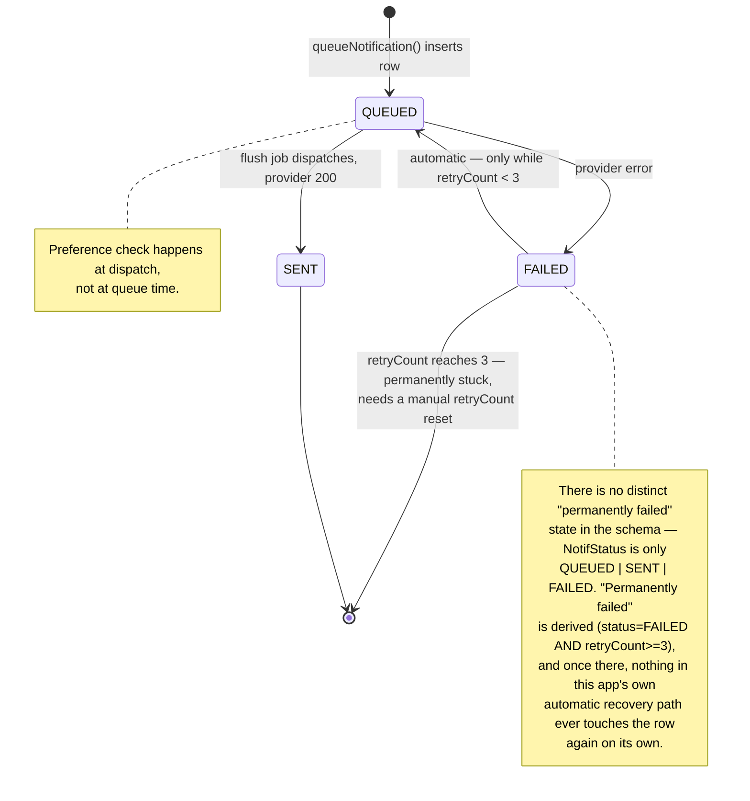
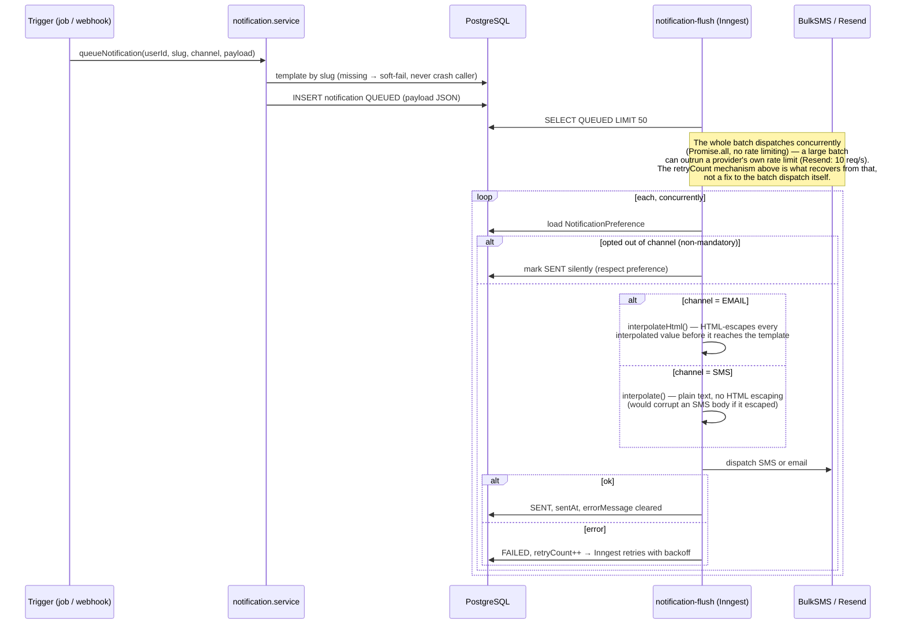
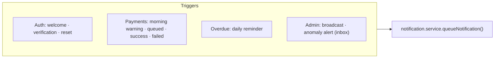

# Notification Pipeline

From event trigger to delivery — template resolution, channel routing, preference enforcement, and the in-app inbox. Related: [02-payment-flow.md](./02-payment-flow.md) · [03-contribution-lifecycle.md](./03-contribution-lifecycle.md).

Two surfaces: **Notifications** (SMS/email, queued and flushed) and the **Inbox** (`InboxMessage`, in-app, read/unread). Most events write both.

---

## Delivery state

**A real incident matched this exact shape, 2026-08-29**: 229 notifications
(115 SMS, 114 email) crossed the `retryCount >= 3` line and sat
permanently stuck. The email half's root cause was a missing
`RESEND_API_KEY`; the SMS half's was missing BulkSMS credentials. Fixing
the credentials did not, on its own, revive the stuck rows — they needed
an explicit `retryCount` reset, which is a manual operator action, not
something `requeueFailedNotifications()` will ever do by itself.

## Queue → flush → deliver

Templates are seeded rows with `{{variable}}` placeholders interpolated **at send time** (e.g. `morning-warning-sms`, `payment-success-sms/email`, `payment-failed-sms`, `overdue-reminder-sms/email`, `welcome-email`, `email-verification`, `password-reset`). **The HTML-escaping split above is load-bearing, not cosmetic**: every named email template used to interpolate a member's own `firstName` straight into hand-written HTML with zero escaping — a member setting their name to `` had it rendered raw in every email sent to them, reachable through ordinary self-registration. Fixed 2026-08-29 by routing every email interpolation through `interpolateHtml()`.

---

## Triggers & preference rules

| Channel | Mandatory (bypass prefs) | Optional (member may opt out) |
|---|---|---|
| Reasoning | account/security/critical | receipts & reminders |
| Examples | `email-verification`, `password-reset`, `payment-failed-sms` | `morning-warning-sms`, `payment-success-*`, `overdue-reminder-*` |

Opting out marks the message `SENT` silently — the member simply isn't dispatched to. **BulkSMS delivery receipts** (verified by source IP) update `deliveredAt` / flip to `FAILED` via `POST /webhooks/bulksms`, matched against the notification's `externalRef` column — **not** its `id`. BulkSMS caps the id it echoes back on a receipt at 20 characters; this system's Prisma cuid notification ids are 25, so the send path computes a deterministic 20-char SHA-256-based id (`shortSuppliedId`) and stores it in `externalRef` at send time specifically so the receipt can find its way back to the right row. Matching on `id` instead (an earlier version of the send-side fix did exactly this) fails silently — `updateMany` finds zero rows and throws nothing — so every real delivery receipt would have updated nothing at all.
