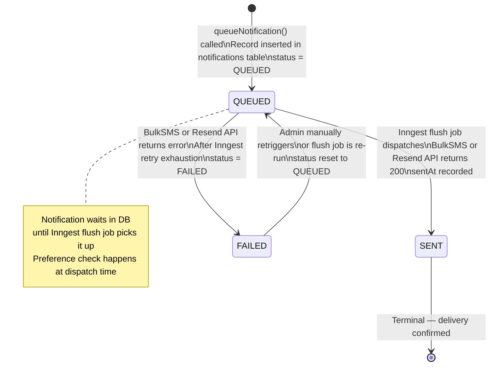
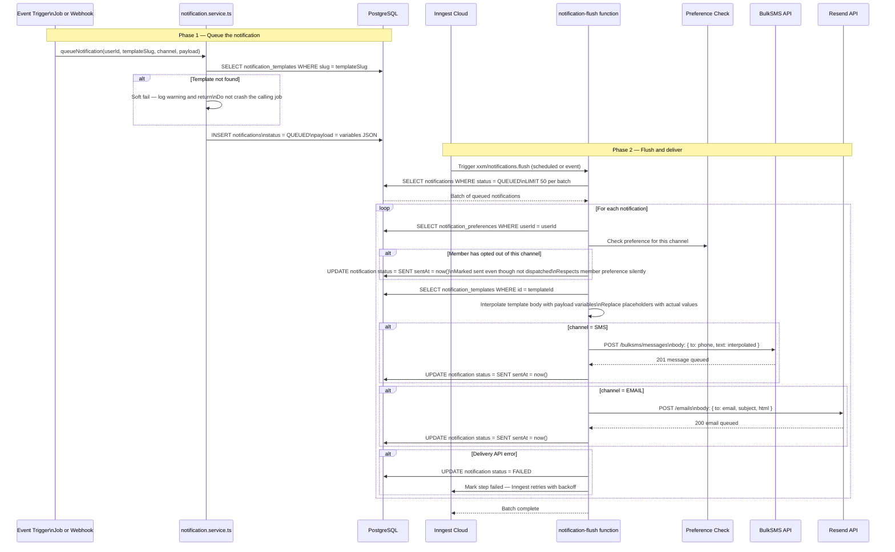
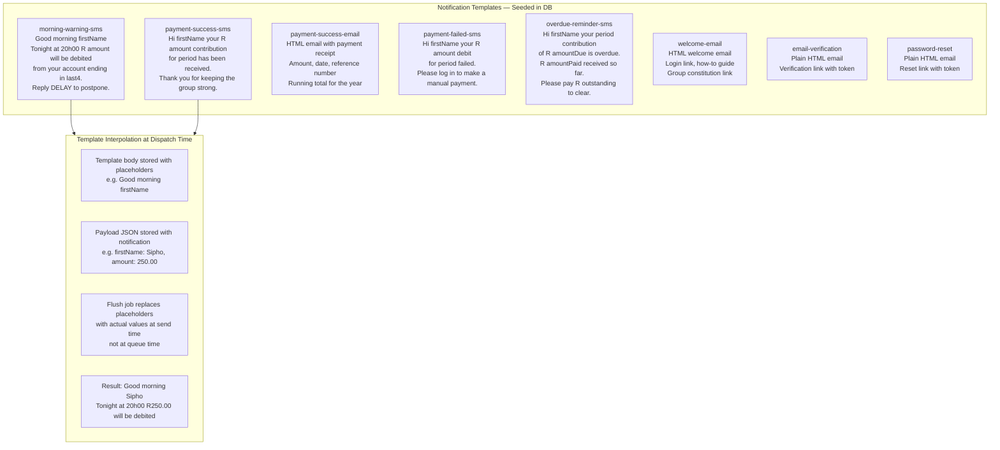
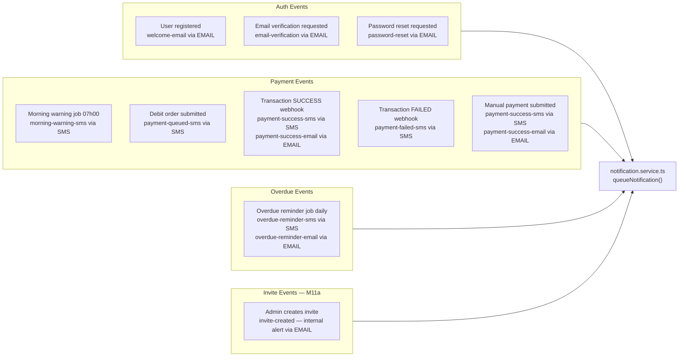
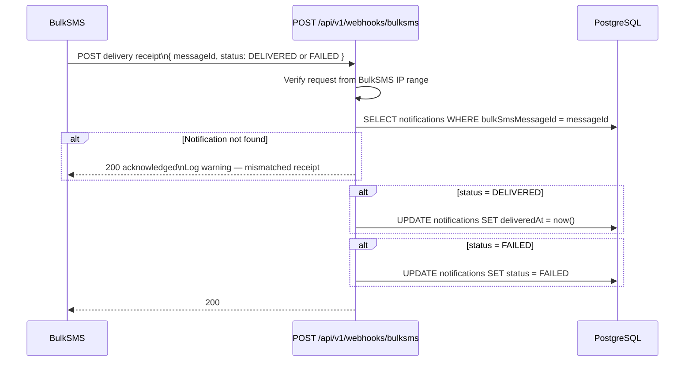
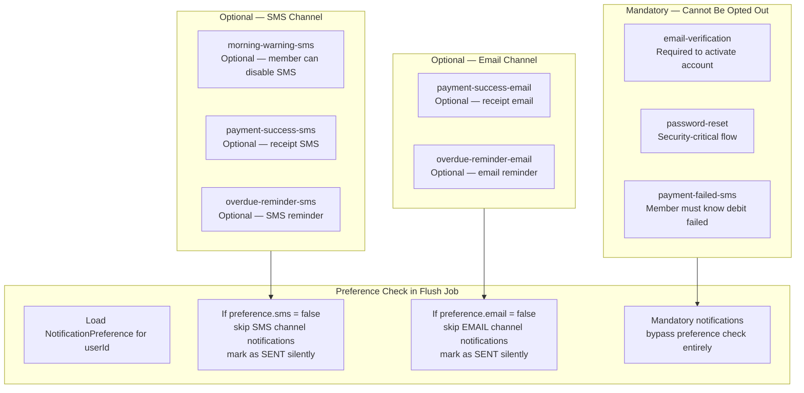

# Notification Pipeline

| | |
|---|---|
| **Purpose** | Documents the full notification pipeline — from event trigger to delivery receipt, including template resolution, channel routing, and preference enforcement |
| **Modules** | M07 Notification System · M06 Job Engine (job triggers) |
| **Related Docs** | [02-payment-flow.md](./02-payment-flow.md) · [03-contribution-lifecycle.md](./03-contribution-lifecycle.md) · [../database/01-erd.md](../database/01-erd.md) |

---

## Diagram 1 — Notification Status State Machine

---

## Diagram 2 — Full Notification Pipeline

---

## Diagram 3 — Template Resolution and Interpolation

---

## Diagram 4 — Notification Trigger Map

> Every place in the system that triggers a notification, and which template it uses.

---

## Diagram 5 — BulkSMS Delivery Receipt Flow

---

## Diagram 6 — Preference Enforcement

> Members can opt out of non-critical channels — this shows which notifications are mandatory.

