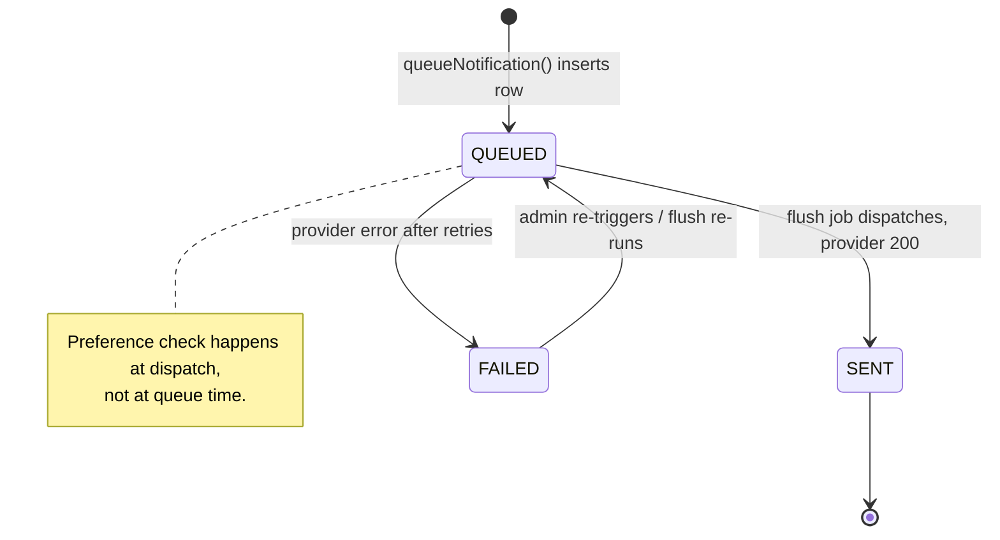
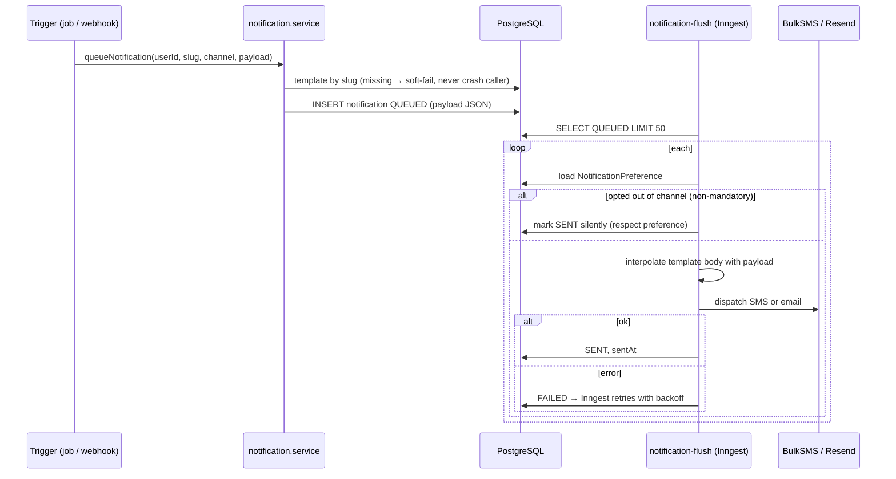
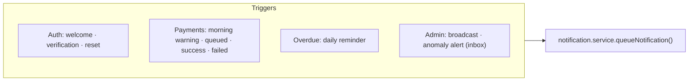

# Notification Pipeline

From event trigger to delivery — template resolution, channel routing, preference enforcement, and the in-app inbox. Related: [02-payment-flow.md](./02-payment-flow.md) · [03-contribution-lifecycle.md](./03-contribution-lifecycle.md).

Two surfaces: **Notifications** (SMS/email, queued and flushed) and the **Inbox** (`InboxMessage`, in-app, read/unread). Most events write both.

---

## Delivery state

## Queue → flush → deliver

Templates are seeded rows with `{{variable}}` placeholders interpolated **at send time** (e.g. `morning-warning-sms`, `payment-success-sms/email`, `payment-failed-sms`, `overdue-reminder-sms/email`, `welcome-email`, `email-verification`, `password-reset`).

---

## Triggers & preference rules

| Channel | Mandatory (bypass prefs) | Optional (member may opt out) |
|---|---|---|
| Reasoning | account/security/critical | receipts & reminders |
| Examples | `email-verification`, `password-reset`, `payment-failed-sms` | `morning-warning-sms`, `payment-success-*`, `overdue-reminder-*` |

Opting out marks the message `SENT` silently — the member simply isn't dispatched to. **BulkSMS delivery receipts** (verified by source IP) update `deliveredAt` / flip to `FAILED` via `POST /webhooks/bulksms`.
