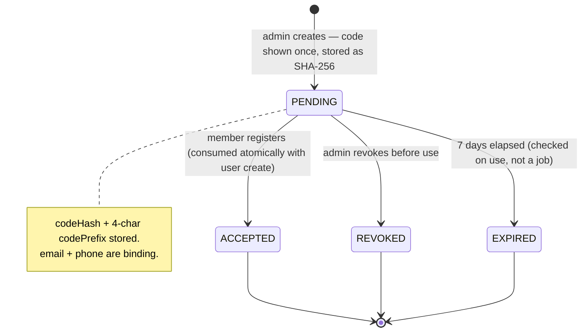
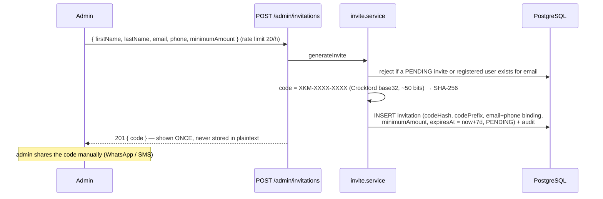

# Invite & Registration Flow

Registration is **invite-gated** (M11a, live). The admin issues a one-time `XKM-XXXX-XXXX` code bound to a specific email + phone; without a valid, unexpired, unconsumed, matching code there is no account. Related: [01-auth-flow.md](./01-auth-flow.md) · [../security/01-security-architecture.md](../security/01-security-architecture.md).

---

## Invitation state machine



## Admin creates an invite



---

## Two-step signup

```mermaid
sequenceDiagram
    participant B as Member
    participant V as POST /auth/invitations/validate
    participant R as POST /auth/register
    participant SVC as auth + invite services
    participant DB as PostgreSQL
    participant M as Resend

    Note over B,V: Step 1 — validate code
    B->>V: { code } (rate limit 5/15min)
    V->>SVC: hash + lookup
    alt invalid / used / revoked / expired
        V-->>B: 400 INV_001..004
    end
    V-->>B: 200 { firstName, lastName, email, phone, minimumAmount }

    Note over B,R: Step 2 — complete (email + phone locked; idNumber blank; amount ≥ minimum)
    B->>R: { inviteCode, email, phone, names, idNumber, monthlyAmount, password, consent }
    R->>SVC: re-validate code (anti-race)
    SVC->>SVC: enforce email + phone match invite (binding)
    alt mismatch
        SVC-->>B: 403 INV_005
    end
    SVC->>DB: tx — INSERT user PENDING + MEMBER role + prefs + verify token,<br/>mark invitation ACCEPTED (atomic)
    SVC->>M: verification email
    R-->>B: 201 — check email to activate
```

After verification the account is still `PENDING` until an admin activates it (see [01-auth-flow.md](./01-auth-flow.md)).

---

## Security properties

| Property | How |
|---|---|
| No plaintext codes | Only `codeHash` (SHA-256) + 4-char `codePrefix` stored; admin list shows `XKM-AB…` |
| Shown once | Lost code → revoke + reissue |
| Single-use | Consumed in the same transaction as user creation — no race |
| 7-day expiry | Enforced at validate **and** consume |
| Identity binding | Submitted email + phone must equal the invite's |
| Brute-force resistant | ~50-bit code + rate-limited validate endpoint |
| Audited | Create, accept, revoke all logged |
