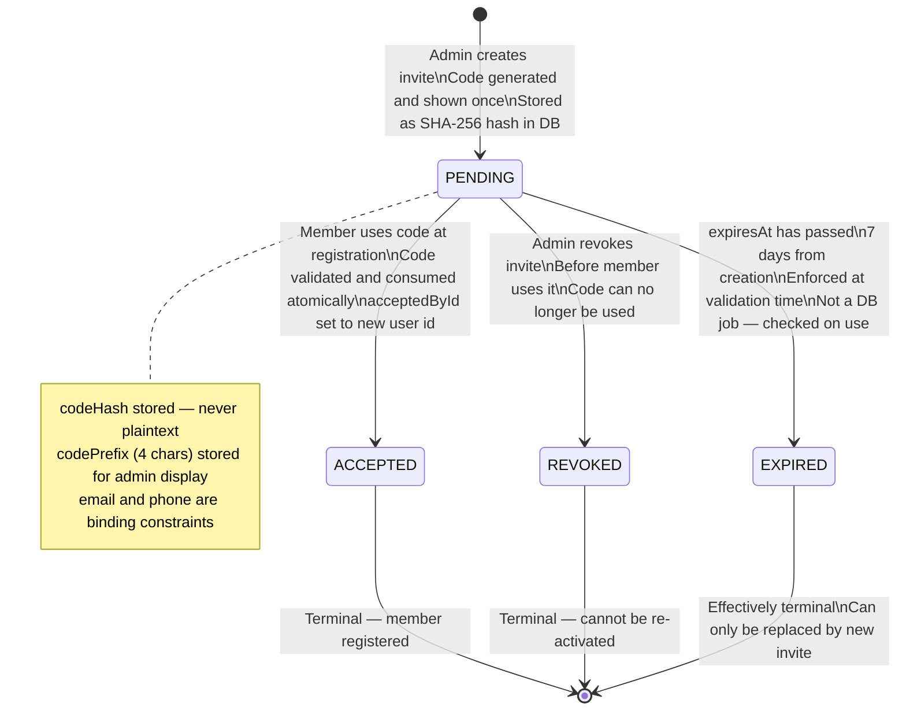
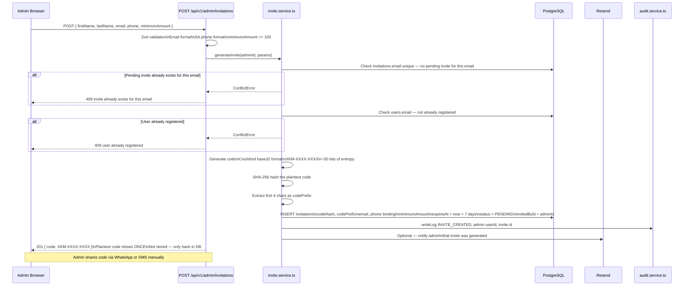
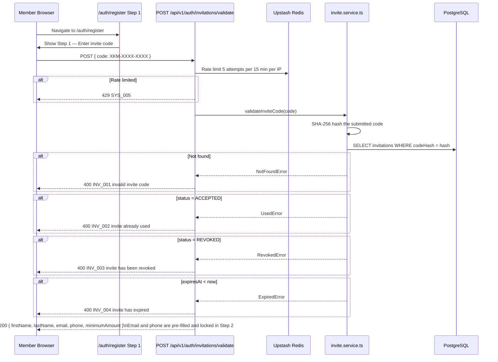
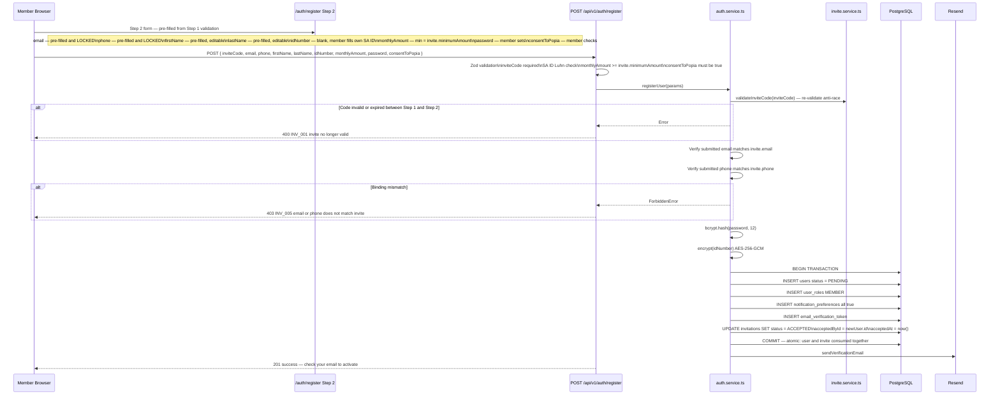
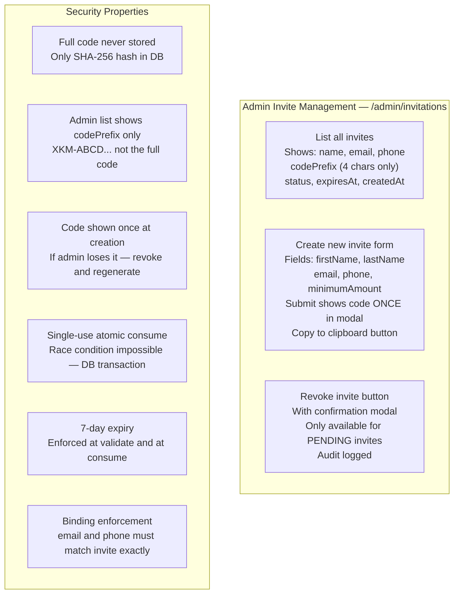

# Invite and Registration Flow (M11a)

| | |
|---|---|
| **Purpose** | Documents the invite-gated registration system — from admin creating an invite to member completing signup |
| **Module** | M11a Invite and Access Control (patches M02 Auth System) |
| **Status** | ✅ IMPLEMENTED — M11a complete; frontend completed in Phase 2 Step 5 (PR #64) |
| **Related Docs** | [01-auth-flow.md](./01-auth-flow.md) · [../database/01-erd.md](../database/01-erd.md) · [../security/01-security-architecture.md](../security/01-security-architecture.md) |

---

## Why Invite-Gated Registration?

Current state (pre-M11a): Registration is open. Any person who knows the URL and has a valid SA ID and phone number can create an account. This is a development convenience that **must be closed before production launch**.

M11a adds an invite layer: the admin generates a one-time `XKM-XXXX-XXXX` code and shares it with the intended member. Registration requires a valid, unexpired, unconsumed code whose email and phone match the submitted data. No code, no account.

---

## Diagram 1 — Invitation Status State Machine

---

## Diagram 2 — Admin Creates Invite

---

## Diagram 3 — Member Validates Invite Code (Step 1 of 2)

---

## Diagram 4 — Member Completes Registration (Step 2 of 2)

---

## Diagram 5 — Admin Invite Management

---

## Diagram 6 — Pre vs Post M11a Registration Comparison

```mermaid
flowchart LR
    subgraph BEFORE["Before M11a — Open Registration"]
        B1["Anyone with URL can register"]
        B2["Only SA ID and phone format validated"]
        B3["No admin approval needed"]
        B4["Any stranger can create an account"]
    end

    subgraph AFTER["After M11a — Invite-Gated"]
        A1["Admin creates invite for specific person"]
        A2["Code tied to specific email and phone"]
        A3["7-day expiry — timely onboarding required"]
        A4["Single-use — code dies on registration"]
        A5["Admin can revoke at any time before use"]
        A6["Full audit trail of every invite"]
    end

    BEFORE -.->|"M11a closes this"| AFTER
```

---

## Code Format Reference

Invite codes follow the pattern `XKM-XXXX-XXXX` where `XXXX` segments use Crockford Base32 encoding (excludes confusable characters I, L, O, U).

| Component | Value |
|---|---|
| Prefix | `XKM` — identifies as an Xkimm Xa Mali invite |
| Segments | Two 4-character Crockford Base32 groups |
| Entropy | ~50 bits — brute-force infeasible with rate limiting |
| Hash | SHA-256 of full plaintext code |
| DB storage | `codeHash` (full hash) + `codePrefix` (first 4 chars for display) |
| Displayed to admin | Full code once at creation time only |
| Displayed in admin list | `codePrefix` only — e.g., `XKM-AB...` |
