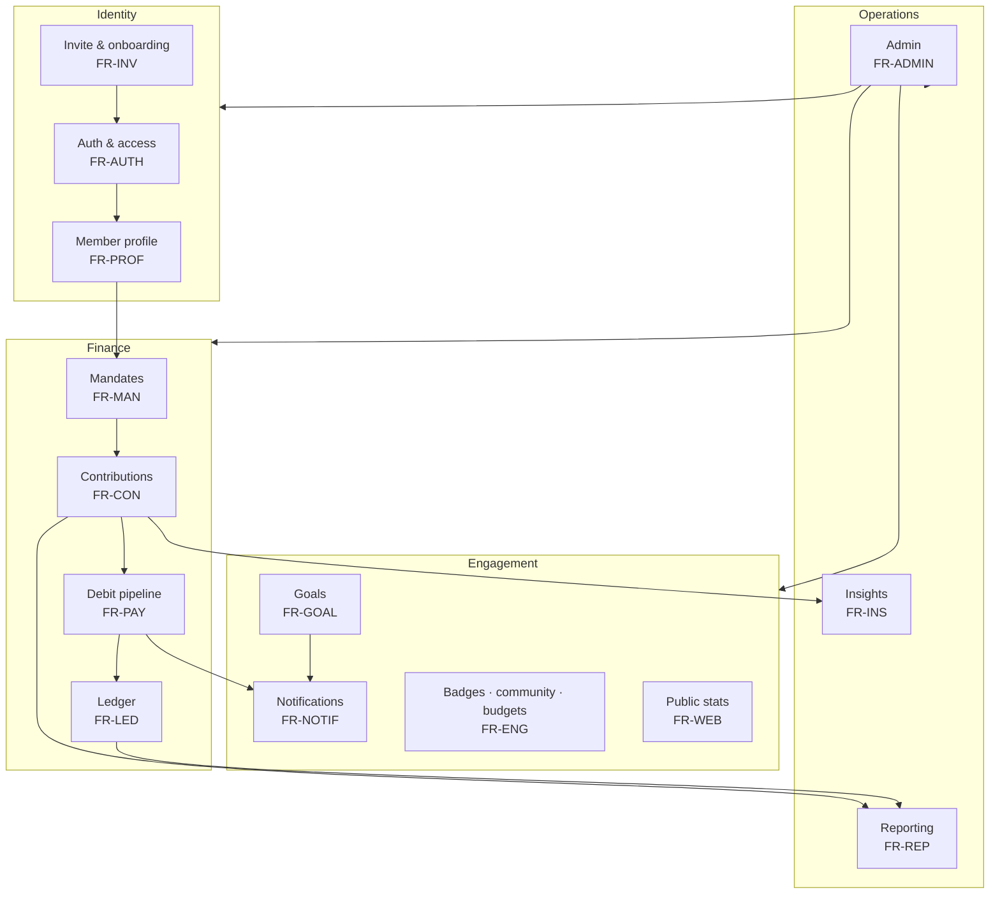
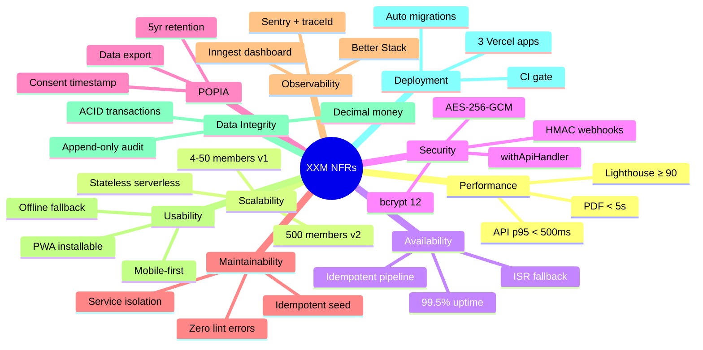

# Xkimm Xa Mali Foundation — System Requirements

> "Blessed is the hand that giveth." — Acts 20:35

| | |
|---|---|
| **System** | Xkimm Xa Mali Foundation (XXM) |
| **Version** | v1.0 |
| **Classification** | Financial platform — highest data sensitivity |
| **Scale** | 4–50 members, <1,000 req/day (v1) |
| **Related Docs** | [system-overview.md](./system-overview.md) · [security/01-security-architecture.md](./security/01-security-architecture.md) · [build-order.md](./build-order.md) |

---

## System Domain Map

High-level view of the functional domains and their dependencies.

---

## NFR Coverage Map

---

## 1. Functional Requirements

### 1.1 Authentication & Access Control

| ID | Requirement |
|----|-------------|
| FR-AUTH-001 | Registration is invite-gated — only people with a valid admin-issued invite code can create an account |
| FR-AUTH-002 | Registration collects: email, SA phone number, SA ID number (Luhn-validated), first name, last name, password, and POPIA consent with timestamp |
| FR-AUTH-003 | Email verification is required before an account is usable — token sent via Resend |
| FR-AUTH-004 | Admin must activate an account (set status `ACTIVE`) before the member can log in |
| FR-AUTH-005 | Login uses email + password; session is maintained via HTTP-only JWT cookie (30-day TTL) |
| FR-AUTH-006 | Explicit logout destroys the session cookie |
| FR-AUTH-007 | Password reset is self-service via email link; the forgot-password endpoint never reveals whether an email is registered |
| FR-AUTH-008 | Authenticated password change requires the current password |
| FR-AUTH-009 | Accounts are locked after consecutive failed login attempts; admin can unlock manually |
| FR-AUTH-010 | Two roles exist: `ADMIN` and `MEMBER`; a user may hold both simultaneously |
| FR-AUTH-011 | Route access is tiered: L0 public, L1 authenticated member, L2 admin, L3 system/webhook |

### 1.2 Invite & Onboarding

| ID | Requirement |
|----|-------------|
| FR-INV-001 | Admin generates an invite for a specific person, pre-loading first name, last name, email, phone, and minimum contribution amount |
| FR-INV-002 | Invite codes use the format `XKM-XXXX-XXXX` (Crockford Base32, ~50 bits entropy) |
| FR-INV-003 | Invite codes expire after 7 days from creation |
| FR-INV-004 | Invite codes are single-use — consumed atomically with user creation in a single DB transaction |
| FR-INV-005 | The email and phone submitted at registration must exactly match the invite (binding constraint) |
| FR-INV-006 | Admin can revoke any unused (PENDING) invite at any time |
| FR-INV-007 | Admin can view all invites showing status, creation date, expiry, and code prefix — full code is never re-displayed |
| FR-INV-008 | The full plaintext code is shown to the admin exactly once at creation and never stored |

### 1.3 Member Profile

| ID | Requirement |
|----|-------------|
| FR-PROF-001 | Members can view and edit their profile (name, phone, address) |
| FR-PROF-002 | Members can add, update, and remove bank accounts |
| FR-PROF-003 | SA bank account numbers are validated with a modulus check before saving |
| FR-PROF-004 | Members designate one primary bank account used for debit orders |
| FR-PROF-005 | Members manage notification preferences (SMS, email, push) individually |
| FR-PROF-006 | Members can request a POPIA data export — all their data returned as a ZIP |
| FR-PROF-007 | Members cannot view or modify other members' profiles or data |

### 1.4 Payment Mandates

| ID | Requirement |
|----|-------------|
| FR-MAN-001 | Members create a DebiCheck mandate by selecting a bank account, debit day (1–28), and amount (≥ R100) |
| FR-MAN-002 | Mandates are submitted to Netcash and require admin approval before becoming ACTIVE |
| FR-MAN-003 | Members can update the debit day and amount (takes effect from the next collection cycle) |
| FR-MAN-004 | Members can cancel an active mandate |
| FR-MAN-005 | Members can request a one-time delay for the current month's debit, selecting an alternative date |
| FR-MAN-006 | Mandate status transitions (PENDING → ACTIVE → SUSPENDED → CANCELLED) are driven by Netcash webhooks |
| FR-MAN-007 | A member may only have one active mandate at a time |

### 1.5 Contribution Engine

| ID | Requirement |
|----|-------------|
| FR-CON-001 | Monthly contribution records are auto-generated on the 1st of each month for all ACTIVE members |
| FR-CON-002 | Contribution statuses: PENDING, PARTIAL, PAID, OVERDUE, WAIVED |
| FR-CON-003 | Members can make a manual (once-off) payment for any outstanding period |
| FR-CON-004 | Partial payments are supported — `amountPaid` accumulates; PAID status is set when `amountPaid >= amountDue` |
| FR-CON-005 | Admin can generate contribution records for all members for a specified month/year |
| FR-CON-006 | Admin can waive an outstanding contribution |

### 1.6 Payment Processing (Debit Pipeline)

| ID | Requirement |
|----|-------------|
| FR-PAY-001 | A morning warning SMS is sent at 07:00 SAST on each member's debit day |
| FR-PAY-002 | The debit run executes at 20:00 SAST, submitting debit orders to Netcash for all mandates not marked for delay |
| FR-PAY-003 | A `Transaction` record is created before Netcash submission (status: PENDING) |
| FR-PAY-004 | Netcash webhooks update transaction and contribution status (SUCCESS, FAILED, REVERSED) and trigger notifications |
| FR-PAY-005 | An idempotency key on every transaction prevents double-debits under Inngest retries |
| FR-PAY-006 | Overdue reminders fire daily (max once per day per member) until the contribution is settled or month-end |

### 1.7 Goals System

| ID | Requirement |
|----|-------------|
| FR-GOAL-001 | Admin creates group financial goals (MONTHLY, YEARLY, CUSTOM) with a target amount and deadline |
| FR-GOAL-002 | Goals transition through: DRAFT → ACTIVE → ACHIEVED / FAILED |
| FR-GOAL-003 | Admin activates a DRAFT goal, making it visible to members |
| FR-GOAL-004 | Admin records progress updates against an active goal |
| FR-GOAL-005 | Admin can lock a goal (irreversible) to record a final achieved state |
| FR-GOAL-006 | Members can view all active and past goals with progress bars |

### 1.8 Notifications

| ID | Requirement |
|----|-------------|
| FR-NOTIF-001 | Notifications are delivered via SMS (BulkSMS), email (Resend), or both, per template channel setting |
| FR-NOTIF-002 | Notification content is driven by `NotificationTemplate` records with `{{variable}}` placeholders |
| FR-NOTIF-003 | Members have an in-app notification inbox |
| FR-NOTIF-004 | Members can mark individual notifications or all as read |
| FR-NOTIF-005 | Members can disable non-critical notification channels individually |
| FR-NOTIF-006 | SMS delivery status is tracked via BulkSMS delivery receipt webhooks |
| FR-NOTIF-007 | Admin can broadcast a message to all, active, or pending members on any channel |
| FR-NOTIF-008 | Notification templates are seeded idempotently on every deploy — admin edits to template bodies are never overwritten |

### 1.9 Reporting & Statements

| ID | Requirement |
|----|-------------|
| FR-REP-001 | Members generate and download a PDF statement for any month showing their contributions and transactions |
| FR-REP-002 | PDFs are generated server-side with `@react-pdf/renderer`, stored in Vercel Blob, and returned via a 15-minute signed URL |
| FR-REP-003 | Members view their full transaction history with date range, status, and type filters |
| FR-REP-004 | Admin views financial reports: total pool, monthly collection rate, per-member breakdown |
| FR-REP-005 | Admin exports contribution and transaction data as CSV for any period |

### 1.10 Admin Dashboard

| ID | Requirement |
|----|-------------|
| FR-ADMIN-001 | Admin sees aggregated stats: total members, active mandates, monthly collection rate, total pool balance |
| FR-ADMIN-002 | Admin can search, filter (by status), view, suspend, and reactivate members |
| FR-ADMIN-003 | Admin views a member's full profile — contribution history, mandate status, login history |
| FR-ADMIN-004 | Admin approves or rejects pending mandates |
| FR-ADMIN-005 | Admin views an immutable audit log, filterable by entity, action, and user |
| FR-ADMIN-006 | Admin can trigger an emergency force-debit (with confirmation modal) |
| FR-ADMIN-007 | Admin can grant or revoke the ADMIN role on any member |

### 1.11 Public Stats & Website

| ID | Requirement |
|----|-------------|
| FR-WEB-001 | The public website shows live stats: active member count, total pooled capital (ZAR), months active |
| FR-WEB-002 | Stats are served from `GET /api/v1/stats/public` — unauthenticated, zero PII, Redis-cached for 1 hour |
| FR-WEB-003 | The WhatsApp page shows group info, rules summary, and a deep link to the WhatsApp group |
| FR-WEB-004 | The WhatsApp page and public website are accessible without authentication |

### 1.12 Ledger (Phase 3)

| ID | Requirement |
|----|-------------|
| FR-LED-001 | The group pool is tracked in an append-only double-entry ledger; balance = Σ credits − Σ debits |
| FR-LED-002 | A SUCCESS transaction posts a pool CREDIT; a REVERSED transaction posts a pool DEBIT |
| FR-LED-003 | Ledger posting is idempotent — `UNIQUE(refType, refId, direction)` prevents double-posting under retries |
| FR-LED-004 | A nightly job reconciles the ledger by rebuilding from settled transactions; admin can read the ledger and balance via `GET /api/v1/admin/ledger` |

### 1.13 Engagement (Phase 3)

| ID | Requirement |
|----|-------------|
| FR-ENG-001 | Members can cheer, comment on, and pledge toward group goals; cheer toggles are race-safe |
| FR-ENG-002 | Members earn contribution badges/tiers recalculated from their payment history |
| FR-ENG-003 | Members can post and read community messages |
| FR-ENG-004 | Members can set a personal monthly budget, with admin override support |

### 1.14 Member Insights (Phase 3)

| ID | Requirement |
|----|-------------|
| FR-INS-001 | Each member sees a year-end forecast (YTD paid + monthly amount × remaining months) |
| FR-INS-002 | Insights show on-time payment rate and an at-risk flag with plain-language nudges |
| FR-INS-003 | A member may only read their own insights — enforced at the service layer |

### 1.15 Admin Intelligence & Signatures (Phase 3)

| ID | Requirement |
|----|-------------|
| FR-ADMIN-008 | A daily anomaly watch alerts admins (inbox + audit) on low collection rate, failed-debit spikes, or overdue thresholds |
| FR-ADMIN-009 | Webhooks are processed exactly once via a dedupe table — redelivery returns 200 without re-processing |
| FR-ADMIN-010 | Admins can capture a signature; it is embedded in generated statement PDFs (with signature history) |

---

## 2. Non-Functional Requirements

### 2.1 Performance

| ID | Requirement | Target |
|----|-------------|--------|
| NFR-PERF-001 | API p95 response time (authenticated, non-report endpoints) | < 500 ms |
| NFR-PERF-002 | Statement PDF generation time | < 5 s |
| NFR-PERF-003 | Full member history CSV export | < 10 s |
| NFR-PERF-004 | Dashboard page LCP on a 4G connection | < 2.5 s |
| NFR-PERF-005 | Lighthouse mobile performance score | ≥ 90 |
| NFR-PERF-006 | Public stats endpoint response time (cache hit) | < 100 ms |
| NFR-PERF-007 | Monthly debit run completes for all active members | < 5 min total |

### 2.2 Scalability

| ID | Requirement |
|----|-------------|
| NFR-SCALE-001 | Supports 4–50 members in v1 with no architecture changes |
| NFR-SCALE-002 | Supports up to 500 members in v2 with only Neon/Upstash tier upgrades (no code changes) |
| NFR-SCALE-003 | All database queries hit indexed columns for production-volume lookup patterns |
| NFR-SCALE-004 | Vercel serverless scales horizontally — no single-instance state held outside Redis/DB |
| NFR-SCALE-005 | Redis rate limiters use sliding window, not fixed-window, to distribute load evenly |

### 2.3 Availability & Reliability

| ID | Requirement | Target |
|----|-------------|--------|
| NFR-AVAIL-001 | System uptime | ≥ 99.5% |
| NFR-AVAIL-002 | Payment pipeline jobs (Inngest) retry on transient failure | 3 retries with exponential backoff |
| NFR-AVAIL-003 | External service calls (BulkSMS, Resend, Netcash) retry on transient failure | 3 retries, 500 ms base delay |
| NFR-AVAIL-004 | `GET /api/v1/health` monitored with automated alerting | Better Stack uptime check |
| NFR-AVAIL-005 | Public website falls back to static placeholder values when the web API is unreachable | No error shown to visitors |
| NFR-AVAIL-006 | The debit pipeline is idempotent — re-running after failure never causes double charges | Idempotency keys enforced at DB level via UNIQUE constraint |

### 2.4 Security

| ID | Requirement |
|----|-------------|
| NFR-SEC-001 | All traffic is HTTPS-only; HTTP redirects to HTTPS; HSTS header set via Vercel |
| NFR-SEC-002 | Session tokens live in HTTP-only, SameSite=Strict cookies — never in `localStorage` |
| NFR-SEC-003 | Passwords are hashed with bcrypt at cost factor 12 |
| NFR-SEC-004 | SA ID numbers and bank account numbers are encrypted at rest with AES-256-GCM (random 12-byte IV per value) |
| NFR-SEC-005 | Password reset and email verification tokens are stored as SHA-256 hashes only — plaintext is never persisted |
| NFR-SEC-006 | Every API route validates input with Zod before passing to the service layer |
| NFR-SEC-007 | Netcash webhooks are verified with HMAC-SHA256 using `timingSafeEqual` (prevents timing attacks) |
| NFR-SEC-008 | Inngest webhook events are verified with the Inngest signing key (built into the Inngest SDK) |
| NFR-SEC-009 | Rate limiting is applied to all mutation endpoints via Upstash sliding window (per IP or per user ID) |
| NFR-SEC-010 | Every response from a `withApiHandler`-wrapped route carries an `x-trace-id` header |
| NFR-SEC-011 | Admin cannot permanently delete transaction records — only reverse them |
| NFR-SEC-012 | Members cannot view other members' PII, bank details, or financial records — enforced at service layer |
| NFR-SEC-013 | Content-Security-Policy and other security headers are set on all responses |
| NFR-SEC-014 | Invite codes are stored as SHA-256 hashes — plaintext is never stored and never re-shown |

### 2.5 POPIA Compliance (SA Protection of Personal Information Act)

| ID | Requirement |
|----|-------------|
| NFR-POPIA-001 | Explicit POPIA consent is collected and timestamped (`popiaConsentAt`) at registration |
| NFR-POPIA-002 | Members can download all their personal data via `GET /api/v1/members/:id/export` (ZIP of JSON) |
| NFR-POPIA-003 | Financial records are retained for a minimum of 5 years (legal obligation) |
| NFR-POPIA-004 | Account deletion is a soft-delete; a hard purge runs after 90 days (excluding financial records) |
| NFR-POPIA-005 | Only data required for the business purpose is collected (data minimisation principle) |
| NFR-POPIA-006 | No member data is shared with third parties beyond the payment processor (Netcash) |
| NFR-POPIA-007 | A privacy policy page is publicly accessible at all times |
| NFR-POPIA-008 | Every admin access to member personal data is logged in the audit trail |

### 2.6 Maintainability & Code Quality

| ID | Requirement |
|----|-------------|
| NFR-MAINT-001 | All API route handlers are wrapped with `withApiHandler` — no top-level try/catch in route files |
| NFR-MAINT-002 | Business logic lives exclusively in the service layer — never in route handlers or UI components |
| NFR-MAINT-003 | Cross-context data access goes through service interfaces — no direct DB queries from the UI layer |
| NFR-MAINT-004 | TypeScript strict mode is enabled across all apps and packages |
| NFR-MAINT-005 | Zero TypeScript errors and zero ESLint errors are maintained at all times (CI-enforced) |
| NFR-MAINT-006 | Schema changes must go through Prisma migrations — no manual schema edits on the database |
| NFR-MAINT-007 | The seed script is idempotent — safe to run on every deploy without overwriting admin data |
| NFR-MAINT-008 | All workspace packages define a `test` script for compatibility with the turbo test pipeline |

### 2.7 Observability

| ID | Requirement |
|----|-------------|
| NFR-OBS-001 | All unhandled API errors are forwarded to Sentry with request context (path, method, traceId) |
| NFR-OBS-002 | Every API response carries an `x-trace-id` header for end-to-end request correlation |
| NFR-OBS-003 | Structured logging is used for all service-layer events — no bare `console.log` |
| NFR-OBS-004 | Inngest job history, retries, and failures are visible in the Inngest dashboard |
| NFR-OBS-005 | Uptime monitoring with on-call alerting is configured via Better Stack |
| NFR-OBS-006 | Core Web Vitals are tracked via Vercel Analytics |
| NFR-OBS-007 | Sentry release tracking attributes errors to specific deployments |

### 2.8 Usability

| ID | Requirement |
|----|-------------|
| NFR-USE-001 | The member portal is mobile-first and fully responsive (target: Android Chrome on budget handsets) |
| NFR-USE-002 | The app is installable as a PWA from Android Chrome |
| NFR-USE-003 | An offline fallback page is shown when the member has no network connection |
| NFR-USE-004 | All user-facing error messages are in plain language — raw error codes are never shown to members |
| NFR-USE-005 | All forms show inline validation errors without a full page reload |
| NFR-USE-006 | All loading and error states are explicitly handled in every page and form |

### 2.9 Data Integrity

| ID | Requirement |
|----|-------------|
| NFR-INT-001 | PostgreSQL with ACID transactions — financial writes are never partially committed |
| NFR-INT-002 | `UNIQUE` constraint on `transactions.idempotencyKey` prevents double-charge at the database level |
| NFR-INT-003 | `UNIQUE` constraint on `contributions(userId, periodMonth, periodYear)` prevents duplicate monthly records |
| NFR-INT-004 | Foreign key constraints enforce referential integrity across all tables |
| NFR-INT-005 | Soft deletes on all user-facing data — hard deletes require an explicit purge job |
| NFR-INT-006 | The `audit_logs` table is append-only — no UPDATE or DELETE is ever issued against it |
| NFR-INT-007 | All financial amounts are `Decimal(10, 2)` — never floating-point — to prevent precision errors |

### 2.10 Deployment & Operations

| ID | Requirement |
|----|-------------|
| NFR-DEP-001 | All three apps (web, admin, website) deploy independently to Vercel |
| NFR-DEP-002 | Every PR to main triggers a Vercel preview deployment |
| NFR-DEP-003 | Database migrations run automatically as part of the Vercel build command (`prisma migrate deploy`) |
| NFR-DEP-004 | The CI gate (typecheck → lint → test → prisma validate) must pass before any merge to main |
| NFR-DEP-005 | Environment variables are never committed to version control |
| NFR-DEP-006 | A fresh clone plus `npm install` produces a working local development environment |
| NFR-DEP-007 | Staging uses Neon database branching — isolated from production data |

---

## 3. Constraints

| ID | Constraint |
|----|------------|
| CON-001 | Payment processing is South Africa-only (Netcash, SA banking rails, DebiCheck/NAEDO) |
| CON-002 | SMS is South Africa-only (BulkSMS, SA phone number format: `+27XXXXXXXXX`) |
| CON-003 | Registration requires a valid SA ID number (13-digit, Luhn-validated) |
| CON-004 | Minimum contribution amount is R100 per month |
| CON-005 | Debit day must be between 1 and 28 (avoids February edge case) |
| CON-006 | All timestamps are stored in UTC; SAST (UTC+2) display is the responsibility of the UI layer |
| CON-007 | Zero-rating (data-free access) is deferred to v2 — not a v1 requirement |
| CON-008 | The system is designed for a single group — multi-group support is a v2 feature |

---

## 4. Future Requirements (v2 Scope)

Out of scope for v1. Documented for planning.

| ID | Description |
|----|-------------|
| V2-001 | Zero-rating / data-free access via SA operator agreements (Vodacom, MTN, Cell C, Telkom) |
| V2-002 | Web push notifications via service worker |
| V2-003 | WhatsApp Business API for automated notifications (beyond group deep link) |
| V2-004 | Multi-group support — one installation serving multiple independent savings groups |
| V2-005 | Member-to-member loan tracking within the group |
| V2-006 | Investment tracking and contribution attribution to specific goals |
| V2-007 | Native mobile app (React Native) consuming the same API |
| V2-008 | Bulk member import via CSV for group migration from manual tracking |
