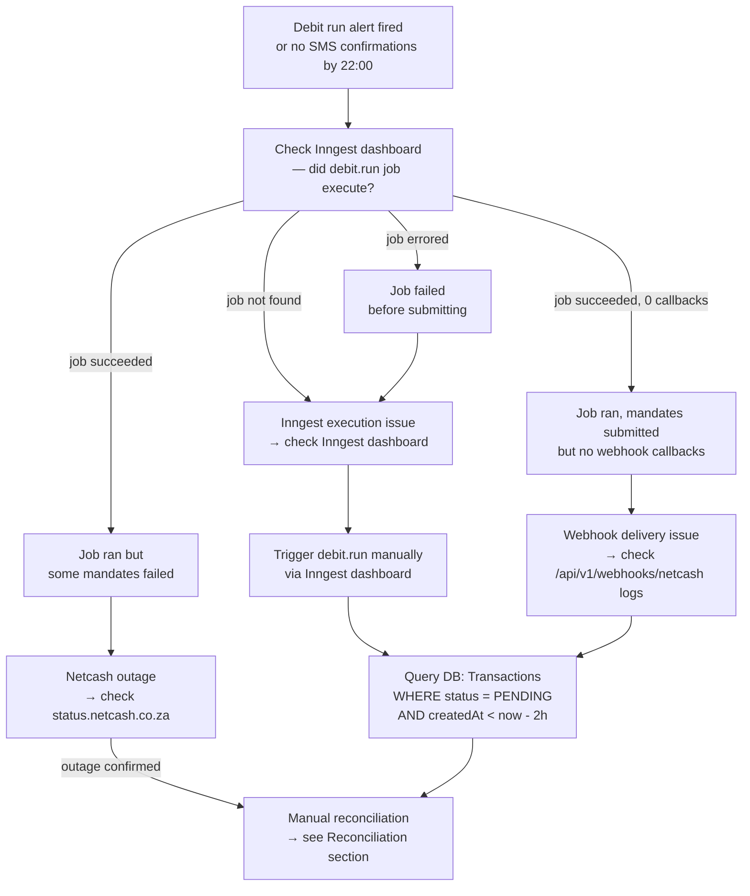
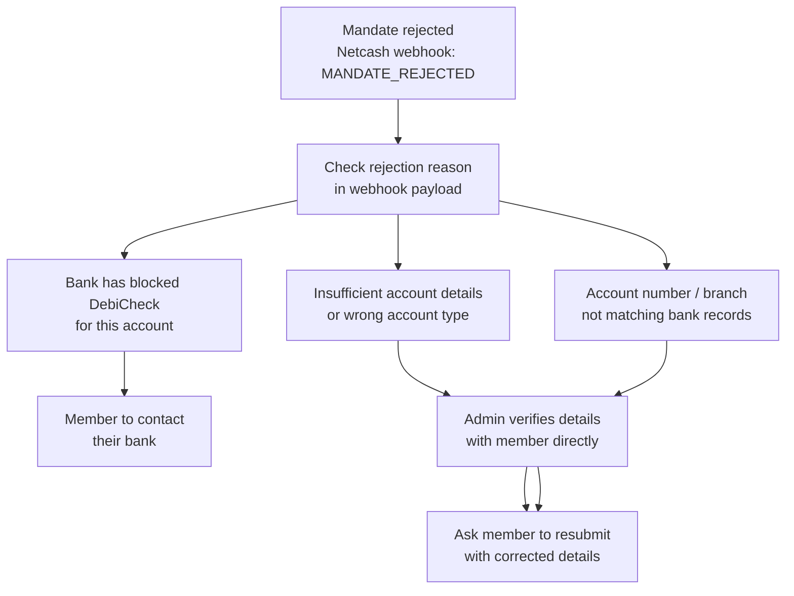

# Operational Runbook — Xkimm Xa Mali

> This runbook covers: failed debit runs, stuck transactions, webhook failures, and emergency procedures.
> For infrastructure setup, see [constitutions/infra.md](./constitutions/infra.md).

---

## Debit Run Failure

### Triage Decision Tree



---

### Step 1 — Verify the Job Ran

1. Open the **Inngest dashboard** → Functions → `debit.run`
2. Look for a run around 20:00 SAST on the target date
3. Check status: `Completed`, `Failed`, or `Cancelled`

If the job failed: check the error in the Inngest run detail. Common causes:
- `DATABASE_URL` environment variable missing in production
- Neon connection pool exhausted (check Neon dashboard)
- Unhandled exception in `debit.run` function body

---

### Step 2 — Check Pending Transactions

```sql
-- Find all transactions stuck in PENDING older than 2 hours
SELECT t.id, t.idempotencyKey, t.amount, t.createdAt, u.email
FROM "Transaction" t
JOIN "Contribution" c ON t.contributionId = c.id
JOIN "User" u ON c.userId = u.id
WHERE t.status = 'PENDING'
  AND t.createdAt < NOW() - INTERVAL '2 hours'
ORDER BY t.createdAt ASC;
```

---

### Step 3 — Retry via Inngest

To re-trigger the debit run for a specific date:

1. Inngest dashboard → Functions → `debit.run` → **Invoke**
2. Pass the payload: `{ "date": "YYYY-MM-DD" }`
3. The function uses the idempotency key `debit-run-{date}-{mandateId}` — already-submitted mandates will not be double-charged

---

### Step 4 — Manual Reconciliation

If Netcash confirms a transaction succeeded but the webhook was never received:

1. Log into the **Netcash portal** and pull the batch result
2. For each successful transaction, run:

```sql
-- Mark transaction as SUCCESS
UPDATE "Transaction"
SET status = 'SUCCESS', updatedAt = NOW()
WHERE id = '<transaction_id>'
  AND status = 'PENDING';

-- Mark contribution as PAID
UPDATE "Contribution"
SET status = 'PAID', paidAt = NOW(), updatedAt = NOW()
WHERE id = '<contribution_id>'
  AND status = 'PENDING';
```

3. Create an AuditLog entry for each manual update:

```sql
INSERT INTO "AuditLog" (id, action, entityType, entityId, adminId, note, createdAt)
VALUES (
  gen_random_uuid(),
  'MANUAL_RECONCILE',
  'Transaction',
  '<transaction_id>',
  '<admin_user_id>',
  'Manual reconcile after webhook delivery failure on YYYY-MM-DD',
  NOW()
);
```

---

## Stuck Webhook

### Symptoms
- Netcash dashboard shows debit as `SUCCESS` or `FAILED`
- No corresponding `Transaction` status update in DB
- Member did not receive confirmation SMS

### Diagnosis

```bash
# Check Better Stack logs for webhook endpoint
# Filter: path=/api/v1/webhooks/netcash, date=target date
```

Common causes:

| Cause | Signal | Fix |
|---|---|---|
| HMAC signature mismatch | `403 Forbidden` in logs | Verify `NETCASH_WEBHOOK_SECRET` env var matches Netcash portal setting |
| Duplicate webhook (Netcash retries) | `409 Conflict` in logs | Already processed — check Transaction status |
| Database write failure | `500` in logs | Check Neon connection, retry transaction |
| IP not allowlisted | `403` before reaching handler | Add Netcash IP to Vercel allowlist |

### Force Replay

If Netcash supports webhook replay (check their portal), replay the callback.

If not: use manual reconciliation (Step 4 above).

---

## Overdue Contribution Recovery

### Member pays outside the system

When a member pays via EFT directly (outside Netcash):

1. Admin portal → Contributions → Find OVERDUE contribution
2. Mark as PAID with manual payment reference
3. This creates a `Transaction` of type `MANUAL` in the DB

```sql
-- Verify before marking paid
SELECT c.id, c.periodMonth, c.periodYear, c.status, u.email
FROM "Contribution" c
JOIN "User" u ON c.userId = u.id
WHERE c.id = '<contribution_id>';
```

---

### Reversal

Transactions are immutable. To reverse a charge:

1. Create a new `Transaction` record with `type = 'REVERSAL'`
2. Link it to the original transaction via the contribution
3. Update the `Contribution` status back to `PENDING` or `OVERDUE`

**Never UPDATE or DELETE a Transaction record directly.**

---

## Mandate Issues

### Mandate Rejected by Bank



### Cancelling a Mandate

Mandates are only cancelled when a member leaves the group or requests it:

1. Admin portal → Mandates → Cancel
2. This sets `PaymentMandate.status = 'CANCELLED'` in DB
3. Sends cancellation notice to Netcash via API
4. Member receives confirmation SMS

---

## Emergency Procedures

### Full Debit Run Halt

To stop the debit run from submitting (emergency only — e.g., data integrity concern):

1. Inngest dashboard → Functions → `debit.run` → **Cancel** any queued/running invocation
2. Set environment variable `DEBIT_RUN_PAUSED=true` in Vercel production settings
3. The job checks this flag at startup and exits cleanly

> Communicate to all members via WhatsApp group immediately.

---

### Database Emergency Access

Production DB: Neon dashboard → `xxm-prod` project → Query console

All production queries must be:
- Read-only unless an incident requires it
- Logged with context in the AuditLog table
- Reviewed by a second person before any UPDATE/DELETE

---

### Rate Limit Breach

If legitimate traffic is being rate-limited (e.g., bulk admin import):

1. Upstash dashboard → Redis instance → Keys
2. Find the rate limit key: `ratelimit:{endpoint}:{ip}`
3. Delete the key to reset the window

Do not permanently increase limits without a capacity review.

---

## Monitoring Reference

| Tool | URL | What to check |
|---|---|---|
| Better Stack | uptime.betterstack.com | `/api/v1/health` uptime, alert history |
| Sentry | sentry.io | Errors by release, error rate trends |
| Inngest | app.inngest.com | Job success/failure rates, retry queue depth |
| Vercel | vercel.com/dashboard | Deployment status, function logs |
| Neon | console.neon.tech | Connection pool usage, slow queries |
| Netcash | portal.netcash.co.za | Batch results, mandate status, webhook logs |

---

## On-Call Escalation

| Severity | Definition | Response time |
|---|---|---|
| P1 | Money not moving on debit day | Immediate |
| P2 | Members cannot log in | 1 hour |
| P3 | Notifications not sending | 4 hours |
| P4 | Reports unavailable | Next business day |

P1 incidents: start with this runbook. If unresolved within 30 minutes, contact Netcash support directly.
