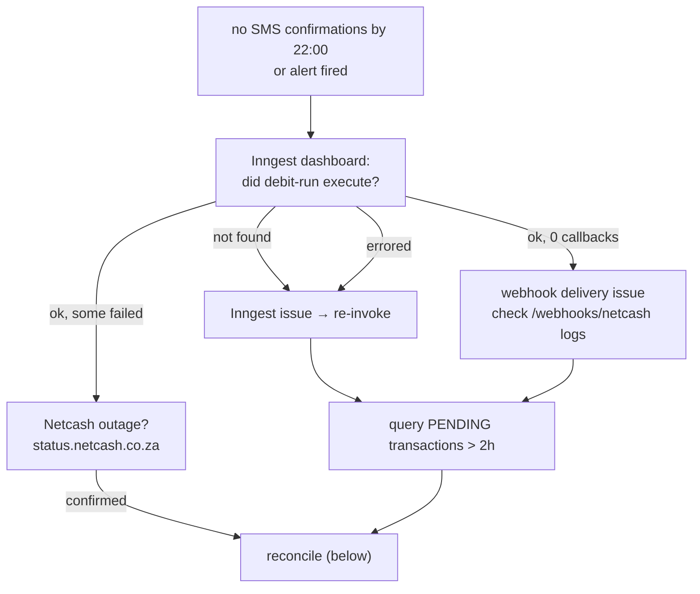

# Operational Runbook

Incident response for the money-moving paths: failed debit runs, stuck webhooks, reconciliation, mandate issues, and emergency halts. Infra setup: [constitutions/infra.md](./constitutions/infra.md) · go-live: [../DEPLOYMENT.md](../DEPLOYMENT.md).

> **Reconciliation has changed:** the system keeps an append-only ledger and reconciles nightly. Prefer the built-in tools (re-drive the webhook, run `reconcileLedger`) over raw SQL. Reach for SQL only as a last resort — and then also post the matching ledger entry, or the pool balance drifts.

---

## Debit run failure



1. **Verify the job ran** — Inngest → Functions → `debit-run`, look for the ~20:00 SAST run. Common failures: missing `DATABASE_URL`, Neon pool exhausted, unhandled exception in the function body.
2. **Find stuck transactions:**
   ```sql
   SELECT t.id, t."idempotencyKey", t.amount, t."createdAt", u.email
   FROM "Transaction" t
   JOIN "Contribution" c ON t."contributionId" = c.id
   JOIN "User" u ON c."userId" = u.id
   WHERE t.status = 'PENDING' AND t."createdAt" < NOW() - INTERVAL '2 hours'
   ORDER BY t."createdAt";
   ```
3. **Retry** — re-invoke `debit-run` from the Inngest dashboard. The idempotency key (`userId_mandateId_month_year`) means already-submitted mandates are skipped — no double charge.

---

## Reconciliation (webhook missed but Netcash settled)

**Preferred path — let the system do it:**
1. If Netcash supports webhook replay, replay the callback. The handler is idempotent (dedupe table) and posts the ledger entry as part of normal settlement.
2. Otherwise, run the **`ledgerReconciliation`** Inngest job (or wait for the nightly run) — it rebuilds ledger state from settled transactions. Check the result via `GET /api/v1/admin/ledger` (returns balance + entries).

**Last resort — manual SQL** (only if the above can't run). Mark the transaction and contribution, **then post the ledger CREDIT**, all in one transaction, and write an audit row:

```sql
BEGIN;
UPDATE "Transaction" SET status = 'SUCCESS', "processedAt" = NOW()
  WHERE id = '<txn_id>' AND status = 'PENDING';
UPDATE "Contribution" SET status = 'PAID', "updatedAt" = NOW()
  WHERE id = '<contribution_id>';
-- keep the pool balance correct (idempotent on refType/refId/direction):
INSERT INTO "LedgerEntry" (id, account, direction, amount, "refType", "refId", "createdAt")
  VALUES (gen_random_uuid(), 'POOL', 'CREDIT', <amount>, 'Transaction', '<txn_id>', NOW())
  ON CONFLICT ("refType", "refId", direction) DO NOTHING;
INSERT INTO "AuditLog" (id, "userId", action, entity, "entityId", payload, "ipAddress", "createdAt")
  VALUES (gen_random_uuid(), '<admin_user_id>', 'MANUAL_RECONCILE', 'Transaction', '<txn_id>',
          '{"reason":"webhook delivery failure"}', NULL, NOW());
COMMIT;
```

> `AuditLog` columns are `userId, action, entity, entityId, payload, ipAddress` — match them exactly.

---

## Stuck webhook

Netcash shows SUCCESS/FAILED but the DB didn't update and no confirmation SMS went out.

| Cause | Signal in logs | Fix |
|---|---|---|
| HMAC mismatch | `401` | `NETCASH_WEBHOOK_SECRET` must match the Netcash portal value |
| Duplicate (Netcash retried) | `200` no-op | Already processed — verify Transaction status; nothing to do |
| DB write failure | `500` | Check Neon connection; the handler released the event key, so a replay re-runs cleanly |
| IP not allowlisted | `403` before handler | Add the Netcash IP to the allowlist |

A **REVERSED** result posts a ledger DEBIT — confirm the balance moved via `GET /api/v1/admin/ledger`.

---

## Mandate & contribution

**Member paid outside the system (EFT):** Admin → Contributions → mark the OVERDUE record paid with a reference; this creates a `MANUAL` transaction and settles normally (ledger CREDIT posted).

**Reversal:** transactions are immutable. Create a new `REVERSAL` transaction — never `UPDATE`/`DELETE` an existing one. Settlement posts a ledger DEBIT.

**Mandate rejected by bank:** read the rejection reason from the webhook payload. Insufficient/wrong account details → admin verifies with the member and asks them to resubmit. Bank blocked DebiCheck → member contacts their bank.

**Cancel a mandate** (member leaves/requests): Admin → Mandates → Cancel → sets `CANCELLED`, sends the Netcash cancellation, member gets an SMS.

---

## Emergency procedures

- **Halt the debit run:** Inngest → `debit-run` → cancel queued/running invocations; set `DEBIT_RUN_PAUSED=true` in Vercel prod (the job checks it at startup and exits cleanly). Tell members in the WhatsApp group immediately.
- **Roll back a bad release:** promote the previous Vercel deployment (one click). Migrations are additive, so no schema rollback is needed.
- **DB emergency access:** Neon → `xxm-prod` → Query console. Read-only unless the incident requires a write; any write is audited and reviewed by a second person first.
- **Rate-limit a legitimate user out:** Upstash → find `ratelimit:{endpoint}:{ip}` → delete the key to reset the window. Don't raise limits without a capacity review.

---

## Monitoring & escalation

| Tool | Check |
|---|---|
| Better Stack | `/api/v1/health` uptime, alert history |
| Sentry | errors by release, error-rate trends |
| Inngest | job success/failure, retry depth |
| Vercel / Neon | deploy status, function logs / pool usage, slow queries |
| Netcash portal | batch results, mandate status, webhook logs |

| Severity | Definition | Response |
|---|---|---|
| P1 | Money not moving on debit day | Immediate — start here; if unresolved in 30 min, contact Netcash support |
| P2 | Members cannot log in | 1 hour |
| P3 | Notifications not sending | 4 hours |
| P4 | Reports unavailable | Next business day |

### What reaches you without you looking

The system raises its own alerts through `services/alert.service.ts`. Severity
decides how far the message travels, not how it is worded:

| Severity | Channels | Meaning |
|---|---|---|
| `critical` | Admin inbox **+ email + SMS** | Money did not move, or the records disagree about money |
| `warning` | Admin inbox **+ email** | Worth seeing today, not tonight |

Every alert is also written to the audit log and to the logger — and a critical
one logs at error level, so it reaches Sentry regardless of whether any channel
delivered.

| Alert | Raised by | Severity |
|---|---|---|
| `DEBIT_RUN_INCOMPLETE` | Debit run, on the night | critical |
| `LEDGER_DRIFT_DETECTED` | Nightly reconciliation | critical |
| `SCHEDULED_JOB_FAILED` | Any money-critical job exhausting its retries | critical |
| `FINANCIAL_ANOMALY_DETECTED` | Morning sweep | critical if the collection rate is below floor, else warning |

**Only `ACTIVE` admins are alerted.** A suspended founder is not an escalation
path. If nothing is delivered, the first thing to check is that at least one
active account holds the ADMIN role — the service logs
`Operational alert has no active admin to reach` for exactly this, because an
alerting system with no recipients looks identical to a quiet night.

**Delivery is not instant.** SMS and email are queued and drained by
`notification-flush`, which runs every five minutes. An alert raised at 18:00
arrives by about 18:05.

**Three ways alerting can itself be down**, in the order worth checking:

1. **`notification-flush` has stopped.** Nothing queued is going anywhere. Its
   own failure alert cannot be delivered by it — what carries that one out is
   the Sentry error, so Sentry is the check that does not depend on this system.
2. **No active admin holds the ADMIN role.** See above.
3. **BulkSMS or Resend credentials are wrong.** The inbox message still lands;
   nobody is paged. Rows in `notifications` stay `QUEUED` or `FAILED` —
   `SELECT status, count(*) FROM notifications GROUP BY status` is the check.

`SCHEDULED_JOB_FAILED` covers a job that **ran and failed**. It does not cover a
job that **never fired** — no heartbeat check exists, so a cron that silently
stops scheduling is still only visible in the Inngest dashboard.
