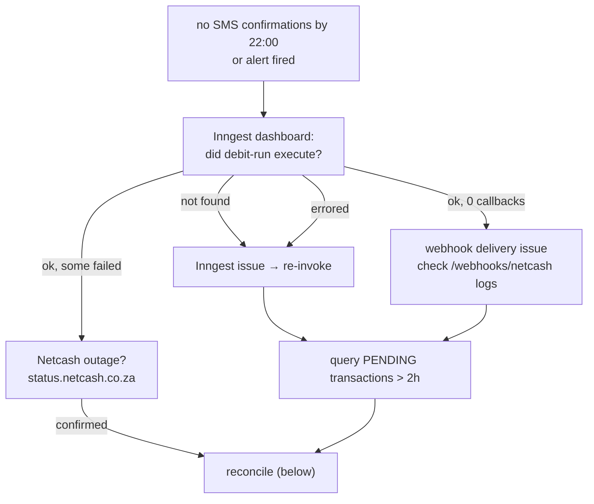

# Operational Runbook

Incident response for the money-moving paths: failed debit runs, stuck webhooks, reconciliation, mandate issues, and emergency halts. Infra setup: [constitutions/infra.md](./constitutions/infra.md) · go-live: [../DEPLOYMENT.md](../DEPLOYMENT.md).

> **Reconciliation has changed:** the system keeps an append-only ledger and reconciles nightly. Prefer the built-in tools (re-drive the webhook, run `reconcileLedger`) over raw SQL. Reach for SQL only as a last resort — and then also post the matching ledger entry, or the pool balance drifts.

---

## Debit run failure



1. **Verify the job ran** — Inngest → Functions → `debit-run`, look for the ~20:00 SAST run. Common failures: missing `DATABASE_URL`, Neon pool exhausted, unhandled exception in the function body.
2. **Find stuck transactions:**
   ```sql
   SELECT t.id, t."idempotencyKey", t.amount, t."createdAt", u.email
   FROM "Transaction" t
   JOIN "Contribution" c ON t."contributionId" = c.id
   JOIN "User" u ON c."userId" = u.id
   WHERE t.status = 'PENDING' AND t."createdAt" < NOW() - INTERVAL '2 hours'
   ORDER BY t."createdAt";
   ```
3. **Retry** — re-invoke `debit-run` from the Inngest dashboard. The idempotency key (`userId_mandateId_month_year`) means already-submitted mandates are skipped — no double charge.

---

## Reconciliation (webhook missed but Netcash settled)

**Preferred path — let the system do it:**
1. If Netcash supports webhook replay, replay the callback. The handler is idempotent (dedupe table) and posts the ledger entry as part of normal settlement.
2. Otherwise, run the **`ledgerReconciliation`** Inngest job (or wait for the nightly run) — it rebuilds ledger state from settled transactions. Check the result via `GET /api/v1/admin/ledger` (returns balance + entries).

**Last resort — manual SQL** (only if the above can't run). Mark the transaction and contribution, **then post the ledger CREDIT**, all in one transaction, and write an audit row:

```sql
BEGIN;
UPDATE "Transaction" SET status = 'SUCCESS', "processedAt" = NOW()
  WHERE id = '<txn_id>' AND status = 'PENDING';
UPDATE "Contribution" SET status = 'PAID', "updatedAt" = NOW()
  WHERE id = '<contribution_id>';
-- keep the pool balance correct (idempotent on refType/refId/direction):
INSERT INTO "LedgerEntry" (id, account, direction, amount, "refType", "refId", "createdAt")
  VALUES (gen_random_uuid(), 'POOL', 'CREDIT', <amount>, 'Transaction', '<txn_id>', NOW())
  ON CONFLICT ("refType", "refId", direction) DO NOTHING;
INSERT INTO "AuditLog" (id, "userId", action, entity, "entityId", payload, "ipAddress", "createdAt")
  VALUES (gen_random_uuid(), '<admin_user_id>', 'MANUAL_RECONCILE', 'Transaction', '<txn_id>',
          '{"reason":"webhook delivery failure"}', NULL, NOW());
COMMIT;
```

> `AuditLog` columns are `userId, action, entity, entityId, payload, ipAddress` — match them exactly.

---

## Stuck webhook

Netcash shows SUCCESS/FAILED but the DB didn't update and no confirmation SMS went out.

| Cause | Signal in logs | Fix |
|---|---|---|
| HMAC mismatch | `401` | `NETCASH_WEBHOOK_SECRET` must match the Netcash portal value |
| Duplicate (Netcash retried) | `200` no-op | Already processed — verify Transaction status; nothing to do |
| DB write failure | `500` | Check Neon connection; the handler released the event key, so a replay re-runs cleanly |
| IP not allowlisted | `403` before handler | Add the Netcash IP to the allowlist |

A **REVERSED** result posts a ledger DEBIT — confirm the balance moved via `GET /api/v1/admin/ledger`.

---

## Mandate & contribution

**Member paid outside the system (EFT):** Admin → Contributions → mark the OVERDUE record paid with a reference; this creates a `MANUAL` transaction and settles normally (ledger CREDIT posted).

**Reversal:** transactions are immutable. Create a new `REVERSAL` transaction — never `UPDATE`/`DELETE` an existing one. Settlement posts a ledger DEBIT.

**Mandate rejected by bank:** read the rejection reason from the webhook payload. Insufficient/wrong account details → admin verifies with the member and asks them to resubmit. Bank blocked DebiCheck → member contacts their bank.

**Cancel a mandate** (member leaves/requests): Admin → Mandates → Cancel → sets `CANCELLED`, sends the Netcash cancellation, member gets an SMS.

---

## Emergency procedures

- **Halt the debit run:** Inngest → `debit-run` → cancel queued/running invocations; set `DEBIT_RUN_PAUSED=true` in Vercel prod (the job checks it at startup and exits cleanly). Tell members in the WhatsApp group immediately.
- **Roll back a bad release:** promote the previous Vercel deployment (one click). Migrations are additive, so no schema rollback is needed.
- **DB emergency access:** Neon → `xxm-prod` → Query console. Read-only unless the incident requires a write; any write is audited and reviewed by a second person first.
- **Rate-limit a legitimate user out:** Upstash → find `ratelimit:{endpoint}:{ip}` → delete the key to reset the window. Don't raise limits without a capacity review.

---

## Rotating the encryption key

`ENCRYPTION_KEY` protects stored bank account numbers and ID numbers. Rotate it
when it may have been exposed — pasted into a terminal, committed, shared, or
held by someone who has left — and on a schedule if you have one.

**Do not simply change the value.** The key is not a password; it is the only
thing that can read what it wrote. Replacing it on its own makes every stored
bank and ID number unreadable in the same instant, and nothing in the app can
recover them.

A rotation is three steps, and the middle one has to finish before the third.

### Before you start

- Take a database backup. Neon → branch → restore point. This is the step you
  will wish you had taken.
- Generate the new key: `openssl rand -hex 32` (64 hex characters).
- Decide the new id — the next integer. If `ENCRYPTION_KEY_ID` is unset the
  current key is id `1`, so the new one is `2`.
- Do one environment at a time, staging first. Keys differ per environment, so
  nothing about production is proved by staging succeeding — but the *procedure*
  is, which is what you are rehearsing.

### Step 1 — add the new key, keep the old one for reading

Set all three, together, in the same deploy:

```
ENCRYPTION_KEY=<the new key>
ENCRYPTION_KEY_ID=2
ENCRYPTION_PREVIOUS_KEYS=1:<the old key>
```

From this deploy on, new values are written under key 2 and stamped with it.
Everything already stored still reads, under key 1. Nothing is unavailable, and
members notice nothing.

The app refuses to start on configuration that cannot be a rotation — the same
id twice, the same key material under two ids, a malformed key. Read the message
rather than working around it; each one means a step was missed.

### Step 2 — move the stored values across

```
npm run secrets:reencrypt              # preview; writes nothing
npm run secrets:reencrypt -- --apply   # rewrite
```

Run it against the environment you are rotating, with that environment's
variables set. It walks `users.idNumber` and `bank_accounts.accountNumber`,
rewrites each value under the active key, and prints a count per column.

Safe to interrupt and safe to re-run: rows already under the active key are
skipped without being decrypted, and each row is committed on its own.

**It must report zero unreadable before you go further.** A non-zero exit means
some values are still tied to a key that is about to be deleted. Each one is
listed with its row id and the key it claims:

| Reported as | What it means | What to do |
|---|---|---|
| `key=1` and unreadable | The old key in `ENCRYPTION_PREVIOUS_KEYS` is wrong | Fix the value and re-run. Do not proceed |
| `key=unversioned`, unreadable | Written under a key not on the ring at all — usually another environment's | Find the key that wrote it, or re-capture the value from the member |
| `key=unrecognisable` | Never was ciphertext — a fixture, or a test mock that reached a real database | Correct or clear the row. It has no recoverable plaintext |

Re-run the preview until it reports zero.

### Step 3 — retire the old key

Only once step 2 has reported zero unreadable **in that environment**:

```
ENCRYPTION_PREVIOUS_KEYS=      # removed
```

Then delete the old key from wherever it is stored. Until you do, an exposed key
is still an exposed key — steps 1 and 2 restore your ability to remove it, they
do not remove it.

Keep the old key somewhere retrievable until you are confident, and keep the
backup from step 0 for as long as your retention policy allows. A key deleted
one step early is not recoverable from anything the app holds.

### Adding a new encrypted column later

`packages/database/scripts/reencrypt-secrets.ts` carries an explicit list of the
encrypted columns. A column added to the schema and not added there will be
missed, and the rotation will report success while leaving that column pinned to
a key you are about to delete.

---

## Monitoring & escalation

| Tool | Check |
|---|---|
| Better Stack | `/api/v1/health` uptime, alert history |
| Sentry | errors by release, error-rate trends |
| Inngest | job success/failure, retry depth |
| Vercel / Neon | deploy status, function logs / pool usage, slow queries |
| Netcash portal | batch results, mandate status, webhook logs |

| Severity | Definition | Response |
|---|---|---|
| P1 | Money not moving on debit day | Immediate — start here; if unresolved in 30 min, contact Netcash support |
| P2 | Members cannot log in | 1 hour |
| P3 | Notifications not sending | 4 hours |
| P4 | Reports unavailable | Next business day |

### What reaches you without you looking

The system raises its own alerts through `services/alert.service.ts`. Severity
decides how far the message travels, not how it is worded:

| Severity | Channels | Meaning |
|---|---|---|
| `critical` | Admin inbox **+ email + SMS** | Money did not move, or the records disagree about money |
| `warning` | Admin inbox **+ email** | Worth seeing today, not tonight |

Every alert is also written to the audit log and to the logger — and a critical
one logs at error level, so it reaches Sentry regardless of whether any channel
delivered.

| Alert | Raised by | Severity |
|---|---|---|
| `DEBIT_RUN_INCOMPLETE` | Debit run, on the night | critical |
| `LEDGER_DRIFT_DETECTED` | Nightly reconciliation | critical |
| `SCHEDULED_JOB_FAILED` | Any money-critical job exhausting its retries | critical |
| `FINANCIAL_ANOMALY_DETECTED` | Morning sweep | critical if the collection rate is below floor, else warning |
| `NOTIFICATIONS_ABANDONED` | Notification flush, after each batch | critical — messages that exhausted every retry and will never send. Throttled to once per 6 hours |
| `SCHEDULED_JOB_SILENT` | Heartbeat check, every 15 minutes | critical — a money-critical job has **not run at all**. Not the same as `SCHEDULED_JOB_FAILED`; see "A job that never fired" below |

**Only `ACTIVE` admins are alerted.** A suspended founder is not an escalation
path. If nothing is delivered, the first thing to check is that at least one
active account holds the ADMIN role — the service logs
`Operational alert has no active admin to reach` for exactly this, because an
alerting system with no recipients looks identical to a quiet night.

**Set `ALERT_FALLBACK_EMAIL`.** This system runs with a **single admin** by
decision, so every channel above depends on one person's account being active,
their phone being reachable, and the notification worker being alive. None of
those links has a spare.

`ALERT_FALLBACK_EMAIL` is a standing address — a shared operations mailbox, or a
bridge into the WhatsApp group — that receives every **critical** alert
regardless of what the admin fan-out does. It is sent **directly**, not queued,
because if the queue is what broke then queueing the alert about it is not a
plan. It needs no user account, so it survives the admin being suspended,
locked out, or simply asleep.

It is optional and unset by default; unset, alerting behaves exactly as it did
before it existed. **On a live deployment, set it.**

**Delivery is not instant.** SMS and email are queued and drained by
`notification-flush`, which runs every five minutes. An alert raised at 18:00
arrives by about 18:05.

**Three ways alerting can itself be down**, in the order worth checking:

1. **`notification-flush` has stopped.** Nothing queued is going anywhere. Its
   own failure alert cannot be delivered by it — what carries that one out is
   the Sentry error, so Sentry is the check that does not depend on this system.
   If it stopped by *never being invoked* rather than by failing, the heartbeat
   check raises `SCHEDULED_JOB_SILENT` within about 45 minutes — and that alert
   cannot be delivered by the flush worker either, so it too arrives via Sentry
   and `ALERT_FALLBACK_EMAIL`, which is sent directly rather than queued.
2. **No active admin holds the ADMIN role.** See above.
3. **BulkSMS or Resend credentials are wrong.** The inbox message still lands;
   nobody is paged. Rows in `notifications` stay `QUEUED` or `FAILED` —
   `SELECT status, count(*) FROM notifications GROUP BY status` is the check.
   This case now raises `NOTIFICATIONS_ABANDONED` once a message has exhausted
   its retries, so it announces itself rather than waiting to be noticed.

**Recovering abandoned notifications.** They stop being retried at
`retryCount >= 3` and stay `FAILED` forever. Read `errorMessage` on those rows
for the cause, fix it, then reset `retryCount` to 0 — the flush worker picks
them up on its next pass. Resetting before fixing the cause just burns the
retries again.

### A job that never fired

`SCHEDULED_JOB_FAILED` covers a job that **ran and failed**. A job that is never
invoked at all fails differently and needs a different first move, so it has its
own code: **`SCHEDULED_JOB_SILENT`**.

The distinction is the whole point. A failed job has a run in the Inngest
dashboard with a stack trace at the end of it. A silent job has **no run to
open** — the app failed to sync after a deploy, a function was disabled, the
signing key expired, or the registration was dropped from the serve route. There
is no error, no failed transaction, and no alert from the job itself, because
the thing that would have spoken is the thing that is missing. From the outside
it is indistinguishable from a quiet month.

**How it works.** Each watched job writes a row to `job_heartbeats` as its
**last** step, so a beat means "this run reached the end" — not that it went
well. A decline-everything debit run still beats; what went wrong there is
`DEBIT_RUN_INCOMPLETE`'s business. `job-heartbeat-check` runs every fifteen
minutes, compares each beat against the window below, and raises one critical
alert naming every job that is overdue.

| Job | Schedule | Silent after | What is lost meanwhile |
|---|---|---|---|
| `debit-run` | daily 18:00 SAST | 26 h | No contributions are being collected |
| `transaction-retry-failed` | daily 12:00 SAST | 26 h | Failed collections stay failed |
| `ledger-reconciliation` | daily 05:00 SAST | 26 h | Drift accumulates unchecked |
| `mandate-status-sync` | daily 04:00 SAST | 26 h | Stale statuses; the debit run skips members |
| `notification-flush` | every 5 min | 30 min | Nothing is delivered to anyone, including these alerts |
| `job-heartbeat-check` | every 15 min | 60 min | Nothing is checking job liveness |

The daily windows are 24 hours plus a two-hour cushion. That is deliberate: a
check that fires on every slightly-late run is a check that gets muted, and a
muted alarm is the state this mechanism exists to prevent.

**`mandate-delay-handler` is deliberately not watched.** It is triggered by an
event, not a cron, so a month in which nobody moves a debit date is a month in
which it correctly never runs. There is no expected interval to measure.

**Throttling.** Once per six hours **per set of silent jobs** — not per job, and
not on time alone. If reconciliation has been quiet for hours and the debit run
then stops too, the changed set speaks immediately rather than waiting out the
window. Throttled on the audit log, not on Redis, for the reason in
`notification-flush`: the cache is a no-op shim when Upstash is unconfigured, so
a Redis throttle fails **open**.

**What to do when it fires.** There is no failed run to look at, so:

1. Open the Inngest dashboard and check the **app is synced** and the named
   functions are **listed and enabled**. A deploy that changed the signing key or
   the serve URL is the common cause.
2. Confirm the function is in the array in
   `apps/web/app/api/v1/webhooks/inngest/route.ts`. It is hand-maintained; a
   function exported but not listed there runs never. A test holds the two lists
   together, but only for functions exported from `apps/web/inngest/index.ts`.
3. `SELECT * FROM job_heartbeats ORDER BY "lastRunAt"` shows exactly when each
   job last reached the end.
4. If the job is running fine and the alert is wrong, the beat is not being
   written — check `Failed to record a job heartbeat` in the logs. That write
   swallows its own errors on purpose, because it happens after money has moved
   and must not fail the run that moved it.

### The gap this does not close

**`job-heartbeat-check` cannot detect its own absence.** It is a cron like
everything it watches, so if Inngest stops scheduling entirely, the watcher
stops with it and nobody is told by anything inside this system. That is
inherent — it cannot be fixed with more code in here.

What closes it is a ping from outside. `/api/v1/health` reports job liveness in
its body for exactly this reason, and it answers over HTTP, which is a different
failure domain from the job runtime:

```json
{ "status": "ok", "checks": { "db": "ok", "redis": "ok", "jobs": "stale" },
  "staleJobs": 2 }
```

`checks.jobs` is `ok`, `stale`, or `unknown` (the heartbeat read itself failed —
reported as `unknown` rather than `ok`, because absent evidence is not good
news).

**A count, never the job names.** This route is public and unauthenticated, and
"notification-flush is stale" tells an anonymous reader that nothing is being
delivered to anybody at this moment — a window rather than a status. To find out
*which* jobs, read the alert, the audit log, or `job_heartbeats`, all of which
require being the operator.

**Point the uptime monitor at it.** Better Stack already polls this endpoint;
add a body assertion on `"jobs":"ok"`. A stale job deliberately **does not**
return 503 — that status is read by hosting and failover tooling as "replace
this instance", which is the wrong remedy for a stopped cron and would trade a
working web app for no web app. The HTTP status stays tied to the database and
Redis, exactly as it was.
