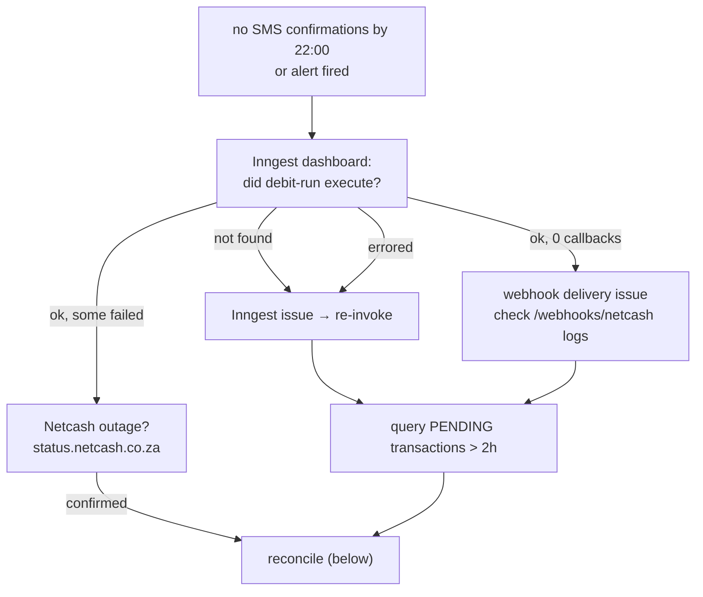

# Operational Runbook

Incident response for the money-moving paths: failed debit runs, stuck webhooks, reconciliation, mandate issues, and emergency halts. Infra setup: [constitutions/infra.md](./constitutions/infra.md) · go-live: [../DEPLOYMENT.md](../DEPLOYMENT.md).

> **Reconciliation has changed:** the system keeps an append-only ledger and reconciles nightly. Prefer the built-in tools (re-drive the webhook, run `reconcileLedger`) over raw SQL. Reach for SQL only as a last resort — and then also post the matching ledger entry, or the pool balance drifts.

---

## Debit run failure



1. **Verify the job ran** — Inngest → Functions → `debit-run`, look for the ~20:00 SAST run. Common failures: missing `DATABASE_URL`, Neon pool exhausted, unhandled exception in the function body.
2. **Find stuck transactions:**
   ```sql
   SELECT t.id, t."idempotencyKey", t.amount, t."createdAt", u.email
   FROM "Transaction" t
   JOIN "Contribution" c ON t."contributionId" = c.id
   JOIN "User" u ON c."userId" = u.id
   WHERE t.status = 'PENDING' AND t."createdAt" < NOW() - INTERVAL '2 hours'
   ORDER BY t."createdAt";
   ```
3. **Retry** — re-invoke `debit-run` from the Inngest dashboard. The idempotency key (`userId_mandateId_month_year`) means already-submitted mandates are skipped — no double charge.

---

## Reconciliation (webhook missed but Netcash settled)

**Preferred path — let the system do it:**
1. If Netcash supports webhook replay, replay the callback. The handler is idempotent (dedupe table) and posts the ledger entry as part of normal settlement.
2. Otherwise, run the **`ledgerReconciliation`** Inngest job (or wait for the nightly run) — it rebuilds ledger state from settled transactions. Check the result via `GET /api/v1/admin/ledger` (returns balance + entries).

**Last resort — manual SQL** (only if the above can't run). Mark the transaction and contribution, **then post the ledger CREDIT**, all in one transaction, and write an audit row:

```sql
BEGIN;
UPDATE "Transaction" SET status = 'SUCCESS', "processedAt" = NOW()
  WHERE id = '<txn_id>' AND status = 'PENDING';
UPDATE "Contribution" SET status = 'PAID', "updatedAt" = NOW()
  WHERE id = '<contribution_id>';
-- keep the pool balance correct (idempotent on refType/refId/direction):
INSERT INTO "LedgerEntry" (id, account, direction, amount, "refType", "refId", "createdAt")
  VALUES (gen_random_uuid(), 'POOL', 'CREDIT', <amount>, 'Transaction', '<txn_id>', NOW())
  ON CONFLICT ("refType", "refId", direction) DO NOTHING;
INSERT INTO "AuditLog" (id, "userId", action, entity, "entityId", payload, "ipAddress", "createdAt")
  VALUES (gen_random_uuid(), '<admin_user_id>', 'MANUAL_RECONCILE', 'Transaction', '<txn_id>',
          '{"reason":"webhook delivery failure"}', NULL, NOW());
COMMIT;
```

> `AuditLog` columns are `userId, action, entity, entityId, payload, ipAddress` — match them exactly.

---

## Stuck webhook

Netcash shows SUCCESS/FAILED but the DB didn't update and no confirmation SMS went out.

| Cause | Signal in logs | Fix |
|---|---|---|
| HMAC mismatch | `401` | `NETCASH_WEBHOOK_SECRET` must match the Netcash portal value |
| Duplicate (Netcash retried) | `200` no-op | Already processed — verify Transaction status; nothing to do |
| DB write failure | `500` | Check Neon connection; the handler released the event key, so a replay re-runs cleanly |
| IP not allowlisted | `403` before handler | Add the Netcash IP to the allowlist |

A **REVERSED** result posts a ledger DEBIT — confirm the balance moved via `GET /api/v1/admin/ledger`.

---

## Mandate & contribution

**Member paid outside the system (EFT):** Admin → Contributions → mark the OVERDUE record paid with a reference; this creates a `MANUAL` transaction and settles normally (ledger CREDIT posted).

**Reversal:** transactions are immutable. Create a new `REVERSAL` transaction — never `UPDATE`/`DELETE` an existing one. Settlement posts a ledger DEBIT.

**Mandate rejected by bank:** read the rejection reason from the webhook payload. Insufficient/wrong account details → admin verifies with the member and asks them to resubmit. Bank blocked DebiCheck → member contacts their bank.

**Cancel a mandate** (member leaves/requests): Admin → Mandates → Cancel → sets `CANCELLED`, sends the Netcash cancellation, member gets an SMS.

---

## Emergency procedures

- **Halt the debit run:** Inngest → `debit-run` → cancel queued/running invocations; set `DEBIT_RUN_PAUSED=true` in Vercel prod (the job checks it at startup and exits cleanly). Tell members in the WhatsApp group immediately.
- **Roll back a bad release:** promote the previous Vercel deployment (one click). Migrations are additive, so no schema rollback is needed.
- **DB emergency access:** Neon → `xxm-prod` → Query console. Read-only unless the incident requires a write; any write is audited and reviewed by a second person first.
- **Rate-limit a legitimate user out:** Upstash → find `ratelimit:{endpoint}:{ip}` → delete the key to reset the window. Don't raise limits without a capacity review.

---

## Rotating the encryption key

`ENCRYPTION_KEY` protects stored bank account numbers and ID numbers. Rotate it
when it may have been exposed — pasted into a terminal, committed, shared, or
held by someone who has left — and on a schedule if you have one.

**Do not simply change the value.** The key is not a password; it is the only
thing that can read what it wrote. Replacing it on its own makes every stored
bank and ID number unreadable in the same instant, and nothing in the app can
recover them.

A rotation is three steps, and the middle one has to finish before the third.

### Before you start

- Take a database backup. Neon → branch → restore point. This is the step you
  will wish you had taken.
- Generate the new key: `openssl rand -hex 32` (64 hex characters).
- Decide the new id — the next integer. If `ENCRYPTION_KEY_ID` is unset the
  current key is id `1`, so the new one is `2`.
- Do one environment at a time, staging first. Keys differ per environment, so
  nothing about production is proved by staging succeeding — but the *procedure*
  is, which is what you are rehearsing.

### Step 1 — add the new key, keep the old one for reading

Set all three, together, in the same deploy:

```
ENCRYPTION_KEY=<the new key>
ENCRYPTION_KEY_ID=2
ENCRYPTION_PREVIOUS_KEYS=1:<the old key>
```

From this deploy on, new values are written under key 2 and stamped with it.
Everything already stored still reads, under key 1. Nothing is unavailable, and
members notice nothing.

The app refuses to start on configuration that cannot be a rotation — the same
id twice, the same key material under two ids, a malformed key. Read the message
rather than working around it; each one means a step was missed.

### Step 2 — move the stored values across

```
npm run secrets:reencrypt              # preview; writes nothing
npm run secrets:reencrypt -- --apply   # rewrite
```

Run it against the environment you are rotating, with that environment's
variables set. It walks `users.idNumber` and `bank_accounts.accountNumber`,
rewrites each value under the active key, and prints a count per column.

Safe to interrupt and safe to re-run: rows already under the active key are
skipped without being decrypted, and each row is committed on its own.

**It must report zero unreadable before you go further.** A non-zero exit means
some values are still tied to a key that is about to be deleted. Each one is
listed with its row id and the key it claims:

| Reported as | What it means | What to do |
|---|---|---|
| `key=1` and unreadable | The old key in `ENCRYPTION_PREVIOUS_KEYS` is wrong | Fix the value and re-run. Do not proceed |
| `key=unversioned`, unreadable | Written under a key not on the ring at all — usually another environment's | Find the key that wrote it, or re-capture the value from the member |
| `key=unrecognisable` | Never was ciphertext — a fixture, or a test mock that reached a real database | Correct or clear the row. It has no recoverable plaintext |

Re-run the preview until it reports zero.

### Step 3 — retire the old key

Only once step 2 has reported zero unreadable **in that environment**:

```
ENCRYPTION_PREVIOUS_KEYS=      # removed
```

Then delete the old key from wherever it is stored. Until you do, an exposed key
is still an exposed key — steps 1 and 2 restore your ability to remove it, they
do not remove it.

Keep the old key somewhere retrievable until you are confident, and keep the
backup from step 0 for as long as your retention policy allows. A key deleted
one step early is not recoverable from anything the app holds.

### Adding a new encrypted column later

`packages/database/scripts/reencrypt-secrets.ts` carries an explicit list of the
encrypted columns. A column added to the schema and not added there will be
missed, and the rotation will report success while leaving that column pinned to
a key you are about to delete.

---

## Monitoring & escalation

| Tool | Check |
|---|---|
| Better Stack | `/api/v1/health` uptime, alert history |
| Sentry | errors by release, error-rate trends |
| Inngest | job success/failure, retry depth |
| Vercel / Neon | deploy status, function logs / pool usage, slow queries |
| Netcash portal | batch results, mandate status, webhook logs |

| Severity | Definition | Response |
|---|---|---|
| P1 | Money not moving on debit day | Immediate — start here; if unresolved in 30 min, contact Netcash support |
| P2 | Members cannot log in | 1 hour |
| P3 | Notifications not sending | 4 hours |
| P4 | Reports unavailable | Next business day |
