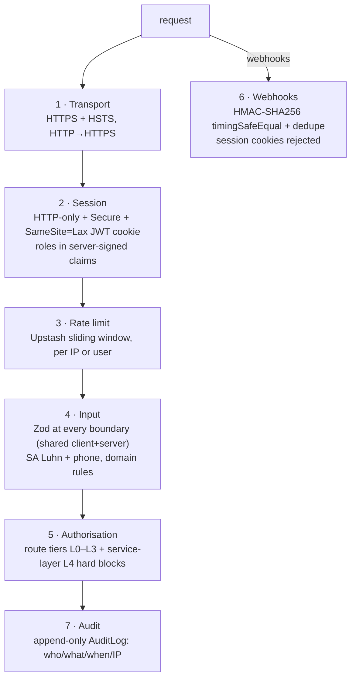
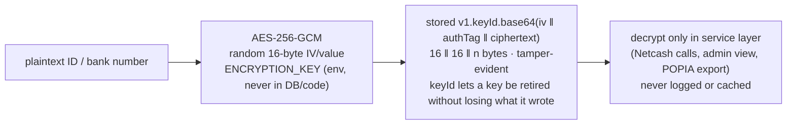
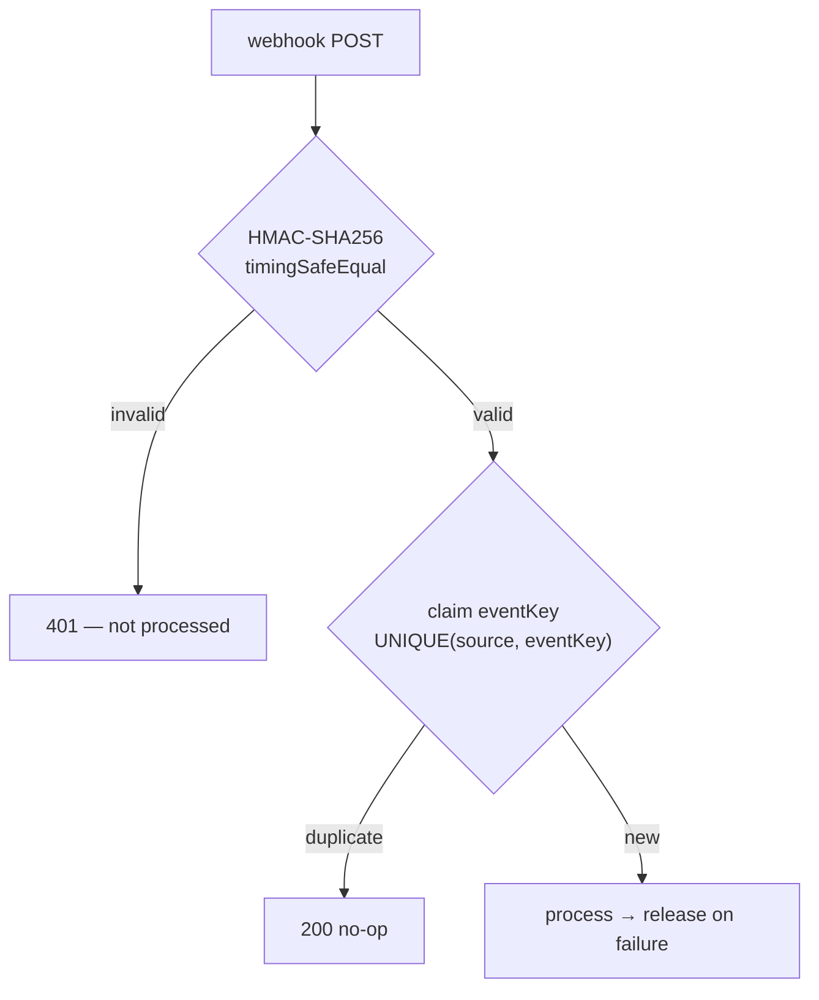

# Security Architecture

Every defence layer: transport, auth, validation, encryption, rate limiting, webhook verification, audit, and POPIA. Related: [../flows/01-auth-flow.md](../flows/01-auth-flow.md) · [../database/03-schema-design.md](../database/03-schema-design.md).

---

## Defence in depth

**A layer worth naming that isn't in the diagram above**: a per-request
**CSP nonce**, generated fresh in `proxy.ts` and threaded onto both the
request and response headers. The policy previously shipped
`script-src 'unsafe-inline'`, which is the one directive that decides
whether a CSP actually stops an XSS or merely documents that one
happened — with it, an injected `<script>` executes like any other tag.
Fixed by generating a nonce per request; the cost is that pages using it
can no longer be prerendered at build time (a real, accepted trade against
an app that moves money). A related, separately-caught bug: the Sentry
ingest host in `connect-src` used a partial wildcard
(`https://o*.ingest.sentry.io`), which is not valid CSP syntax — a
wildcard must be a whole leftmost label — so browsers silently discarded
that source entirely and every client-side error report was blocked by
the app's own policy while looking fully configured.

---

## Authentication & authorisation

Login → NextAuth Credentials → server-signed JWT in an **HTTP-only, Secure, SameSite=Lax** cookie. **Two separate apps, two separate route-protection files** — `apps/web/proxy.ts` and `apps/admin/proxy.ts` (Next.js 16 renamed `middleware.ts` to `proxy.ts`), not one shared middleware. Each decodes its own session on every request; the role lives in the signed claims, so it can't be spoofed. Queries always use `session.user.id` (via `assertCanAccess`), never a client-supplied id.

| Tier | Access | Rule |
|---|---|---|
| L0 | Public | No auth |
| L1 | Member | Own data only, `apps/web` |
| L2 | Admin | All data, ledger, audit — either a real admin session (`apps/admin`, own `proxy.ts` + `requireAdmin()` re-checking role live on every server action) or a trusted server-to-server call into `apps/web`'s `/api/v1/admin/*`, authenticated by a constant-time-compared `ADMIN_API_SECRET` header, not a session at all |
| L3 | System | Webhooks — HMAC only, session cookies explicitly rejected |

**Live revocation, not just JWT expiry**: a Redis-cached `roleVersion`, bumped on any role/status change, is checked on every `apps/web` request and every `apps/admin` server action — a suspended member or a demoted admin loses access immediately, mid-session, rather than waiting up to 24h for the token to expire naturally.

**L4 hard blocks** (service layer, un-bypassable by proxy misconfig): no member reads another's bank/ID number; no member writes `Transaction`/`Contribution`/`LedgerEntry`; admins reverse rather than delete transactions; webhook endpoints reject session cookies.

## Data protection

| Data | Protection |
|---|---|
| Passwords | bcrypt cost 12 (~250ms, GPU-resistant) |
| ID / bank numbers | AES-256-GCM, random IV per value |
| Reset / verify / invite tokens | SHA-256 hash only; plaintext never stored; `usedAt` makes one-time |
| Email / phone | Plain — indexed for lookup (encrypting → `O(n)` login) |

## Rate limits

Sliding-window (Upstash), keyed per IP (pre-auth) or per user. Verified
against `apps/web/lib/redis.ts` directly (updated 2026-08-30 — the
previous version of this table had **login and invite-validate wrong**,
and was missing about half the limiters that actually exist):

**Login is 10/5min, not the same as registration/invite-validate (5/1min,
`authRatelimit`)** — these were previously conflated under one "Auth
5/15min" row, which was wrong for both. Full list:

| Limiter | Window | Guards |
|---|---|---|
| `login` | 10 / 5 min / IP | Sign-in attempts |
| `auth` | 5 / 1 min / IP | Registration, invite-validate |
| `forgot-password` | 5 / 15 min | Password-reset requests |
| `verify-email` | 10 / 15 min | Email verification |
| `resend-verification` | 3 / 15 min | Verification re-sends |
| `api` | 60 / 1 min / user | General authenticated API |
| `payment` | 5 / 1 h / user | Manual contribution payments |
| `mandate` | 3 / 1 h / user | Mandate mutations, general |
| `mandate-create` | 10 / 1 h / user | New mandates |
| `mandate-delay` | 5 / 1 h / user | Delay requests |
| `statement` | 10 / 1 h / user | PDF statement generation |
| `goal-propose` | 3 / 1 h / user | New goal proposals |
| `community-post` | 10 / 1 day / user | Community board posts |
| `admin-invite` | 20 / 1 h | New member invitations |
| `admin-broadcast` | 5 / 1 h | Admin broadcast notifications |
| `admin-bulk` | 3 / 1 h | Bulk admin operations (e.g. mass contribution generation) |
| `public-stats` | 30 / 1 min / IP | Unauthenticated `/api/v1/stats/public` |
| `data-request` | 3 / 1 h / IP | Unauthenticated POPIA data-subject requests |

A leaked invite code is useless without the matching identity at these
rates. **CSRF** is a separate layer, not covered by rate limiting: every
mutating method (POST/PUT/PATCH/DELETE) against an authenticated API route
has its Origin header checked (`verifyCsrfOrigin`) — `SameSite=Lax` alone
was judged insufficient defence-in-depth for a system that moves money.

## Webhook security (exactly-once)

Netcash uses HMAC + IP allowlist; Inngest uses its signing key (in the SDK); BulkSMS uses an IP allowlist. Redelivery is safe — the dedupe table guarantees each event is processed once.

## Integrity & audit

Money is `Decimal(10,2)`; the pool is an **append-only ledger** (idempotent postings, nightly reconciliation), so the balance is always derivable and verifiable. `AuditLog` is append-only (`userId, action, entity, entityId, payload, ipAddress, createdAt`) — every state-changing operation writes one synchronously, including every admin access to member data. A daily **anomaly watch** alerts admins on abnormal collection rates, failed-debit spikes, or overdue thresholds.

## POPIA

Consent is timestamped at registration (`popiaConsentAt`). Members exercise rights two ways: directly in the app (**access** via `GET /members/:id/export` → ZIP of JSON, **correction** via profile edit, **objection** via per-channel notification opt-out, **deletion** via soft-delete with financial records retained 5 years by law), and through a **formal, tracked request** — the `DataSubjectRequest` model, reachable at `POST /api/v1/data-requests` **without a session**, deliberately: the person with the strongest claim to deletion may be a former member who can no longer authenticate. Its `kind` covers all 5 statutory rights (`ACCESS`, `CORRECTION`, `DELETION`, `OBJECTION`, `CONSENT_WITHDRAWAL`), `status` tracks progress (`RECEIVED` → `IN_PROGRESS` → `COMPLETED`/`REFUSED`), and `dueBy` is stored at intake (`receivedAt` + 30 days) rather than computed on read, so a future change to the statutory period never silently moves the deadline on a request already in flight. `subjectId` links to the member where known, but is nullable with `SetNull` (never `Cascade`) — erasing the member must not erase the evidence they asked to be erased. Only data needed for the business purpose is collected; nothing is shared beyond the payment processor (Netcash).

---

## Decision reference

| Decision | Choice | Why |
|---|---|---|
| Session | HTTP-only JWT cookie | XSS can't read it; never in `localStorage` |
| Cookie scope | `SameSite=Lax`, Secure | Survives top-level nav (email links) while blocking CSRF on cross-site POSTs |
| Passwords | bcrypt 12 | GPU-resistant |
| Tokens | SHA-256 hash | Breached DB holds no redeemable tokens |
| PII | AES-256-GCM | Authenticated — detects tampering |
| Webhooks | HMAC + dedupe | Stops forgery, timing attacks, and double-processing |
| Idempotency | UNIQUE DB column | DB-level — survives Redis outage |
| Forgot-password | Always 200 | No user enumeration |
